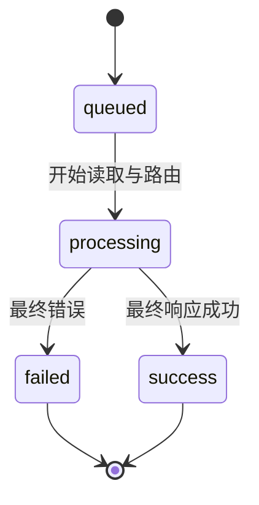
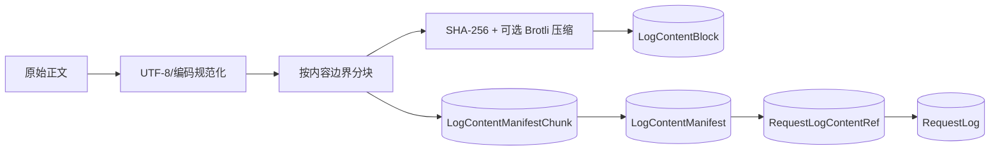

# 11. 可观测性与计费

> 需求前缀：`REQ-OBS`  
> 代码基线：`main@235da3f4`  
> 最后核对日期：2026-09-30  
> 目标：让每次代理请求可被定位、解释、统计和估算成本，并把正文存储、脱敏与访问控制的现状和差距写在明面

## 1. 观测目标

OpenCodex 的观测能力不是单纯的应用日志，而是围绕一次客户端请求建立可查询的业务链路：

```text
客户端主请求
  ├─ 渠道 attempt 1
  ├─ 渠道 attempt 2
  ├─ OCR 子请求（可选）
  ├─ Web Search 轮次（可选，记录在详情）
  └─ 最终客户端响应
```

`request_type` 当前有四个取值：`main`、`attempt`、`ocr`、`diagnostic`。管理台渠道连接测试是独立的顶层 `diagnostic` 日志，不在上述客户端链路内；模型发现当前不写请求日志。

观测系统必须回答：

- 请求是谁发起的、使用哪个访问 Key；
- 请求模型和上游模型分别是什么；
- 选择过哪些渠道，为什么跳过或失败；
- 是否流式、TTFT 和总耗时是多少；
- 输入、缓存、输出 Token 和成本是多少；
- 请求是否经过协议转换、工具、Web Search、图片或 OCR；
- 客户端看到的响应与上游响应有什么差异；
- 普通用户只能看自己的数据，超级管理员能看全局数据。

## 2. 观测对象和生命周期

### 2.1 主请求

主请求由客户端一次 HTTP 调用产生，`request_type=main`。它拥有：

- 请求 ID；
- 用户和访问 Key；
- 入口路径和协议；
- 请求/上游模型；
- 最终渠道和状态；
- 主体 Usage、成本和时序；
- 与 attempt、OCR 子请求的父子关系。

会话字段用于把同一客户端会话的多轮请求串起来，不参与正文恢复：

- `ConversationKey`：按优先级取 thread（`x-codex-turn-metadata.thread_id` 或 `thread-id`）、session（元数据 `session_id`、`session-id`、`x-claude-code-session-id`、`x-interaction-id`）、请求体 `prompt_cache_key`、`x-conversation-id`，分别带 `thread:`、`session:`、`prompt_cache_key:`、`conversation:` 前缀；
- `ConversationTurnId`：`x-codex-turn-metadata.turn_id`、`x-interaction-id`、`x-client-request-id`；
- `ConversationWindowId`：`x-codex-turn-metadata.window_id`、`x-codex-window-id`；
- `PreviousResponseId`：请求体 `previous_response_id` 原文。

### 2.2 渠道尝试

每次向候选渠道发起的调用生成 `request_type=attempt` 日志：

- 记录渠道 ID、类型、上游模型；
- 记录尝试耗时、状态码、代理侧错误文本、上游错误体和是否流式；
- 在 `ResponseBody` 槽位写入 attempt 元数据 JSON：`route_attempt_number`、`route_retry_number`、`configured_retry_count`、`channel_name`、`outcome`、`failover_eligible`；
- `failover_eligible` 表示失败发生在客户端流式响应写出之前且允许故障转移；内置工具已执行时不再转移；
- 可用于解释重试和故障转移；
- 不应被误计为额外的客户端业务请求。

主请求的列表与详情会按 `ParentRequestLogId` 聚合派生 `attempt_count` 和 `failed_attempt_count`；成功但存在失败尝试时，展示状态为 `success_with_retry`。这些是查询期派生值，不落库。

### 2.3 OCR 子请求

图片降级触发的视觉识别请求生成 `request_type=ocr`：

- 关联主请求；
- 记录输入图片来源类别、缓存标记、识别文本和描述；
- 记录上游视觉模型、耗时和错误；
- 成本是否并入主请求由计费策略定义；
- 详情权限与主请求一致。

OCR 缓存命中不写 `ocr` 日志：`ProxyOcrService` 只在非命中路径写入，缓存命中时只复用识别结果。

### 2.4 渠道诊断

管理台渠道连接测试生成 `request_type=diagnostic` 顶层日志：

- 该日志没有访问 Key（`ApiKeyId` 为空）；日志列表在 `request_type=diagnostic` 时把 Key 名称列固定显示为“连接测试”（`Logs.vue` 的 `formatApiKeyName`、`formatRequestType`）；
- 默认列表口径保留 diagnostic 日志，统计与最近错误流默认排除（`ObservabilityService.LogTypeFilterScope`）；
- 记录渠道配置、转换后请求、上游响应与错误；上游 API Key 与敏感 Header 按原文入库（见 §8）；
- 流式完成事件 `channel_test.completed` 发给浏览器时会把敏感键的值替换为 `...`；该替换只作用于 SSE 事件，不影响落库内容（`ChannelDiagnosticsService.RedactObject`）。

### 2.5 生命周期状态


```mermaid
stateDiagram-v2
    [*] --> queued
    queued --> processing: 开始读取与路由
    processing --> success: 最终响应成功
    processing --> failed: 最终错误
    failed --> [*]
    success --> [*]
```

`LifecycleStatus` 是业务状态，不能只根据 HTTP 状态码推断；例如某次 attempt 可能失败，但主请求经过故障转移后成功。

当前状态常量只有 `queued`、`processing`、`success`、`failed`。客户端取消没有单独的 `cancelled` 状态；流式取消会记录错误文本并按现有完成判定落为 `failed`。

## 3. 日志字段产品定义

### 3.1 基本字段

| 字段 | 展示/查询用途 | 权限与展示口径（当前实现） |
|---|---|---|
| request_id | 全链路定位 | 可复制，非秘密 |
| created_at | 时间筛选和排序 | 按用户时区展示 |
| method/path | 入口定位 | 路径可筛选 |
| client_ip | 网络排障 | 超级管理员/受控权限；`TBD` 是否默认展示 |
| model/upstream_model | 模型映射排障 | 用户范围隔离 |
| channel | 渠道排障 | 用户只能看自己的 |
| owner_username | 全局运营筛选 | 仅超级管理员 |
| api_key | Key 名称 | 返回 `api_key_name`（名称不是秘密）；`request_type=diagnostic` 固定显示“连接测试” |
| request_type | main/attempt/ocr/diagnostic | 用于链路树与过滤 |
| parent_request_log_id | 父子导航 | 按权限校验 |
| lifecycle_status | 成功/失败/处理中 | 与 HTTP 状态并列 |
| status_code | HTTP 结果 | 整数筛选 |
| error | 错误摘要 | 原文入库，不做脱敏；流式失败拼接终止原因与最后一行 SSE，整体截断到 2000 字符 |

`error` 的截断常量是 `StreamLogCapture.MaxErrorTextLength`（2000）。列表与详情只返回访问 Key 的名称，不返回 Key 秘密；请求正文中的凭证原文见 §8。

### 3.2 时序和性能字段

| 字段 | 定义 |
|---|---|
| `ProcessingStartedAt` | 进入核心处理时间 |
| `CompletedAt` | 请求完成或失败时间 |
| `DurationMs` | 完成减创建/开始的产品定义耗时 |
| `TtftMs` | 首个有效文本、Reasoning、工具或协议内容写出时间 |
| `IsStream` | 是否请求/响应流式 |

TTFT 不等同第一条空 SSE 行或连接建立时间。不同协议必须使用统一的有效内容定义，否则统计不可比较。

当前实体没有逐行或事件级流式时序字段：历史 `StreamLinesJson` 槽位、`RequestLogStreamLines` 与 `RequestLogDetails.StreamTimingsJson` 已随内容寻址迁移删除（`WriteLog_DoesNotPersistDetailedStreamTimings`）。流式失败只把终止原因与最后一行数据写入 `Error`，形如 `错误文本｜终止:<原因>｜最后SSE:<最后一行 data>`。

TPS 是前端按日志字段计算的派生值，不落库：端到端输出速度 = `OutputTokens / (DurationMs / 1000)`；生成速度 = `OutputTokens / ((DurationMs - TtftMs) / 1000)`，只在 `TtftMs` 有效且小于总耗时时可算（`frontend/src/logTps.js`）。日志列表的“输出速度”列与详情页同时展示这两个口径。

### 3.3 Usage 和成本字段

| 字段 | 含义 |
|---|---|
| InputTokens | 输入 Token |
| CachedTokens | 兼容汇总缓存 Token |
| CacheWriteTokens | 缓存写 Token |
| CacheReadTokens | 缓存读 Token |
| OutputTokens | 输出 Token |
| Cost | 按定价快照计算的金额 |
| CostCurrency | 币种，当前常见 USD |
| PricingModelInfoId | 使用的模型信息 |
| PricingPlanId | 使用的价格计划 |
| PricingSnapshotJson | 完成时价格规则快照 |

`PricingSnapshotJson` 的 `rules[]` 逐条记录 `billing_item`、`billing_mode`、`quantity`、`unit_price`、`cost` 与 `applied_phase`；顶层另有 `resolution`、`currency`、`cost`、`pricing_phase`、`phase_source`、`billing_instant`、`time_zone`、`matched_window`，可据此复算单次请求。

`REQ-OBS-001`（MUST）：当上游提供可解析 Usage 时，系统必须在主请求日志中保存统一字段；无法解析时必须标明缺失原因，不得用 0 冒充真实零用量。

当前差距：`ProxyLogService` 在 `usage` 缺失、字段不可解析或未知协议时直接写入 0，`RequestLog` 没有 Usage 完整性/缺失原因字段，因此当前不能区分“真实为 0”和“未取得 Usage”。

`REQ-OBS-002`（MUST）：成本计算必须基于请求完成时的定价快照，且能追溯到计费项、模式、单位价格和输入用量。

## 4. 内容寻址日志存储

### 4.1 保存槽位

当前枚举严格包含以下 7 个槽位（数值 1–7）：

| 槽位 | 当前写入内容 |
|---|---|
| `RequestHeaders` | 客户端请求头 |
| `RequestBody` | 原始正文，无法取得时为入口载荷序列化 |
| `UpstreamRequestBody` | 转换后请求 |
| `UpstreamResponseBody` | 上游响应 |
| `ResponseBody` | 客户端响应或错误响应 |
| `WebSearchJson` | Web Search 模拟详情 |
| `OcrJson` | OCR 元数据 |

`RequestBody` 优先保存入口原始字节解码出的原文（含 data URL/base64 图片与嵌套二进制），取不到原文时才退回序列化载荷。流式原始行槽位（历史 `StreamLinesJson`，数值 8）已移除：断流或失败时只把最后一行数据行与终止原因写入 `RequestLog.Error`。

当前没有按日志级别关闭正文槽位的实现：创建、处理中和完成阶段会写入所有可取得的槽位，`null` 槽位不建立引用。产品若需要“元数据-only”或分级日志，必须新增明确配置和验收。

### 4.2 编码和去重

当前实现采用内容寻址结构：


```mermaid
flowchart LR
    A["原始正文"] --> B["UTF-8/编码规范化"]
    B --> C["按内容边界分块"]
    C --> D["SHA-256 + 可选 Brotli 压缩"]
    D --> E[("LogContentBlock")]
    C --> F[("LogContentManifestChunk")]
    F --> G[("LogContentManifest")]
    G --> H[("RequestLogContentRef")]
    H --> I[("RequestLog")]
```

当前实现线索：

- 最小块约 2 KiB；
- 平均目标约 8 KiB；
- 最大块约 32 KiB；
- 压缩后更小时保存压缩数据，否则存原文（codec 为 `br` 或 `raw`）；
- Block 和 Manifest 的 `Sha256` 都有唯一索引，写入冲突时回滚到 savepoint、重查既有行后复用（幂等复用），且只对库中不存在的块执行 Brotli；
- 引用替换后清理不再被任何引用使用的清单与物理块。

正式产品要求：

1. 哈希校验失败必须让详情读取显式失败；
2. 内容寻址用于完整性和去重，不等于加密；
3. 删除请求日志时只删除无其他引用的共享内容；
4. 内容存储失败对主请求的影响必须定义（阻断、降级或异步补写）；
5. 必须有存储容量、孤立对象和损坏对象监控。

当前敏感信息差距：`ProxyRequestMetadataFactory` 会复制全部客户端请求头，`ProxyLogService` 随后把它们原样写入 `RequestHeaders`；请求体（含 data URL/base64 图片）也按原文写入 `RequestBody`。当前路径没有移除 `Authorization`、Cookie 或自定义敏感 Header，也没有图片正文占位符。因此内容寻址、压缩和去重不等于脱敏，数据库读取者可接触到明文凭证。

`REQ-OBS-003`（MUST）：详细正文的保存、读取、删除和重组必须保持引用完整性，任何损坏不得静默返回错误正文。

## 5. 日志查询和详情

### 5.1 列表查询

管理台支持：

- 时间范围和自定义时间；
- 请求 ID、会话键、Turn ID、窗口 ID、上一响应 ID；
- 模型、上游模型、渠道、路径、状态码；
- 请求类型、流式标记、生命周期状态；
- 超级管理员按用户筛选；
- API Key 名称筛选；
- 分页、排序、列显示设置；
- `/logs/stream` 实时更新开关（开启/关闭），事件到达时刷新当前页与统计并保留筛选与分页。

查询规则：

- 普通用户的所有过滤条件仍受 Owner 约束；
- 文本联想至少 2 个字符并带防抖；
- 高级过滤修改后需显式应用；
- 请求失败时恢复上次有效过滤器和列表；
- 空结果要显示空态而不是错误；
- 大时间范围和高基数字段要防止无界查询。

当前列表 `page_size` 被服务端限制为 1–200，过滤候选最多返回 200 项；统计的聚合（分组、求和、TTFT 与缓存命中率的分子分母）已下推到数据库，只有汇率折算与补空桶在内存侧完成，自定义时间范围按约 72 个时间桶选择粒度。

### 5.2 详情

详情至少展示：

- 请求状态、类型、父日志和关联子日志；
- 请求、上游模型和渠道；
- 状态码、耗时、TTFT、Token、成本；
- 创建、开始处理、完成时间；
- 错误摘要；
- 请求头；
- 原始请求、上游请求、上游响应、客户端响应；
- OCR 元数据与 Web Search 详情（若存在）；
- 复制和关联日志跳转。

详情与列表当前都不返回 `PricingSnapshotJson` 或计费时段字段，成本只展示 `cost` 与 `cost_currency`（按计费时段展示见 REQ-OBS-022）。

详情读取在服务端一次性重组全部槽位（含 Brotli 解压）并在前端一次性渲染，没有分页或懒加载；超大正文会整块解压、整块渲染。

`REQ-OBS-004`（MUST）：读取日志详情必须在服务端验证日志 Owner 或超级管理员权限，不能只凭前端传入日志 ID。

`REQ-OBS-005`（MUST）：主请求详情必须能导航到所有关联 attempt 和 OCR 子日志，子日志也能返回主请求。

### 5.3 清空日志

当前只有超级管理员可清空全部日志（控制器 `RequireSuperadmin` 加服务层角色校验），前端需要二次确认。`ClearLogs` 在同一个显式事务里按外键依赖顺序执行 6 次 `ExecuteDelete`：

1. Web Search 续传记录（`WebSearchContinuationEntries`）；
2. 日志内容引用（`RequestLogContentRefs`）；
3. 清单块（`LogContentManifestChunks`）；
4. 请求日志（`RequestLogs`）；
5. 清单（`LogContentManifests`）；
6. 物理块（`LogContentBlocks`）。

返回 `deleted_logs`、`deleted_content_refs`、`deleted_content_blocks`、`deleted_web_search_continuations` 四个计数；清空后统计与成本历史随日志一并消失。

正式产品需要确认是否提供：

- 按时间清理；
- 按用户清理；
- 只清正文、保留元数据；
- 清理前导出；
- 审计记录和不可抵赖确认。

## 6. 仪表盘统计

### 6.1 摘要指标

- 总请求数；
- 成功请求数；
- 最近一小时请求数；
- 输入、缓存、输出 Token 与总 Token（总 Token = 输入 + 输出）；
- 总成本和最近一小时成本；
- CNY/USD 双币展示；
- RPM、TPM；
- 5/10/30/60 秒自动刷新（Dashboard 页面）。

### 6.2 图表

- 请求模型分布；
- 错误状态码和渠道分布；
- 成本趋势；
- Token 趋势；
- TTFT 趋势；
- 缓存命中率；
- RPM 趋势。

图表必须明确：

- 时间桶宽度；
- 是否包含 attempt/OCR/diagnostic；
- 成本币种转换来源；
- 缺失 Usage 的处理；
- 无数据和查询失败状态；
- 时区和夏令时规则。

当前统计口径：没有显式 `request_type` 过滤时同时排除 `attempt` 与 `diagnostic`，保留 `main`、`ocr` 和旧数据中的空类型（`ExcludedFromStatsPredicate`）；显式选择某个 `request_type` 时按该类型统计。最近错误流使用同一排除口径但只取失败记录。因而“请求数”和“总成本”是业务流量口径，不等于纯客户端主请求。

总 Token 口径当前是 `InputTokens + OutputTokens`（摘要 `total_tokens`、最近 Token、TPM 与时间桶一致），`CachedTokens` 单独展示、不重复计入总量；缓存命中率仍按 `CachedTokens / (InputTokens + CachedTokens)` 计算。`CachedTokens` 是输入侧的缓存汇总值，不是独立的第四类用量。

成本按 `CostCurrency` 分组后在展示层折算：单条日志保留原始币种与金额，摘要与时间桶使用系统设置 `usd_cny_rate`（默认 7.25）同时给出 `cost_cny` 与 `cost_usd`，前端以 `¥x/$y` 双币展示；非 CNY 币种当前按美元口径折算。

### 6.3 实时队列和错误流

当前管理台有四条实时 SSE，全部是事件驱动推送（初始快照 + 事件去抖 300 ms + 心跳 15 秒），不再按固定间隔轮询：

| 流 | 事件源 | 推送内容 |
|---|---|---|
| `/channels/runtime/stream` | 渠道容量变化 | 渠道运行时快照 |
| `/monitor/active-channels/stream` | 渠道容量变化 | 活跃渠道与处理中计数 |
| `/monitor/recent-errors/stream` | 失败请求日志写入 | 最近错误摘要 |
| `/logs/stream` | 任意请求日志写入 | 轻量通知，前端刷新当前页并保留筛选与分页 |

前端状态机是 `idle`、`connecting`、`live`、`disconnected`：Dashboard 映射为“连接中”“实时更新中”“未连接”；断线按 1 秒起步的指数退避自动重连（上限 30 秒、±20% 抖动），45 秒没有事件视为断线，页面重新可见时立即重试。实时流断开不能阻断普通日志查询和统计查询。

`REQ-OBS-006`（MUST）：实时 SSE 断开时管理台必须显示未连接状态，并允许通过自动重连或刷新恢复；不得将旧数据伪装为实时数据。

## 7. 计费模型

### 7.1 价格继承

当前有效价格解析以请求模型为主、上游模型仅做旧数据兼容回退：

1. 若渠道模型覆盖按 `ChannelId + RequestModel` 命中启用的 `ChannelModelInfo`，使用该渠道模型自己的启用计划；显式配置的 `MatchType/MatchPatternsJson` 继续作为请求模型别名匹配；
2. 请求模型未命中时，兼容回退到 `channel_id + upstream_model` 精确匹配旧 `ChannelModelInfo`；
3. 没有渠道模型覆盖时，全局 `ModelInfo` 优先按请求模型匹配（`exact → prefix → suffix → contains`，模式长度/供应商排序）；
4. 请求模型未命中全局目录时，兼容回退到上游模型的全局匹配。

回退命中时计费快照的 `resolution` 分别记录 `channel_model_override_upstream_fallback` 和 `global_model_match_upstream_fallback`，避免与请求模型命中混淆。

当前没有独立的“渠道级价格计划”回退，也不读取 `ChannelModelMapping.PricingMode/PricingPlanId`。内置和旧版价格需要先播种/迁移为全局模型计划才会参与该解析。若命中渠道模型但没有有效计划，当前会继续回退到全局模型匹配（`CalculateCostFallsBackToGlobalPricingWhenChannelModelInfoHasNoPricing`），快照的 `channel_model_info_id` 为 null；只有全局也未命中或计划没有规则时才生成零成本快照。

### 7.2 计费项和模式

| 计费项 | 适用用量 |
|---|---|
| Input | 输入 Token 或按次；token 模式下用量为 `InputTokens - CacheWriteTokens - CacheReadTokens`（不小于 0） |
| Output | 输出 Token 或按次 |
| Cache write | 缓存写 Token |
| Cache read | 缓存读 Token |

| 模式 | 公式概念 |
|---|---|
| `per_request` | 每次完成请求固定价格 |
| `per_million_tokens` | `tokens / 1,000,000 × unit_price` |
| `tiered_tokens` | 按上下文窗口档位计费：用本次请求的 `InputTokens` 选出第一个 `up_to >= 输入长度` 的档（无上限档兜底），整段用量乘该档单价，不再分段累乘；所有计费项共用输入长度选档 |

### 7.3 成本边界

- 每条 main、attempt、ocr、diagnostic 日志都会独立尝试解析 Usage 和计算成本；默认统计排除 attempt 与 diagnostic，因此这两类成本通常不进入仪表盘，显式筛选时会计入；
- OCR 子请求会写自己的 Usage、价格快照和成本，且默认统计包含 OCR；该成本不会合并进主请求的 `Cost` 字段；
- Web Search Tavily 成本是否计入模型成本：当前不等同模型价格，需单独定义；
- 价格或模型未匹配、计划无规则时，当前仍保存 `Cost=0`、`CostCurrency=USD` 和带 `resolution` 的零成本 `PricingSnapshotJson`；顶层没有“未知成本”布尔状态；
- 多币种汇率来源和更新时间为 `TBD`；
- 历史日志必须保留计算依据。

`REQ-OBS-007`（MUST）：成本展示必须同时展示币种和“已计算/未知/部分 Usage”等状态，不能把缺少价格或 Usage 的金额显示成确定账单。

### 7.4 峰谷分时定价（已实现）

- 价格计划（全局模型计划与渠道模型覆盖计划共用同一形状）带 `TimeZoneId` 与谷段窗口 `OffPeakWindowsJson`：本地时间 `HH:mm`、ISO 星期、跨午夜按起始日拆分、写入时规范化去重排序；窗口上限 24 条按输入条数计，拆分后可能翻倍；
- 计费时刻取请求进入网关的时刻（`RequestLog.CreatedAt`，缺失或越界时退回当前时刻并把实际值写入快照 `billing_instant`），每个请求只判定一次时段，所有计费项共用同一个 `pricing_phase`；
- 峰谷使用绝对单价：默认 `UnitPrice`/`TiersJson` 是峰价，开启峰谷后 `OffPeakUnitPrice`/`OffPeakTiersJson` 是谷价；未开启峰谷开关的计费项即使落在谷段也按峰价，快照里记 `applied_phase=peak`；
- 快照字段：`pricing_phase`（peak/off_peak）、`phase_source`（disabled/window_hit/window_miss/time_zone_unresolved）、`billing_instant`、`time_zone`、`matched_window`、`rules[].applied_phase`；
- 时区无法解析时按峰价计费并记录 `time_zone_unresolved`；时段判定不进入定价缓存（`PricingCacheDoesNotFreezePricingPhase`）。

尚未实现（TBD）：日志详情页不展示 `pricing_phase` 或价格快照；也没有只读的价格试算端点，只能通过真实请求或既有 `CalculateCostAsync` 观察结果（见 REQ-OBS-022、REQ-OBS-023）。

## 8. 脱敏和访问控制

### 8.1 脱敏现状与要求

当前没有日志脱敏层（现状）：

- `ProxyRequestMetadataFactory` 把客户端请求头整表复制为 `RequestHeaders`，`ProxyLogService` 原样写入内容存储；`Authorization`、Cookie、自定义敏感 Header 都按原文落库；
- 请求体保存入口原始 JSON 字节，data URL 图片、`b64_json` 和嵌套授权字段（`authorization`、`authorization_token`、`Bearer ...`）都按原文落库，并有测试断言（`ProxyLogServiceTests.WriteLog_PreservesNestedMcpAuthorizationTokens`、`WriteLog_PreservesNestedImageDataInObjectsAndArrays`、`ChannelDiagnosticsLogTests.TestChannelStreamWritesCompleteRequestLogContent`）；
- 唯一的占位符替换在渠道诊断 SSE 完成事件 `channel_test.completed`：`ChannelDiagnosticsService.RedactObject` 把敏感键的值替换为 `...`（`ChannelDiagnosticsLogTests.TestChannelStreamEmitsDiagnosticDetailEvent` 断言事件体不含上游 Key），该替换不作用于落库内容；
- 内容寻址、Brotli 压缩和去重不等于脱敏。

产品化要求（尚未实现）：

- Authorization、API Key、apikey、x-api-key、Cookie、密码、Data Protection 相关秘密、上游自定义敏感 Header 必须按策略脱敏或隔离；
- 导入/导出文件中的不必要凭证必须移除；
- 脱敏不得降低访问权限，也不得改变客户端可见响应。

当前没有按日志等级裁剪正文的配置：创建、处理与完成阶段都会写入全部可取得槽位（见 §4.1）；若要引入等级化正文保存，必须同时定义脱敏与访问控制。

### 8.2 角色范围

| 操作 | 普通用户 | 超级管理员 |
|---|---:|---:|
| 查看自己的日志 | 是 | 是 |
| 查看其他用户日志 | 否 | 是 |
| 查看日志详情 | 仅自己的 | 全部 |
| 查看全局统计 | 否 | 是 |
| 查看实时全局队列 | 仅自己的范围 | 全部 |
| 清空日志 | 否 | 是 |
| 导出含正文日志 | 按权限/策略 | 按策略 |

## 9. 性能、容量和保留

当前实现有部分保护：

- `StreamResponseCapture` 对同协议流重建的逻辑响应默认限制约 1 MiB、集合 256 项、单个待解析 SSE 数据约 256 KiB；
- `ProxyStreamService` 不再保存逐行 SSE：`StreamLogCapture` 只保留最后一行数据行与终止原因（常量级内存），因此长流不再造成日志与内存放大；
- 流式失败错误文本（终止原因 + 最后一行数据）上限 2000 字符（`StreamLogCapture.MaxErrorTextLength`）；
- 日志详情一次性重组并解压全部槽位、前端一次性渲染，正文没有分页或懒加载；
- 上游客户端与上游模型客户端每主机约 100；
- Web Search 客户端（Tavily、Keenable）约 50，模型目录同步客户端约 10。

正式产品必须确认：

- 单请求正文最大保存量；
- 单个日志总内容上限；
- 单实例日志量和查询响应时间；
- 保留期、归档和自动删除；
- 存储容量告警阈值；
- 大查询是否异步导出；
- SSE 长连接最大时长。

`REQ-OBS-008`（MUST）：日志和统计查询必须有分页、时间范围或容量边界，不能因用户传入极大范围导致无界内存加载。

`REQ-OBS-009`（SHOULD）：系统应提供日志存储使用量、正文块去重率、孤立块数量和最近清理时间等运维指标。

## 10. 可观测性需求与验收

| 编号 | 级别 | 需求 | 验收 |
|---|---|---|---|
| `REQ-OBS-010` | MUST | 主请求、attempt、OCR 形成可导航链路 | 构造重试+图片请求并检查父子关系 |
| `REQ-OBS-011` | MUST | 流式请求记录 TTFT、结束状态和关键时序 | 三协议流式测试 |
| `REQ-OBS-012` | MUST | 原始、上游、客户端正文槽位按权限读取 | 普通/超级管理员越权测试 |
| `REQ-OBS-013` | MUST | 内容寻址正文可重组并校验 SHA-256 | Block/Manifest 单元测试 |
| `REQ-OBS-014` | MUST | 统计不重复计算 attempt 为客户端请求 | 主请求+多尝试统计测试 |
| `REQ-OBS-015` | MUST | 成本保留价格快照 | 修改价格后历史日志不变 |
| `REQ-OBS-016` | MUST | 实时 SSE 断开显示未连接 | 断开/重连 E2E |
| `REQ-OBS-017` | MUST | 日志过滤始终受 Owner 约束 | 构造跨用户 ID 查询 |
| `REQ-OBS-018` | MUST | 清空日志有权限和二次确认 | 普通用户拒绝，超级管理员确认 |
| `REQ-OBS-019` | SHOULD | 支持结构化导出和受控正文导出 | 权限、脱敏和大数据量测试 |
| `REQ-OBS-020` | SHOULD | readiness 与观测指标可区分 | 数据库/Redis 故障测试 |

### 10.1 追加需求（峰谷分时定价与追溯）

`REQ-OBS-021`（MUST，CURRENT）：峰谷分时定价必须按请求进入网关的时刻判定时段，峰价与谷价都使用绝对单价，并把判定依据写入价格快照。价格计划带 IANA 时区与规范化谷段窗口（上限 24 条按输入条数计，跨午夜按起始日拆分，拆分后可能翻倍）；每个请求只判定一次时段，所有计费项共用；未开启峰谷的计费项在谷段仍按峰价；快照写入 `pricing_phase`、`phase_source`、`billing_instant`、`time_zone`、`matched_window` 与 `rules[].applied_phase`。验收：`ModelCatalogServiceTests.PricingSnapshotRecordsPhaseDetails`、`OffPeakWindowSwitchesUnitPrice`、`OffPeakWindowUsesHalfOpenBoundaries`、`CrossMidnightWindowFollowsStartDayWeekdays`、`TimeZoneDecidesPricingPhase`、`TieredOffPeakUsesOffPeakTiers`、`TieredTokensSelectsTierByContextWindow`、`PricingCacheDoesNotFreezePricingPhase`、`UnresolvableTimeZoneFallsBackToPeakPrice`。

`REQ-OBS-022`（SHOULD，TBD）：日志详情页与详情接口应展示计费时段（`pricing_phase`/`phase_source`）与价格快照，便于按账单解释单次请求。当前 `RequestLogDto`/`LogDetailResponse` 不返回价格快照或时段字段，`Logs.vue` 只展示 `cost` 与 `cost_currency`；`ObservabilityServiceTests.LogsPage_ProjectionDoesNotReadPricingSnapshotJson` 固化了列表不读取快照的现状。

`REQ-OBS-023`（SHOULD，TBD）：应提供只读价格试算端点（按模型 + 用量 + 时刻返回命中计划、峰谷判定与分项金额）。当前 `ModelCatalogController` 只有模型目录、导入导出与同步路由，没有试算接口，也没有对应页面；只能通过真实请求后查看落账快照或直接调用 `ModelCatalogService.CalculateCostAsync`。

`REQ-OBS-024`（MUST，TBD）：峰谷计费需求必须登记到 `prd/18` 追溯索引。本轮只更新 `prd/11`；`prd/18` 的 `REQ-OBS` 仍为 20 条，尚未收录 021–024。

## 11. 源码追溯

| 区域 | 位置 |
|---|---|
| 日志控制器 | `opencodex_proxy/src/Presentation/OpenCodex.Api/Controllers/ObservabilityController.cs` |
| 实时推送 | `OpenCodex.Api/Services/RealtimeStreamService.cs`、`OpenCodex.Api/Controllers/RealtimeStreamController.cs` |
| 日志写入 | `OpenCodex.Core/Services/Proxy/ProxyLogService.cs` |
| 流式日志捕获 | `OpenCodex.Core/Services/Proxy/StreamLogCapture.cs` |
| 历史流式行清理 | `OpenCodex.Core/Services/LogMaintenance/StreamLineLogCleanupService.cs` |
| 内容编码 | `OpenCodex.Core/Services/Proxy/LogContentCodec.cs` |
| 内容存储 | `OpenCodex.Core/Services/Proxy/LogContentStore.cs` |
| 统计服务 | `OpenCodex.Core/Services/ObservabilityService.cs` |
| 渠道诊断日志 | `OpenCodex.Core/Services/ChannelDiagnosticsService.cs` |
| 请求实体 | `OpenCodex.Domain/Domain/RequestLog.cs` |
| 内容实体 | `OpenCodex.Domain/Domain/LogContent.cs` |
| 内容寻址迁移 | `OpenCodex.Data/Migrations/SqliteMigrations/20260810233458_ContentAddressedLogs.cs`、`OpenCodex.Data/Migrations/PostgresMigrations/20260810233510_ContentAddressedLogs.cs` |
| 峰谷迁移 | `OpenCodex.Data/Migrations/SqliteMigrations/20260827065350_PricingPeakOffPeak.cs`、`OpenCodex.Data/Migrations/PostgresMigrations/20260827065604_PricingPeakOffPeak.cs` |
| 仪表盘 | `frontend/src/Dashboard.vue` |
| 日志页面 | `frontend/src/Logs.vue`、`frontend/src/logTps.js` |
| 实时客户端 | `frontend/src/api/sseClient.js` |
| 定价与成本解析 | `OpenCodex.Core/Services/ModelCatalogService.cs` |
| 峰谷窗口与快照 | `OpenCodex.CoreBase/Domain/Models/ModelPricingCalculation.cs`（`PricingWindowCalendar`、`ModelPricingSnapshot`） |
| 价格页面 | `frontend/src/ModelCatalog.vue`、`frontend/src/Channels.vue`、`frontend/src/pricingOffPeak.js` |
| 测试 | `ObservabilityServiceTests.cs`、`ObservabilityControllerTests.cs`、`ObservabilityDiagnosticLogFilterTests.cs`、`LogContentCodecTests.cs`、`LogContentStoreTests.cs`、`ProxyLogServiceTests.cs`、`RealtimeStreamServiceTests.cs`、`StreamLineLogCleanupServiceTests.cs`、`ChannelDiagnosticsLogTests.cs`、`ModelCatalogServiceTests.cs`、`logTps.test.js`、`pricingOffPeak.test.js`、`sseClient.test.js` |
