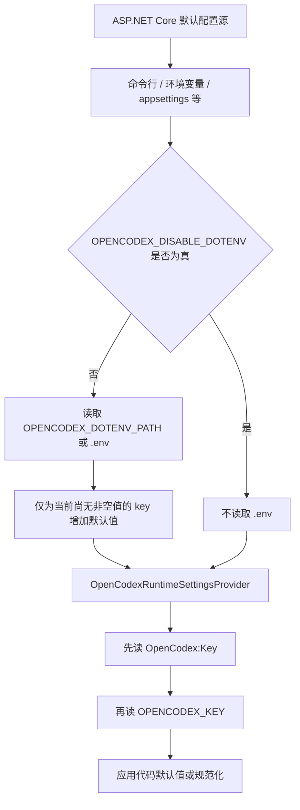
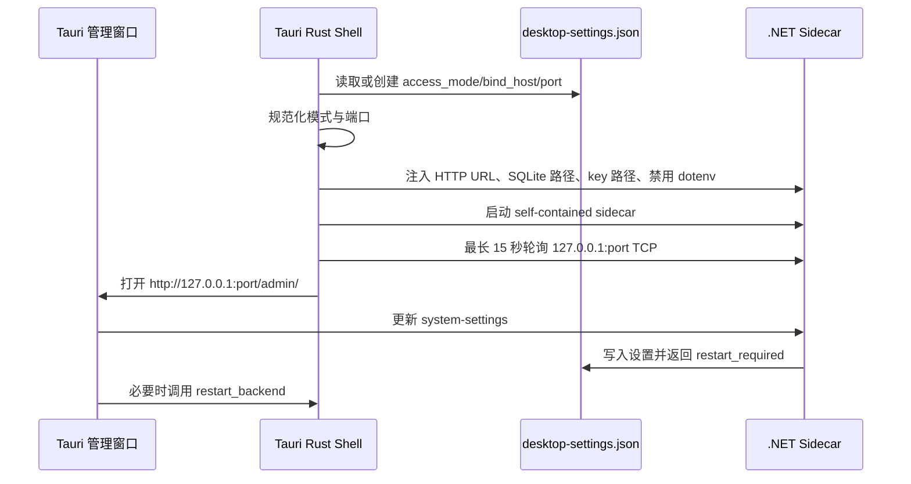

# 12. 配置管理需求

## 1. 文档元数据

| 字段 | 内容 |
|---|---|
| 文档编号 | PRD-CFG-012 |
| 需求编号前缀 | `REQ-CFG` |
| 产品 | OpenCodex Proxy |
| 基线提交 | `3827590eb33acb67dd063054c4a36d2b87b09002` |
| 文档状态 | 当前实现基线审计 + 目标要求 |
| 最后核对日期 | 2026-08-17 |
| 事实来源 | 当前源码、`.env.example`、Docker Compose、Tauri 启动代码、配置与路由测试 |
| 目标读者 | 产品、后端、桌面端、运维、测试、安全负责人 |

### 1.1 事实标签

本文使用以下标签，防止把规划误写成已实现能力：

- **当前实现基线**：可由基线提交中的执行源码或测试直接确认。
- **目标要求**：产品期望行为，可能尚未实现，必须通过对应验收标准后才可宣称完成。
- **TBD**：尚待产品、运维或安全负责人决策，本文不虚构默认值。
- **风险**：当前行为可能造成安全、可靠性、兼容性或运维问题。

---

## 2. 范围

### 2.1 本文覆盖

1. ASP.NET Core 配置源、优先级与 `.env` 加载规则；
2. 数据库、Redis、管理员、Cookie、Data Protection、超时、OCR 目录等运行时配置；
3. 本地开发、Docker SQLite、Docker PostgreSQL + Redis、Tauri 桌面端四类运行模式；
4. 桌面系统设置：访问模式、绑定地址、端口、探测请求拦截；
5. 渠道配置的结构、默认值、验证、环境变量展开与特殊约束；
6. 配置失败、依赖不可用时的降级语义；
7. 配置安全、变更审计、文档一致性和可维护性要求。

### 2.2 本文不展开

- 用户和角色的完整业务流程，见用户与权限章节；
- 协议字段转换细节，见协议转换章节；
- 数据表与迁移细节，见 [14-data-and-migrations.md](./14-data-and-migrations.md)；
- Docker、桌面安装包与远程发布步骤，见部署与发布章节；
- 全量非功能指标，见 [13-non-functional-requirements.md](./13-non-functional-requirements.md)。

---

## 3. 配置分层与解析模型

### 3.1 当前实现基线

`DotEnvDefaults.Load` 在读取 `.env` 时遵循以下规则：

1. 文件不存在时静默返回空集合；
2. 忽略空行和以 `#` 开头的注释；
3. 接受 `export KEY=value`；
4. 只按第一个 `=` 分隔；
5. 去除整值两侧成对的单引号或双引号；
6. 若 ASP.NET Core 当前配置中同名 key 已有非空值，则 `.env` 不覆盖；
7. 不执行 shell 转义、变量插值或多行值解析；
8. 桌面 sidecar 显式设置 `OPENCODEX_DISABLE_DOTENV=true`，因此桌面端不读取工作目录 `.env`。

### 3.2 配置优先级

从产品契约角度，优先级应描述为：

| 优先级 | 配置来源 | 当前实现基线 | 备注 |
|---:|---|---|---|
| 1 | `OpenCodex:*` 配置键 | 是 | 运行时读取时优先于对应 `OPENCODEX_*`；可由 `OpenCodex__Key` 环境变量映射 |
| 2 | `OPENCODEX_*` 环境变量 | 是 | Docker、Tauri sidecar 和常规服务部署的主要入口 |
| 3 | `.env` | 是，桌面端除外 | 只补充启动时尚无非空值的 key |
| 4 | 代码默认值 | 是 | 非法正整数目前通常静默回退默认值，而非启动失败 |
| 特殊 | Docker Compose `environment` | 是 | 会覆盖 `env_file` 中同名变量 |
| 特殊 | Tauri sidecar 注入 | 是 | 强制 SQLite、HTTP 监听地址、数据目录和禁用 `.env` |

**风险：** 当前没有一个面向管理员的“有效配置快照”接口，运维人员难以确认最终值来自何处；连接字符串和秘密值也不能直接原样展示，因此目标能力必须同时满足可诊断与脱敏。

---

## 4. 运行时配置目录

### 4.1 公共运行时配置表

| 配置项 | 对应主键 | 环境变量 | 当前默认值 | 当前验证/规范化 | 敏感性 | 运行时影响 |
|---|---|---|---|---|---|---|
| 数据库提供程序 | `OpenCodex:DbProvider` | `OPENCODEX_DB_PROVIDER` | `sqlite` | trim、小写；`postgresql`/`pgsql` 仅在 DbContext 工厂中归一为 `postgres` | 低 | 决定 SQLite 或 PostgreSQL DbContext 与迁移集 |
| 数据库连接串 | `OpenCodex:DbConnectionString` | `OPENCODEX_DB_CONNECTION_STRING` | `Data Source=logs/opencodex.db` | 仅 trim；连接阶段才验证 | 高 | 主数据、配置、日志、用户和密钥元数据持久化 |
| 管理员用户名 | `OpenCodex:AdminUsername` | `OPENCODEX_ADMIN_USERNAME` | `admin` | 空白回退 `admin` | 中 | 环境变量超级管理员身份 |
| 管理员密码 | `OpenCodex:AdminPassword` | `OPENCODEX_ADMIN_PASSWORD` | 空字符串 | 仅 trim；当前运行时 provider 不强制非空 | 高 | 环境变量超级管理员登录；桌面首次初始化可不依赖该值 |
| 默认上游超时 | `OpenCodex:DefaultTimeout` | `OPENCODEX_DEFAULT_TIMEOUT` | `120` 秒 | 必须可解析且 `>0`，否则静默回退 120 | 低 | 渠道未显式配置时的默认 HTTP 超时 |
| OCR 缓存目录 | `OpenCodex:OcrCacheDir` | `OPENCODEX_OCR_CACHE_DIR` | `ocr-cache` | 空白由设置对象归一为默认值 | 中 | OCR 中间缓存路径；本地 OCR 能力边界另行定义 |
| Redis 连接串 | `OpenCodex:RedisConnection` | `OPENCODEX_REDIS_CONNECTION` | 空 | trim；空表示禁用 | 高 | L2 缓存、跨实例失效、亲和、容量、熔断共享状态 |
| Redis key 前缀 | `OpenCodex:RedisPrefix` | `OPENCODEX_REDIS_PREFIX` | `opencodex` | trim；空白回退默认值 | 中 | 多环境 Redis key 与 Pub/Sub 频道隔离 |
| 通用缓存 TTL | `OpenCodex:CacheDefaultTtlSeconds` | `OPENCODEX_CACHE_DEFAULT_TTL_SECONDS` | `300` 秒 | 必须可解析且 `>0`，否则静默回退 300 | 低 | 两级缓存未单独指定 TTL 时使用 |
| Cookie 有效期 | `OpenCodex:AdminCookieDays` | `OPENCODEX_ADMIN_COOKIE_DAYS` | `30` 天 | 必须可解析且 `>0`，否则回退 30 | 中 | 管理台 Cookie 过期时间与滑动续期 |
| Cookie 隔离秘密 | `OpenCodex:SecretKey` | `OPENCODEX_SECRET_KEY` | `change-me-session-secret` | trim；空白仍回退示例值 | 高 | 经 SHA-256 派生 Data Protection ApplicationName |
| Data Protection key 目录 | `OpenCodex:DataProtectionKeysPath` | `OPENCODEX_DATA_PROTECTION_KEYS_PATH` | `logs/.keys` | 转绝对路径并自动创建目录 | 高 | Cookie 加解密密钥持久化 |

### 4.2 启动与桌面内部配置

| 配置项 | 当前默认/来源 | 当前用途 | 对外文档状态 |
|---|---|---|---|
| `OPENCODEX_DISABLE_DOTENV` | false；桌面注入 true | 禁用 `.env` 补充加载 | README 未说明 |
| `OPENCODEX_DOTENV_PATH` | `.env` | 指定替代 dotenv 文件 | README 未说明 |
| `OPENCODEX_CONTENT_ROOT` | 未设置 | 指定静态资源 content root；特殊值 `APP_CONTEXT_BASE_DIRECTORY` | README 未说明 |
| `OPENCODEX_DESKTOP_SETTINGS_PATH` | 非桌面为空 | 桌面设置 JSON 路径，并标识 `managed_by_desktop` | README 未说明 |
| `OPENCODEX_DESKTOP_BIND_HOST` | `127.0.0.1` | 推断桌面访问模式 | README 未说明 |
| `OPENCODEX_DESKTOP_PORT` | `18080` | 推断桌面端口 | README 未说明 |
| `OPENCODEX_DESKTOP_TARGET` | 构建脚本按当前平台推断 | 选择 sidecar RID/三元组 | README 仅描述构建命令，未列完整值 |
| `ASPNETCORE_URLS` | 模式相关 | Kestrel 监听 URL | 由启动配置或 Tauri 注入 |
| `ASPNETCORE_ENVIRONMENT` | 本地 Development；容器/桌面 Production | Swagger、静态文件和环境行为 | 分散在 launch profile、Dockerfile、Tauri |
| `TZ` | `.env.example` 为 `Asia/Shanghai` | 容器/进程时区 | 应视部署环境配置，不由业务设置 provider 读取 |
| `Logging__LogLevel__Microsoft.EntityFrameworkCore.Database.Command` | Compose 为 `Warning` | 降低 EF SQL 命令日志噪声 | 仅 Compose 中存在 |
| `DOCKER_LOG_MAX_SIZE` | `50m` | Docker json-file 单文件轮转上限 | 部署脚本/Compose |
| `DOCKER_LOG_MAX_FILE` | `5` | Docker json-file 保留文件数 | 部署脚本/Compose |

### 4.3 README 配置漂移

| 文档内容 | 当前实现事实 | 判定 |
|---|---|---|
| README 与 DEPLOYMENT 手动示例使用 `OPENCODEX_DB_PATH` | 当前源码不读取该变量；应使用 `OPENCODEX_DB_PROVIDER` + `OPENCODEX_DB_CONNECTION_STRING` | **风险：陈旧配置会被静默忽略** |
| README/DEPLOYMENT 描述 `BASIC`、`DEBUG`、`TRACE` 日志展示等级 | 当前基线未发现 `OPENCODEX_LOG_VIEW_LEVEL`、`OPENCODEX_LOG_LEVEL` 或对应运行时设置 | **风险：文档宣称能力与实现不一致** |
| README 未列 Redis、数据库 provider/connection string | `.env.example` 和生产 Compose 已使用这些配置 | **缺失** |
| README 未列桌面内部变量 | Tauri sidecar 依赖这些变量启动 | **缺失，但其中多数应标为内部变量而非普通用户选项** |

---

## 5. 桌面系统设置

### 5.1 设置模型

| 字段 | API JSON | 当前默认值 | 合法值/范围 | 保存位置 | 生效方式 |
|---|---|---|---|---|---|
| 访问模式 | `access_mode` | `localhost` | `localhost`、`local`、`lan`、`network`；保存时规范为 `localhost`/`lan` | `desktop-settings.json` | 改变时返回 `restart_required=true` |
| 绑定地址 | `bind_host` | `127.0.0.1` | 仅接受 `127.0.0.1`/`localhost` 或 `0.0.0.0`，并由访问模式重新计算 | 同上 | 改变时需重启 sidecar |
| 端口 | `port` | `18080` | `1024..65535` | 同上 | 改变时需重启 sidecar |
| 探测请求拦截 | `intercept_probe_requests` | `false` | boolean | 同上 | 当前控制器每次请求读取，理论上无需重启 |

### 5.2 权限与 API

- `GET /system-settings` 与 `PUT /system-settings` 仅超级管理员可用；
- 非法访问模式或端口返回 HTTP 400 业务错误；
- `admin_url` 始终返回 `http://127.0.0.1:{port}/admin/`，即使服务以 LAN 模式监听；
- `managed_by_desktop` 仅依据是否配置 `OPENCODEX_DESKTOP_SETTINGS_PATH`；
- `restart_required` 只比较访问模式、绑定地址和端口，不因探测请求拦截变化而置为 true。

### 5.3 桌面运行模式

### 5.4 当前桌面设置风险

1. Rust `DesktopSettings` 结构当前只包含 `access_mode`、`bind_host`、`port`，不包含 `.NET` 新增的 `intercept_probe_requests`；Rust 读取后会忽略该字段并重新写文件，因此桌面启动或重启可能丢失该设置。
2. LAN 模式使用 `http://0.0.0.0:{port}`，没有内建 TLS；Cookie 的 `SecurePolicy=SameAsRequest` 意味着 HTTP 下 Cookie 不带 Secure。
3. sidecar 只通过 TCP 端口判断启动成功，不验证 `/health`、数据库迁移、静态资源或管理台可用性。
4. 桌面设置文件损坏时，Rust 端会回退默认值并覆盖文件；`.NET` 端直接反序列化，若独立调用时文件 JSON 损坏可能抛异常。两端容错语义不一致。

---

## 6. 运行模式差异

| 维度 | 本地开发 | Docker SQLite | Docker PostgreSQL + Redis | Tauri 桌面 |
|---|---|---|---|---|
| 默认监听 | `https://localhost:8443` launch profile | 容器 8080，宿主 `127.0.0.1:8002` | 容器 8080，宿主默认 `127.0.0.1:8002` | HTTP `127.0.0.1:18080` 或 `0.0.0.0:port` |
| `.env` | 默认读取当前目录 `.env` | `env_file: .env` | `env_file: .env` | 显式禁用 |
| 数据库 | 默认 SQLite，可配置 PostgreSQL | 强制 SQLite 连接串 | Compose 强制 PostgreSQL 连接串 | 强制 SQLite，位于 app data/logs |
| Redis | 可选 | 默认未启用 | 强制 `redis:6379` | 未注入，默认禁用 |
| Data Protection key | 默认 `logs/.keys` 或配置路径 | 应挂载到 `/app/logs` | 应挂载到 `/app/logs` | app data/keys |
| 静态资源 | Vite 开发服务器或 API wwwroot | 镜像内 `/app/wwwroot/admin` | 同左 | Tauri resources 作为 content root |
| TLS | 开发证书 | 应由反向代理提供 | 应由反向代理提供 | 当前无内建 TLS |
| 多实例一致性 | 通常单实例 | 单实例 | Redis 提供共享状态 | 单实例 |
| 自动迁移 | 启动执行 | 启动执行 | 启动执行 | 启动执行 |

---

## 7. 渠道配置规则

### 7.1 渠道字段

| 字段 | 必填 | 当前默认 | 当前规则 |
|---|---:|---|---|
| `id` | 是 | 无 | 非空；同一 owner 下不可重复 |
| `owner_username` | 由权限/导入决定 | 当前用户 | 参与 owner 隔离 |
| `name` | 业务要求 | 空 | 持久化为非空字符串 |
| `group_name` | 否 | 空 | 用于分组展示 |
| `type` | 是 | 无 | `responses`、`chat`、`messages`、`images` |
| `baseurl` | 是 | 无 | 必须以 `http://` 或 `https://` 开头 |
| `apikey` | 按鉴权模式 | 空 | 作为上游秘密保存；不是 OpenCodex 访问 API Key |
| `auth_mode` | 否 | `config` | `config` 或 `none` |
| `headers` | 否 | `{}` | 必须为对象；值可包含环境变量占位符 |
| `timeout_seconds` | 否 | 系统默认 120 | 正整数 |
| `circuit_break_duration_seconds` | 否 | `0` | 非负整数；主链路中 0 表示禁用熔断 |
| `retry_count` | 否 | `3` | 非负整数；代表额外重试次数，普通渠道总尝试数为 `N+1` |
| `priority` | 否 | `0` | 非负整数 |
| `capacity` | 是 | 无 | 正整数；部分更新存在沿用旧值逻辑，但新建验证要求必填 |
| `enabled` | 否 | `true` | boolean |
| `models` | 否；images 特殊 | `[]` | 每项必须为对象；`model` 必填，`upstream_model` 空时回填 `model`；请求模型不可重复 |
| `compat` | 否 | `{}` | 只允许白名单字段 |

### 7.2 兼容配置白名单

| 字段 | 类型 | 当前默认 | 说明 |
|---|---|---|---|
| `enable_apply_patch_prompt_compat` | boolean | false | Apply Patch 提示兼容 |
| `preserve_thinking_history` | boolean | false | 保留 thinking 历史 |
| `intercept_probe_requests` | 当前验证未单独约束类型 | 无 | 渠道级兼容字段；与桌面全局同名设置必须在产品文档中区分 |
| `rename_params` | object | `{}` | 参数重命名 |
| `drop_params` | list | `[]` | 删除参数 |
| `drop_tool_types` | list | `[]` | 删除指定工具类型 |
| `force_params` | object | `{}` | 强制覆盖参数 |
| `default_params` | object | `{}` | 缺省参数 |
| `unsupported_params` | list | `[]` | 命中时显式拒绝的参数 |
| `images_api_dialect` | string | 无 | 仅 images 渠道允许，值为 `openai` 或 `xai` |

### 7.3 Images 渠道特殊规则

1. `retry_count` 必须为 0；
2. `compat.images_api_dialect` 必填且只能为 `openai` 或 `xai`；
3. 至少存在一个对象型模型映射；
4. 非 images 渠道不得携带 `images_api_dialect`。

### 7.4 渠道环境变量展开

- `$NAME` 和 `${NAME}` 会在字符串、对象和列表中递归展开；
- 未找到环境变量时保留原始占位符，而不是返回空字符串或报错；
- 展开后的值仍需经过渠道验证；
- 当前没有占位符 allow-list，也没有“未解析占位符”统一启动/保存错误；
- 配置导出、日志和诊断必须避免把展开后的秘密明文暴露给无权用户。

---

## 8. Redis 配置与降级

### 8.1 当前实现基线

- 连接串为空：Redis 禁用，缓存使用纯进程内 L1；亲和、容量和熔断使用进程内状态。
- 首次连接：`AbortOnConnectFail=false`、`ConnectRetry=3`、连接超时至少 5 秒、KeepAlive 至少 30 秒、指数重连策略 5 秒。
- 首次连接抛异常：provider 将 `_connectionFailed` 置为 true，本进程后续不再尝试新建连接，通常需要重启才能恢复使用 Redis。
- 两级缓存 Redis 读写、删除、广播失败：吞掉异常并继续主流程；跨实例 L1 最终依赖 TTL 收敛。
- 分布式容量租约默认 600 秒；锁 TTL 5 秒，锁重试 3 次、间隔 10ms；锁失败后执行无锁占位，极端竞态下可能轻微超限。
- Redis 不可用时容量限制退化为每实例计数，不能保证多实例全局硬上限。

### 8.2 目标降级语义

PRD 将 Redis 定义为**可选的共享状态与缓存组件，而非主数据源**。任何 Redis 降级必须：

1. 不导致用户、渠道、API Key、日志等主数据丢失；
2. 明确哪些能力退化为单实例近似；
3. 在管理台和运行日志中暴露已脱敏的降级状态；
4. 支持依赖恢复后的自动重连或明确提示需要重启；
5. 不把缓存命中视为权限真值，最终权限必须可回源数据库验证。

---

## 9. 配置故障与用户可见行为

| 故障 | 当前实现基线 | 目标要求 |
|---|---|---|
| `.env` 不存在 | 静默继续 | 保持；诊断快照标记未加载 |
| `.env` 格式行非法 | 忽略该行 | SHOULD 输出不含秘密的启动告警与行号 |
| 非法数据库 provider | 解析阶段保留，DI 解析 DbContext 时抛异常 | MUST 在启动前验证并给出支持值 |
| 数据库连接失败 | 自动迁移阶段启动失败 | MUST 输出可操作、脱敏错误；不得继续返回健康 |
| 非法正整数配置 | 多数静默回退默认值 | 目标行为 TBD：严格失败或告警回退，必须统一 |
| Redis 连接失败 | 主流程降级，首次失败后本进程不重试创建 | SHOULD 可观测并可自动恢复；恢复策略需测试 |
| Data Protection 目录不可写 | 服务注册/启动失败 | MUST 明确错误路径与权限，不泄露 secret |
| Data Protection key 未持久化 | 容器重建后 Cookie 失效 | MUST 在生产部署检查中阻断或高亮告警 |
| 桌面设置 JSON 损坏 | Rust 回退并覆盖；.NET 读取语义不同 | MUST 统一为备份损坏文件、恢复默认并提示 |
| 渠道环境变量缺失 | 占位符原样保留，可能在上游鉴权时失败 | SHOULD 在保存/测试渠道时明确提示未解析变量 |
| LAN 端口被占用 | sidecar 启动失败，15 秒后桌面报错 | MUST 显示端口、模式和恢复操作 |

---

## 10. 配置安全与变更治理

### 10.1 秘密分类

| 类别 | 示例 | 存储/传输目标要求 |
|---|---|---|
| 身份秘密 | 管理员密码、普通用户密码 | 数据库只保存安全哈希；环境密码不得进入日志或 API 响应 |
| OpenCodex 访问凭证 | `ocx_...` | **目标要求**为明文仅创建时显示、持久化哈希和必要前后缀；当前实体仍保留可空 `KeyPlaintext`，属于安全差距 |
| 上游凭证 | 渠道 `apikey`、Authorization header | 仅有权用户可配置；读取接口默认遮罩；导出需显式高权限操作 |
| 搜索凭证 | Tavily API Key | 与上游凭证同等级保护 |
| 会话保护材料 | `OPENCODEX_SECRET_KEY`、Data Protection keys | 必须可轮换、持久化、最小权限；不得使用示例值进入生产 |
| 数据库/Redis凭证 | connection string | 不得硬编码在公开 Compose；展示时必须脱敏 |

### 10.2 变更与审计

配置变更至少应记录：操作者、owner、对象类型、对象 ID、变更时间、变更前后摘要、是否包含秘密、是否需重启、结果。秘密字段的审计记录只能保存“已修改/已清除”等状态，不保存明文。

### 10.3 性能、容量、可靠性、兼容性与可维护性

| 质量维度 | 当前实现基线 | 目标要求 |
|---|---|---|
| 性能 | `OpenCodexRuntimeSettingsProvider` 是 singleton，但 `GetSettings()` 每次重新读取 `IConfiguration`；`DesktopSystemSettingsStore.Get()` 每次读取并反序列化设置文件，代理控制器为判断 probe 拦截会在每个代理请求上调用它 | 配置读取开销必须进入基准；桌面设置应采用可靠缓存并在写入后失效，不能让高并发代理请求重复文件 I/O |
| 容量 | 未定义最大 `.env` 大小、最大配置 JSON、最大渠道数、最大模型映射数或 header/compat 深度 | 上限均为 TBD；超过上限必须在保存/导入阶段拒绝，而不是在路由热路径耗尽内存 |
| 可靠性 | 桌面设置使用 `File.WriteAllText` 直接覆盖，没有临时文件 + fsync + 原子替换；文件损坏时 Rust 与 .NET 容错不同 | 设置写入必须原子，保留最近可用副本；读取失败必须可诊断并采用统一恢复策略 |
| 兼容性 | 当前没有配置 schema version；README 中已有失效变量，Rust/.NET 的 desktop settings 字段也发生漂移 | 所有可持久化配置必须带 schema version 或拥有明确向前/向后兼容规则；弃用项必须有迁移期和告警 |
| 可维护性 | 环境变量、Compose、Tauri 注入、运行时 provider 和文档分散维护 | 配置目录应成为单一事实源，并由测试生成/校验样例与文档 |

### 10.4 配置迁移、备份、恢复与回滚

配置恢复单元不仅包括 `.env`：

| 配置资产 | 当前位置 | 备份要求 | 恢复/回滚要求 |
|---|---|---|---|
| 环境/secret 引用 | `.env`、部署平台 secret store | 不得把明文秘密提交仓库；备份必须加密 | 恢复后先执行脱敏 preflight，不得直接打印有效值 |
| 桌面设置 | `desktop-settings.json` | 写入前 SHOULD 保留上一版本；损坏文件另存 | 新旧桌面版本必须保留未知字段，回滚不得删除新字段 |
| 渠道与系统业务配置 | SQLite/PostgreSQL | 随主数据库备份 | schema/config 版本必须与应用兼容，详见 [14-data-and-migrations.md](./14-data-and-migrations.md) |
| Data Protection key ring | `logs/.keys` 或指定目录 | 必须与数据库和部署配置共同备份 | 缺失时明确要求重新登录；不得伪称会话已恢复 |
| Redis key prefix/状态 | Redis | Redis 不是配置主数据备份 | 恢复数据库后允许冷启动重建，旧共享状态可丢弃或按批准策略恢复 |

配置迁移必须满足：

1. 新版本读取旧配置时不得静默改变安全敏感语义；
2. 未识别字段应按每种配置类型的契约保留或明确拒绝，桌面设置不得在重写时丢字段；
3. 配置项重命名必须提供旧名识别、弃用告警和移除版本；
4. 应用回滚前必须验证旧版本能读取当前配置和数据库 schema；
5. 任何自动修复都必须先保存原文件或形成可审计变更记录。

---

## 11. 需求与验收标准

> `MUST` 为发布阻断要求；`SHOULD` 为应实现要求，如延期必须记录原因、责任人与目标版本。

| 编号 | 级别 | 目标要求 | 当前状态 | 验收标准 |
|---|---|---|---|---|
| REQ-CFG-001 | MUST | 系统必须维护唯一、可机器检查的配置目录，列出名称、类型、默认值、敏感性、作用域、是否需重启和适用模式。 | 缺口 | 自动或测试读取目录，验证 `.env.example`、Compose、Tauri 注入和 runtime provider 中的公开配置均有记录；未知公开项使检查失败。 |
| REQ-CFG-002 | MUST | 配置优先级必须遵循“显式 `OpenCodex:*` > 对应 `OPENCODEX_*` > `.env` 默认 > 代码默认”。 | 基本实现 | 分别构造四层不同值的配置测试，断言最终值；桌面禁用 dotenv 用例单独通过。 |
| REQ-CFG-003 | MUST | `.env` 不得覆盖已有非空 ASP.NET Core 配置。 | 已实现 | `DotEnvDefaults` 测试覆盖环境已有值、空值、引号、`export`、注释和非法行。 |
| REQ-CFG-004 | MUST | 数据库配置必须只使用 `OPENCODEX_DB_PROVIDER` 与 `OPENCODEX_DB_CONNECTION_STRING`；陈旧 `OPENCODEX_DB_PATH` 必须从正式文档移除或启动时明确告警。 | 文档漂移 | README、DEPLOYMENT、样例与代码搜索不再把 `OPENCODEX_DB_PATH` 写成有效配置；若保留兼容，则有迁移测试和弃用告警。 |
| REQ-CFG-005 | MUST | 数据库 provider 在服务监听前必须验证为 `sqlite` 或 `postgres`（接受规范化别名时需文档化）。 | 部分实现 | 非法 provider 的启动测试返回明确错误并且 `/health` 不可用；错误不包含连接串秘密。 |
| REQ-CFG-006 | MUST | 生产配置不得使用示例 Cookie secret、示例数据库密码或空管理员密码。 | 缺口 | Production 环境启动前校验；使用示例/空值时阻断启动或依据批准策略产生发布阻断检查，具体策略由安全评审确认。 |
| REQ-CFG-007 | MUST | Data Protection key 目录必须可写且在持久化部署中可跨重启保留。 | 部分实现 | 容器重建后旧 Cookie 仍可解密的集成测试通过；不可写目录启动失败并给出脱敏错误。 |
| REQ-CFG-008 | MUST | 正整数配置的非法值处理必须统一，不得无提示地在部分组件失败、部分组件回退。 | 缺口 | 对超时、Cookie 天数、缓存 TTL 的空值、0、负数、非数字、溢出分别断言同一策略；策略写入配置目录。 |
| REQ-CFG-009 | MUST | 桌面端必须固定支持 `localhost` 与 `lan` 两种模式，并把绑定地址规范为 `127.0.0.1` 与 `0.0.0.0`。 | 已实现 | `DesktopSystemSettingsStoreTests` 和 Rust 单测覆盖别名、非法值与双向规范化。 |
| REQ-CFG-010 | MUST | 桌面端口必须限制为 1024–65535，非法端口不得启动 sidecar。 | 已实现 | API 更新与 Rust 设置加载测试覆盖边界 1023、1024、65535、65536。 |
| REQ-CFG-011 | MUST | `intercept_probe_requests` 必须在 .NET 与 Rust 设置模型间无损保留。 | **缺口/风险** | 设置为 true 后完成桌面重启和应用重启，GET `/system-settings` 仍返回 true；设置文件字段未丢失。 |
| REQ-CFG-012 | MUST | 只有超级管理员可以读取或修改系统设置。 | 已实现 | 未登录、普通用户、超级管理员三组 API 测试分别得到 401/403/成功。 |
| REQ-CFG-013 | MUST | 影响监听地址或端口的变更必须返回 `restart_required=true`；仅动态字段变化不得错误要求重启。 | 已实现 | 参数化测试覆盖模式、host、port、probe 四类单独变化。 |
| REQ-CFG-014 | MUST | LAN 模式必须明确标记当前为明文 HTTP，并在启用前展示安全影响。 | 缺口 | 管理台启用 LAN 前显示确认信息；API 响应暴露 `transport_security` 或等价状态；安全测试验证没有误标为 HTTPS。 |
| REQ-CFG-015 | SHOULD | 系统应提供脱敏的“有效配置诊断”，显示值来源而非秘密值。 | 缺口 | 超级管理员可查看 provider、模式、来源、是否使用默认值；连接串、密码、Key 只显示已配置状态和安全摘要。 |
| REQ-CFG-016 | MUST | 渠道配置必须按白名单拒绝未知顶层字段和未知 compat 字段。 | 已实现 | `RouteTests` 覆盖未知字段返回 400；新增字段时测试与本文目录同步更新。 |
| REQ-CFG-017 | MUST | 渠道 `capacity` 必须为正整数；新建渠道不得产生零容量或缺失容量记录。 | 已实现 | 新建/导入/批量更新测试覆盖缺失、0、负数和正整数。 |
| REQ-CFG-018 | MUST | Images 渠道必须执行 dialect、模型映射和 `retry_count=0` 三项约束。 | 已实现 | 前后端单测和 API 集成测试覆盖 openai/xai、非法 dialect、无映射、非零重试。 |
| REQ-CFG-019 | MUST | 环境变量占位符只能在保存或执行前按既定语法递归展开；缺失变量不得被静默替换为空。 | 已实现一部分 | 单元测试覆盖 `$NAME`、`${NAME}`、嵌套对象/数组、缺失变量保留；渠道测试明确提示未解析占位符。 |
| REQ-CFG-020 | MUST | 所有秘密字段在读取、日志、诊断、导入导出和错误中必须脱敏。 | 部分实现 | 安全测试植入数据库、Redis、上游、Tavily、Cookie 秘密，断言普通响应、日志和诊断事件不含原文。 |
| REQ-CFG-021 | MUST | Redis 为空或不可用时服务必须保持主数据正确，并明确退化为进程内缓存与单实例共享状态。 | 已实现一部分 | 禁用 Redis、启动时 Redis 不可达、运行中断开三类集成测试通过；管理接口能识别降级状态。 |
| REQ-CFG-022 | SHOULD | Redis 在依赖恢复后应自动重新加入，无需重启应用。 | 当前首次失败需重启 | 故障注入测试先拒绝连接后恢复 Redis，应用在批准的恢复时间（TBD）内重新建立 L2、订阅和共享状态。 |
| REQ-CFG-023 | MUST | Docker Compose 中数据库、Redis和应用秘密不得使用仓库内固定生产值。 | 缺口 | Compose 使用必填环境变量或 secret provider；缺失时部署失败；仓库扫描无固定生产口令。 |
| REQ-CFG-024 | MUST | 配置变更必须产生不含秘密的审计记录。 | TBD/缺口 | 修改系统、渠道、Web Search 和用户安全配置后，可按操作者与对象检索审计事件；明文秘密不存在。 |
| REQ-CFG-025 | SHOULD | 桌面设置文件损坏时应保留损坏副本并以可见方式恢复默认，而非静默覆盖。 | 缺口 | 注入非法 JSON，桌面生成带时间戳备份、恢复默认并显示提示；服务可继续启动。 |
| REQ-CFG-026 | MUST | README、DEPLOYMENT、`.env.example` 与配置目录必须在发布门禁中保持一致。 | 缺口 | CI 对变量名、默认值和废弃项做静态核对；本文列出的 README 漂移被修复。 |

---

## 12. TBD 决策

| 编号 | 待决问题 | 决策角色 | 发布影响 |
|---|---|---|---|
| TBD-CFG-001 | 非法正整数配置是阻断启动，还是告警并回退默认值？ | 产品 + 运维 | 影响兼容性和故障可见性 |
| TBD-CFG-002 | 生产环境空管理员密码是否允许仅通过首次 setup 初始化？ | 产品 + 安全 | 影响容器首次部署流程 |
| TBD-CFG-003 | LAN 模式是否必须内建 TLS，还是只允许由受信反向代理提供 TLS？ | 安全 + 桌面端 | 影响网络暴露范围 |
| TBD-CFG-004 | Redis 自动恢复目标时间和重试退避策略。 | 运维 + 后端 | 影响多实例一致性 |
| TBD-CFG-005 | 配置审计日志保存多久、是否可导出。 | 合规 + 产品 | 影响数据库容量 |
| TBD-CFG-006 | 渠道级与全局 `intercept_probe_requests` 的命名、优先级及作用范围。 | 产品 + 后端 | 防止同名配置歧义 |
| TBD-CFG-007 | 是否支持外部 secret manager，以及首批支持的实现。 | 运维 + 安全 | 影响生产秘密治理 |

---

## 13. 风险清单

| 风险 | 等级 | 当前事实 | 缓解要求 |
|---|---|---|---|
| README 使用已失效的 `OPENCODEX_DB_PATH` | 高 | 变量不被当前源码读取 | 实施 REQ-CFG-004、REQ-CFG-026 |
| 示例 Cookie secret 与 PostgreSQL 密码进入生产 | 高 | 代码/Compose 有固定示例值 | 实施 REQ-CFG-006、REQ-CFG-023 |
| 桌面重启丢失 probe 设置 | 高 | Rust 设置结构缺字段 | 实施 REQ-CFG-011 |
| LAN HTTP 暴露 Cookie/API Key | 高 | sidecar 监听明文 HTTP | 实施 REQ-CFG-014，完成 TBD-CFG-003 |
| Redis 首次失败后不再尝试创建连接 | 中 | `_connectionFailed` 持续到进程重启 | 实施 REQ-CFG-022 |
| 多实例 Redis 降级后容量只按实例限制 | 中 | 进程内 counter 各自独立 | 管理台告警，明确单实例降级契约 |
| 缺失环境变量占位符到上游阶段才暴露 | 中 | 原占位符被保留 | 渠道保存/测试时预检 |
| 日志等级文档与实现不符 | 中 | 当前无相应运行时配置 | 修正文档或补充正式实现，不得继续模糊描述 |

---

## 14. 源码、测试与部署追溯

### 14.1 源码锚点

| 主题 | 文件 |
|---|---|
| `.env` 加载与优先级 | [OpenCodexHostBuilderExtensions.cs](../opencodex_proxy/src/Presentation/OpenCodex.Api/Hosting/OpenCodexHostBuilderExtensions.cs)、[DotEnvDefaults.cs](../opencodex_proxy/src/Presentation/OpenCodex.Api/Configuration/DotEnvDefaults.cs) |
| 运行时设置读取 | [OpenCodexRuntimeSettingsProvider.cs](../opencodex_proxy/src/Presentation/OpenCodex.Api/Configuration/OpenCodexRuntimeSettingsProvider.cs)、[OpenCodexRuntimeSettings.cs](../opencodex_proxy/src/Libraries/OpenCodex.CoreBase/Abstractions/OpenCodexRuntimeSettings.cs) |
| Cookie 与 Data Protection | [OpenCodexServiceCollectionExtensions.cs](../opencodex_proxy/src/Presentation/OpenCodex.Api/Hosting/OpenCodexServiceCollectionExtensions.cs) |
| content root 与静态资源 | [Program.cs](../opencodex_proxy/src/Presentation/OpenCodex.Api/Program.cs) |
| 桌面系统设置 | [DesktopSystemSettingsStore.cs](../opencodex_proxy/src/Presentation/OpenCodex.Api/Configuration/DesktopSystemSettingsStore.cs)、[SystemSettingsDtos.cs](../opencodex_proxy/src/Libraries/OpenCodex.CoreBase/DTOs/SystemSettings/SystemSettingsDtos.cs) |
| Tauri sidecar 注入 | [src-tauri/src/lib.rs](../src-tauri/src/lib.rs) |
| 渠道字段与验证 | [OpenCodexConfig.cs](../opencodex_proxy/src/Libraries/OpenCodex.Core/Config/OpenCodexConfig.cs)、[ConfigValidator.cs](../opencodex_proxy/src/Libraries/OpenCodex.Core/Config/ConfigValidator.cs) |
| 渠道环境变量展开 | [ConfigEnvironmentExpander.cs](../opencodex_proxy/src/Libraries/OpenCodex.Core/Config/ConfigEnvironmentExpander.cs) |
| Redis 建连与降级 | [RedisConnectionProvider.cs](../opencodex_proxy/src/Libraries/OpenCodex.Core/Services/Caching/RedisConnectionProvider.cs)、[TwoLevelCacheService.cs](../opencodex_proxy/src/Libraries/OpenCodex.Core/Services/Caching/TwoLevelCacheService.cs) |
| 容量共享状态 | [ChannelCapacityService.cs](../opencodex_proxy/src/Libraries/OpenCodex.Core/Services/Proxy/ChannelCapacityService.cs) |

### 14.2 配置与部署文件

- [.env.example](../.env.example)
- [README.md](../README.md)
- [DEPLOYMENT.md](../DEPLOYMENT.md)
- [docker-compose-sqlite.yml](../docker-compose-sqlite.yml)
- [docker-compose-pgsql.yml](../docker-compose-pgsql.yml)
- [scripts/prepare_tauri_sidecar.mjs](../scripts/prepare_tauri_sidecar.mjs)

### 14.3 测试锚点

- [DesktopSystemSettingsStoreTests.cs](../opencodex_proxy/tests/OpenCodex.Api.Tests/DesktopSystemSettingsStoreTests.cs)
- [SetupRoutesTests.cs](../opencodex_proxy/tests/OpenCodex.Api.Tests/SetupRoutesTests.cs)
- [RouteTests.cs](../opencodex_proxy/tests/OpenCodex.Api.Tests/RouteTests.cs)
- [ProbeRequestInterceptorTests.cs](../opencodex_proxy/tests/OpenCodex.Api.Tests/ProbeRequestInterceptorTests.cs)
- [ChannelAffinityServiceTests.cs](../opencodex_proxy/tests/OpenCodex.Api.Tests/ChannelAffinityServiceTests.cs)
- [ChannelCircuitBreakerServiceTests.cs](../opencodex_proxy/tests/OpenCodex.Api.Tests/ChannelCircuitBreakerServiceTests.cs)
