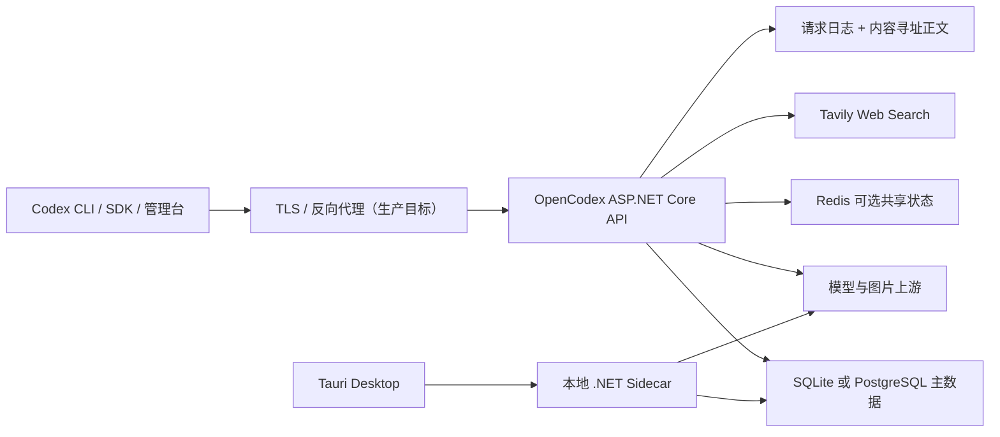
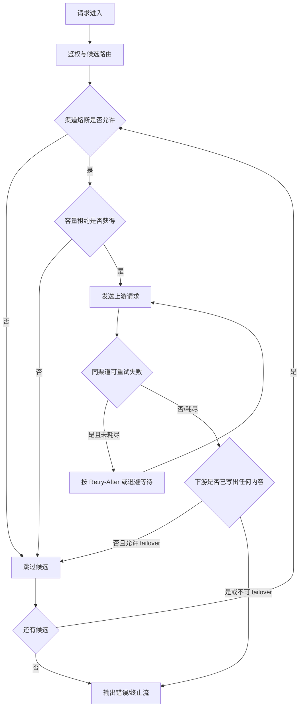

# 13. 非功能需求

## 1. 文档元数据

| 字段 | 内容 |
|---|---|
| 文档编号 | PRD-NFR-013 |
| 需求编号前缀 | `REQ-NFR` |
| 产品 | OpenCodex Proxy |
| 基线提交 | `3827590eb33acb67dd063054c4a36d2b87b09002` |
| 文档状态 | 当前实现基线审计 + 目标要求；SLA/SLO 数值待基准测试 |
| 最后核对日期 | 2026-08-17 |
| 事实来源 | 服务端、前端、Tauri、Docker、CI、测试源码与部署文件 |
| 目标读者 | 产品、架构、研发、测试、运维、安全与发布负责人 |

### 1.1 事实标签

- **当前实现基线**：源码或测试已体现的行为，不自动等于正式 SLO。
- **目标要求**：产品必须或应当达到的质量属性。
- **TBD**：需要压测、业务容量预测或安全评审后决定，本文不凭空填写数值。
- **风险**：基线行为与生产要求之间的缺口。

### 1.2 重要声明

当前仓库没有正式 SLA、SLO、错误预算、RTO 或 RPO。测试文档中的 `TTFT < 100ms` 是可控内存输入下的回归断言，不能直接解释为包含上游模型网络耗时的生产承诺。本文所有未由代码固定且尚未完成基准测试的指标均标记为 TBD。

---

## 2. 范围与质量模型

本文覆盖：

1. 性能、延迟、吞吐与资源容量；
2. 流式实时性、背压、缓冲与捕获边界；
3. 可用性、可靠性、重试、故障转移、熔断和依赖降级；
4. 安全、隐私、秘密、网络暴露与供应链；
5. 数据完整性、日志可靠性与恢复能力；
6. 平台、协议、数据库、浏览器和桌面兼容性；
7. 可观测性、可测试性、可维护性和发布质量门禁；
8. 可访问性、国际化和用户体验的非功能边界。

---

## 3. 当前实现质量参数

> 下表记录代码参数，不代表服务等级承诺。

### 3.1 非功能优先级

当质量属性发生冲突时，目标决策顺序为：

1. 数据与鉴权正确性、秘密保护；
2. 不混流、不越权、不破坏已持久化数据；
3. 可恢复性和故障可诊断性；
4. 协议兼容与用户可见结果完整性；
5. 可用性和延迟；
6. 资源效率与成本优化。

该顺序不表示性能不重要，而是明确：系统不得为了降低延迟而跳过鉴权、完整性校验或跨渠道流边界。

### 3.2 运行模式质量差异

| 模式 | 性能/容量 | 可靠性 | 安全 | 兼容性 |
|---|---|---|---|---|
| 本地开发 | 单实例、开发证书、Vite 代理 | 依赖本地文件和默认 SQLite | 仅开发用途；可接受自签名证书 | macOS/Linux/Windows 的 .NET/Node 环境差异需开发者自行满足 |
| Docker SQLite | 适合轻量单实例，写并发能力 TBD | 数据位于挂载卷；无跨实例共享状态 | 宿主默认仅 loopback 暴露 | 生产镜像当前仅 linux/amd64 |
| Docker PostgreSQL + Redis | 当前生产默认，支持跨实例共享容量/亲和/熔断 | PostgreSQL 为主数据，Redis 可降级 | 依赖外部 TLS；当前 Compose 固定 DB 密码且 Redis 无认证 | PostgreSQL 17、Redis 7 Alpine 为当前 Compose 基线 |
| Tauri Desktop | 单机 SQLite；sidecar 启动最长等待 15 秒 | app data 持久化；无 Redis | localhost 默认；LAN 当前为明文 HTTP | CI 发布 macOS arm64、Windows x64、Linux x64 DEB |

| 类别 | 当前实现参数 | 语义 |
|---|---|---|
| 默认上游超时 | 120 秒 | 渠道未设置 `timeout_seconds` 时使用 |
| Tavily 超时 | 15 秒 | 单次搜索 HTTP 调用取消时间 |
| 上游连接池 | 每主机最多 100 连接 | 主上游与模型发现 HttpClient；连接寿命 15 分钟、空闲 5 分钟 |
| Tavily 连接池 | 每主机最多 50 连接 | 连接寿命 10 分钟、空闲 2 分钟 |
| 默认同渠道重试 | 3 次额外重试 | 最多 4 次 HTTP 尝试；images 渠道强制 0 |
| 可重试 HTTP 状态 | 429、500、502、503、504 | 其余状态通常不做同渠道 HTTP 重试 |
| 重试退避 | 约 `min(500ms × 2^attempt, 8s)` | `Retry-After` 优先，单次最多 30 秒 |
| 熔断失败阈值 | 3 | 连续可计数失败后进入 open |
| 熔断开放期 | 服务默认 60 秒 | 渠道显式 0 在主链路表示禁用；渠道可覆盖时长 |
| 半开探测并发 | 1 | 单渠道同一时刻默认只允许一个 probe |
| 渠道亲和 TTL | 30 分钟滑动 | Redis 可用时跨实例，否则仅进程内 |
| 容量租约 TTL | 600 秒 | Redis 槽位异常未释放时自动回收 |
| 分布式容量锁 | TTL 5 秒，重试 3 次，间隔 10ms | 锁失败后存在无锁占位退化路径 |
| 通用缓存 TTL | 300 秒 | 特定鉴权、路由、定价缓存另有 60 秒 TTL |
| 流捕获总预算 | 1 MiB | 用于重建完整响应与日志摘要，不限制真实下游响应大小 |
| 流集合上限 | 256 项 | 超限标记截断 |
| 单 pending SSE 数据 | 256 KiB、最多 1024 行 | 超限丢弃到下一个事件边界并计 malformed |
| 图片编辑单文件 | 20 MiB | PNG/JPEG/WebP，并校验文件签名 |
| 图片编辑总文件 | 100 MiB | 当前应用级限制；反向代理也必须兼容 |
| 图片数量 | 16 张 + 最多 1 个 mask | 超限返回 413/400 |
| 桌面后端启动等待 | 15 秒，每 250ms TCP 探测 | 只检查端口，不检查业务 readiness |
| Docker 健康检查 | 30 秒间隔、10 秒超时、3 次失败、40 秒启动期 | `/health` 当前仅静态返回 ok |
| Docker 日志轮转 | 默认 50 MiB × 5 | 应用、PostgreSQL、Redis 均使用 json-file 配置 |
| 前端 chunk 告警 | 550 KiB | 仅构建告警阈值，不是下载预算 |

---

## 4. 性能与容量需求

### 4.1 指标口径

| 指标 | 定义 | 当前可观测性 | 目标值 |
|---|---|---|---|
| API 接收延迟 | 从请求到进入代理编排 | 可从日志阶段时间推导一部分 | TBD |
| 上游连接延迟 | 从发送上游请求到收到响应头 | 流时序/日志包含相关阶段 | TBD |
| TTFT | 首个符合协议计数规则的文本、推理或工具增量到达下游的时间 | `RequestLog.TtftMs`；同协议与跨协议当前判定语义有差异 | TBD，且必须按协议方向分别定义 |
| 总时长 | 请求接收到结束、错误或取消 | `DurationMs` | TBD |
| 非流式吞吐 | 单实例每秒完成请求数 | 未形成正式压测 | TBD |
| 流式并发 | 单实例同时保持的 SSE 数 | 渠道 capacity 与活跃数可提供局部信息 | TBD |
| 管理接口延迟 | 日志查询、统计、配置 CRUD 响应时间 | 有请求日志但无 SLO | TBD |
| 日志写入开销 | 日志压缩、分块、去重和数据库事务增加的延迟 | 未见正式基准 | TBD |
| 内存峰值 | 不同并发、流长度、工具 schema 和图片请求下的进程 RSS | 未见正式基准 | TBD |

### 4.2 流式实时性

当前写出器对每一行执行 `WriteAsync` 后立即 `FlushAsync`，并设置：

- `Content-Type: text/event-stream`；
- `Cache-Control: no-cache`；
- `X-Accel-Buffering: no`；
- 若观察到 `response.completed` 但未观察到 `[DONE]`，补写 `data: [DONE]`。

流式目标要求：

1. 转换器不得先收集完整上游响应再向客户端输出；
2. 反向代理必须关闭响应和请求缓冲；
3. 第一条下游可见内容之前允许重试或切换渠道，写出之后不得拼接另一上游响应；
4. 捕获、日志和统计失败不得阻塞真实流输出；
5. 慢客户端的背压、取消和断线必须传播到上游；
6. 同协议与跨协议 TTFT 的定义必须统一或在指标标签中明确区分。

### 4.3 资源容量

- **SQLite 模式**当前适用于桌面与轻量单实例；并发上限尚无基准数据。
- **PostgreSQL + Redis 模式**是当前生产默认部署；多实例硬容量依赖 Redis。
- `ChannelCapacityService` 即使使用 Redis，也只在本地维护展示/最少连接排序所用的活跃数，因此多实例展示为近似值。
- Redis 分布式锁失败时执行无锁判满和占位，极端竞态可能轻微超限。
- 当前 Docker Compose 未设置 CPU、内存、PID 或文件描述符限制。

---

## 5. 可用性、可靠性与降级

### 5.1 请求可靠性状态机

### 5.2 依赖故障矩阵

| 依赖/故障 | 当前实现基线 | 可接受的目标降级 | 不可接受行为 |
|---|---|---|---|
| Redis 未配置 | 使用 L1 与进程内亲和/容量/熔断 | 单实例继续服务并显示“共享状态禁用” | 宣称具备多实例全局容量保证 |
| Redis 首次连接失败 | 进程内降级；当前进程不再创建新连接 | 主请求继续，产生告警，并在目标恢复策略内重连或提示重启 | 静默长期降级且无运维信号 |
| Redis 运行中断开 | 缓存操作吞异常并回源 | 主数据正确；跨实例一致性在 TTL 后收敛 | 使用陈旧权限超过批准窗口 |
| SQLite/PostgreSQL 不可用 | 启动迁移失败，或运行请求失败 | readiness 失败并停止接收新流量 | `/health` 仍报告可服务 |
| 单一上游失败 | 同渠道重试、然后路由 failover | 未写出下游内容前切换；记录每次 attempt | 已写出后拼接另一渠道响应 |
| 所有上游失败 | 返回安全错误，日志保留真实状态 | 错误形状与入口协议兼容 | 泄露上游密钥、原始敏感 body |
| Tavily 不可用 | Web Search 模拟失败 | 不影响未使用搜索的请求；搜索错误可诊断 | 阻塞全部代理请求 |
| 日志内容存储失败 | 当前部分路径可能与业务写入耦合 | 主请求结果优先，记录降级计数；策略需明确 | 因可观测性失败破坏成功响应，除非合规策略明确要求 fail-closed |
| 客户端取消 | cancellation 传播 | 尽快停止上游读取、释放容量租约、完成日志状态 | 继续无限读取或永久占用 capacity |

### 5.3 健康检查

当前 `/health` 仅返回 `{status:"ok"}`，没有检查：

- 数据库连接和迁移状态；
- Redis 状态及是否处于降级；
- Data Protection key 目录；
- 静态管理台资源；
- 上游渠道；
- 磁盘剩余空间。

目标应拆分：

1. **Liveness**：进程事件循环和基本 HTTP 栈存活，不依赖可选外部上游；
2. **Readiness**：主数据库、迁移、必要目录和核心初始化已完成；
3. **Degraded status**：Redis或可选服务不可用但仍能服务时，不应错误标为完全健康；
4. **详细诊断**：只向超级管理员或运维面暴露，不在公共健康端点泄露连接信息。

---

## 6. 安全与隐私

### 6.1 当前实现基线

| 控制 | 当前状态 |
|---|---|
| 管理台 Cookie | HttpOnly、SameSite=Lax、Secure=SameAsRequest、默认 30 天、滑动续期 |
| Data Protection | key 持久化到配置目录，ApplicationName 由 secret 的 SHA-256 摘要前 16 个十六进制字符隔离 |
| OpenCodex 访问 API Key | README 宣称明文仅创建时展示、数据库保存哈希；当前实体和服务仍写入可空 `KeyPlaintext`，与文档冲突 |
| 日志脱敏 | **高风险缺口**：请求头会原样进入日志元数据，嵌套 MCP Authorization、图片/base64 等内容也会被正文存储测试明确保留；当前没有通用秘密扫描或默认安全视图 |
| TLS | 本地开发 HTTPS；Docker 依赖外部反向代理；Tauri LAN 当前为 HTTP |
| PostgreSQL | Compose 固定 `admin/123456` |
| Redis | Compose 无密码与 TLS，位于内部 Docker network |
| 应用限流 | 未发现 ASP.NET Core RateLimiter 配置 |
| 登录防爆破 | 未发现专用锁定或速率限制 |
| CSRF | 未发现 antiforgery middleware/token；当前主要依赖 SameSite Cookie |
| CSP | Tauri `csp: null` |
| DevTools | Tauri 创建窗口时显式 `devtools(true)` |
| 容器权限 | Dockerfile 未设置非 root `USER` |
| 安装包签名 | macOS 使用 ad-hoc identity；未见 notarization；Windows 未见签名配置 |

### 6.2 安全边界

1. 管理接口与代理接口属于不同鉴权面：前者使用 Cookie 会话，后者使用 OpenCodex Bearer API Key；
2. 客户端 Bearer Key不得透传给上游；上游认证来自渠道配置；
3. LAN 模式将管理台和代理 API 暴露给同网段主机，当前 HTTP 无法抵抗同网段窃听或篡改；
4. 请求/响应正文、工具参数、Web Search 与 OCR 日志可能包含业务敏感信息，必须按高敏数据处理；
5. TRACE/BASIC/DEBUG 日志等级在 README 中存在描述，但当前基线没有对应设置实现，不能把其作为隐私控制依赖。

### 6.3 供应链与构建安全

- `.NET` SDK 固定为 10.0.300，但 Docker 基础镜像使用浮动 `10.0-alpine`；
- Docker 前端使用 Node 22，CI 使用 Node 24；
- Rust 使用浮动 stable toolchain；
- 仓库缺少 `src-tauri/Cargo.lock`；
- 当前 CI 无 SBOM、镜像漏洞扫描、依赖许可证检查、秘密扫描和产物签名验证。

---

## 7. 数据完整性与日志可靠性

当前日志正文使用 SHA-256 内容寻址、2–32 KiB 内容定义分块和可逆 Brotli 压缩。读取时校验：

1. 块原始长度；
2. 块 SHA-256；
3. manifest chunk 数量和顺序；
4. 完整正文长度；
5. 完整正文 SHA-256。

非功能目标：

- 哈希不一致必须明确报告数据损坏，不得返回伪造或部分正文为完整结果；
- 日志清理必须同时处理引用、manifest、manifest chunk、物理块和请求日志；
- 共享块删除必须防止仍被其他 manifest 引用；
- 日志保存、压缩和读取应纳入性能基准；
- 日志保留期、总容量、归档和删除证明目前均为 TBD；
- 备份与恢复要求见 [14-data-and-migrations.md](./14-data-and-migrations.md)。

### 7.1 迁移、备份、恢复与回滚的非功能约束

| 主题 | 当前实现基线 | 目标非功能要求 |
|---|---|---|
| 自动迁移 | 进程启动同步执行 EF `Database.Migrate()` | 迁移完成前不得 ready；失败必须 fail-closed 和可诊断 |
| 迁移备份 | 发布脚本未自动创建恢复点 | 破坏性 migration 前必须有已验证备份，缺失时阻断发布 |
| SQLite 恢复 | 有持久化目录，无标准恢复演练 | 必须使用一致快照并验证 WAL/完整性、key ring 和应用兼容 |
| PostgreSQL 恢复 | 有数据卷，无自动备份/PITR流程 | 备份类型、RPO/RTO 为 TBD；必须在隔离环境定期恢复演练 |
| Redis 恢复 | RDB `save 60 1`，但非主数据 | 允许冷启动；不得把 Redis 备份当业务数据库备份 |
| 应用回滚 | 当前部署使用可变镜像并强制重建 | 必须记录镜像 digest、schema 兼容范围和自动/人工回滚判定 |
| schema Down | migration 存在 Down 不代表数据可逆 | 破坏性 Down 必须标为不可逆或有限损失，优先回滚应用而非盲目回退 schema |

备份与恢复本身也必须满足安全、性能和可靠性要求：备份加密、完整性校验、恢复演练不得影响生产写入超过批准窗口，且恢复后必须通过 readiness、鉴权、渠道和日志抽样校验。

---

## 8. 兼容性

### 8.1 服务端与部署

| 维度 | 当前支持/基线 | 缺口或限制 |
|---|---|---|
| .NET | `net10.0`，SDK 10.0.300 | 运行环境必须具备 .NET 10 或使用桌面自包含 sidecar |
| 容器 | Alpine，默认只构建 `linux/amd64` | 未提供生产 multi-arch 镜像 |
| 数据库 | SQLite、PostgreSQL | 必须维护两套 provider-specific migration |
| Redis | Redis 7 Compose；可选 | 无认证/TLS默认配置；故障后共享状态降级 |
| 反向代理 | Nginx 脚本关闭 buffering | 其它代理的 SSE 配置未文档化 |

### 8.2 桌面平台

| 平台 | CI 产物 | 准备脚本声明 | 当前发布缺口 |
|---|---|---|---|
| macOS arm64 | DMG | 支持 | ad-hoc 签名，无 notarization/updater |
| macOS x64 | 无 | 支持 | 未进入矩阵 |
| Windows x64 | NSIS | 支持 | 未见代码签名 |
| Windows arm64 | 无 | 支持 | 未进入矩阵 |
| Linux x64 | DEB | 支持 | workflow 名称为 Deepin，但未定义最低发行版/库版本 |
| Linux arm64 | 无 | 支持 | 未进入矩阵 |

### 8.3 浏览器与管理台

- Vite 未配置显式 browserslist 或 build target；
- 未定义 Chrome、Edge、Safari、Firefox 最低版本；
- 管理台依赖 Vue 3、Element Plus、ECharts；
- 已有移动端布局改造，但未见正式桌面/平板/手机断点验收矩阵；
- 未见自动化无障碍检查、键盘导航和屏幕阅读器门禁。

### 8.4 协议兼容

当前测试覆盖 Responses、Chat、Messages 的同协议和六个跨协议方向，但质量要求必须按以下维度分别验证：

- 请求与非流式响应；
- 流式事件顺序、完整性和实时性；
- reasoning、usage、finish reason；
- function/custom/native tools、MCP、Apply Patch、Web Search；
- 图片、OCR 与独立 Images API；
- 错误事件和客户端取消。

---

## 9. 可观测性与运维性

### 9.1 当前可观测内容

- 请求生命周期状态、状态码、时长、TTFT；
- 入口/上游模型、渠道、owner、API Key 元数据；
- token、缓存 token、成本和价格快照；
- 请求/上游/响应正文、Web Search、OCR、流式行内容槽位；
- 主请求、attempt、OCR 子请求之间的父子关系；
- 管理台统计和 SSE 活跃渠道/错误流。

### 9.2 当前缺口

- 无 Prometheus/OpenTelemetry 标准指标出口；
- 无正式 trace/span 传播契约；
- `/health` 不反映 readiness；
- 无 Redis 降级、迁移版本、磁盘空间、日志去重率等运维指标；
- 无报警规则、值班手册、错误预算和容量报警阈值；
- Docker json-file 轮转只控制容器 stdout/stderr，不控制数据库请求日志增长。

---

## 10. 可测试性与可维护性

### 10.1 测试基线

静态统计显示当前测试项目约包含：

- 43 个 `*Tests.cs` 测试类；
- 416 个 `[Fact]`；
- 25 个 `[Theory]`；
- 70 个 `[InlineData]`；
- 未发现显式 `Skip`。

前端存在两个 `node:test` 文件，但根目录和 frontend 的 `package.json` 均未定义 `test` 脚本。当前唯一 GitHub Actions workflow 仅在手动触发或 `v*` tag push 时运行后端测试，不覆盖普通 PR/push。

### 10.2 质量门禁缺口

| 门禁 | 当前状态 |
|---|---|
| PR 后端测试 | 无 |
| 前端单元测试 | 文件存在，未接入脚本/CI |
| 前端 lint/typecheck | 无 |
| Rust test/clippy/fmt | 无 |
| 代码覆盖率 | 无采集与阈值 |
| 浏览器 E2E | 无 CI 门禁 |
| Docker 构建/冒烟 | release 外无门禁 |
| SQLite/PostgreSQL 双 provider 集成 | 未形成独立 CI matrix |
| 性能回归 | 流式局部断言存在，无正式基准平台 |
| 安全扫描/SBOM | 无 |
| Markdown 链接与需求编号检查 | 无 |

---

## 11. 可访问性、国际化与易用性

### 11.1 当前基线

- 管理台主要为中文界面；
- 时间区默认示例为 `Asia/Shanghai`；
- 后端 JSON 与日志使用 UTF-8；
- Docker 安装 ICU 和 tzdata；
- 管理台已有移动端菜单和布局；
- 未发现正式 i18n 框架或 WCAG 自动测试。

### 11.2 目标边界

- 第一阶段 UI 语言可以仅中文，但所有可见文本不得散落为不可检索的动态拼接，便于后续本地化；
- 时间展示必须明确时区，持久化时间应保持统一时间基准；
- 核心管理动作必须可用键盘完成；
- 表单错误不能只通过颜色表达；
- 移动端必须覆盖初始化、登录、渠道启停、Key 创建、日志查看等关键路径；
- 正式 WCAG 等级为 TBD，不在完成评审前宣称合规。

---

## 12. 需求与验收标准

| 编号 | 级别 | 目标要求 | 当前状态 | 验收标准 |
|---|---|---|---|---|
| REQ-NFR-001 | MUST | 发布前必须建立正式指标字典，统一 TTFT、总时长、成功率、错误率、吞吐和并发的计算口径。 | 缺口 | 指标文档经产品/研发/运维评审；同协议和跨协议 TTFT 差异被消除或以标签区分；测试验证计算。 |
| REQ-NFR-002 | MUST | 生产 SLO 数值必须来自可复现基准测试，不得直接引用内存单测阈值。 | 缺口 | 保存基准环境、数据集、命令和结果；p50/p95/p99 与容量拐点得到批准；未批准项保持 TBD。 |
| REQ-NFR-003 | MUST | 流式路径必须逐增量写出并 flush，不得等待完整上游响应。 | 已实现并有测试 | 使用可控延迟源，在源流结束前客户端已收到首个 delta；六个跨协议方向和同协议路径均覆盖。 |
| REQ-NFR-004 | MUST | 反向代理必须关闭 SSE 响应缓冲，并保留取消传播。 | 部署脚本已部分实现 | Nginx/目标代理集成测试逐条收到事件；客户端断开后上游请求与容量租约在批准时间（TBD）内释放。 |
| REQ-NFR-005 | MUST | 捕获预算超限不得截断真实客户端响应，只能截断观测副本并标记。 | 已实现一部分 | 超过 1 MiB 的测试断言下游完整、日志 `_opencodex_capture.truncated=true`，进程内存不失控。 |
| REQ-NFR-006 | MUST | 服务必须为请求体、图片、工具 schema 和 SSE 事件设置可配置且可测试的资源边界。 | 部分实现 | 图片与 SSE 已有边界测试；普通 JSON body、工具 schema 深度/大小阈值完成 TBD 决策并有 413/400 验收。 |
| REQ-NFR-007 | MUST | 上游连接池、超时和重试必须可观测，且总最坏等待时间可计算。 | 部分实现 | 日志记录配置超时、实际 attempt 和等待原因；测试覆盖 Retry-After、指数退避、取消与超时区别。 |
| REQ-NFR-008 | MUST | 首次下游写出后不得执行跨渠道故障转移。 | 已实现并有测试 | 流首前失败切换、流首后失败不切换的服务测试通过，且不会混合两个上游正文。 |
| REQ-NFR-009 | MUST | 熔断必须覆盖 closed/open/half-open，默认阈值、开放期和 probe 并发必须可测试。 | 已实现 | 状态机、Redis与内存路径测试通过；渠道 0 秒禁用语义有明确契约。 |
| REQ-NFR-010 | MUST | Redis 不可用时主数据和鉴权真值不得丢失；多实例一致性降级必须显式可见。 | 部分实现 | 故障注入下数据库回源正确；管理端/指标显示 degraded；不得把本地活跃数展示为全局精确值。 |
| REQ-NFR-011 | SHOULD | Redis 恢复后应用应自动恢复共享缓存和状态。 | 缺口 | 启动时不可达后恢复 Redis，应用无需重启即可在批准时间（TBD）内恢复连接、订阅与共享状态。 |
| REQ-NFR-012 | MUST | 必须区分 liveness、readiness 与 degraded health。 | 缺口 | 数据库断开时 liveness 可仍成功、readiness 失败；Redis断开时 degraded 可见；公共响应不泄露连接串。 |
| REQ-NFR-013 | MUST | 自动迁移和默认数据播种完成前实例不得进入 ready。 | 当前启动同步执行，但 health 未区分 | 启动集成测试延迟或破坏迁移，负载均衡不向实例发流量；成功后才 ready。 |
| REQ-NFR-014 | MUST | 生产网络必须使用 TLS；LAN HTTP 模式不得被描述为安全远程访问。 | 缺口 | Docker 生产入口和允许 LAN 的部署通过 TLS 测试；若保留 HTTP，UI/API 明确显示风险且默认关闭 LAN。 |
| REQ-NFR-015 | MUST | 管理登录、访问 API Key 和高成本代理接口必须具备速率限制与防爆破策略。 | 缺口 | 针对 IP、账号和 Key 的限流测试通过；阈值由安全评审确定并记录，不泄露账号存在性。 |
| REQ-NFR-016 | MUST | 生产秘密不得硬编码在 Compose、镜像、日志或前端资源。 | 缺口 | secret scan 通过；固定 `admin/123456` 被移除；镜像层和构建日志不含秘密。 |
| REQ-NFR-017 | MUST | 管理 Cookie 必须保持 HttpOnly，并在 HTTPS 部署中为 Secure；Cookie key 必须持久化。 | 部分实现 | HTTPS 集成测试校验属性；容器重建后会话仍有效；secret/key 轮换流程有测试。 |
| REQ-NFR-018 | MUST | 日志脱敏不得修改真实业务 payload，且必须覆盖已知认证、图片和嵌套秘密。 | **高风险缺口** | 原始业务 payload 保持不变；持久化前生成受控日志副本；Authorization、Cookie、嵌套 MCP token、自定义 secret、图片/base64 和 raw SSE 的脱敏测试通过；只有明确授权的受保护原始槽位可保留敏感正文。 |
| REQ-NFR-019 | MUST | 日志正文损坏必须被检测，不得静默返回错误内容。 | 已实现一部分 | 修改块数据、长度、顺序、manifest hash，读取均返回明确数据损坏错误且不返回伪完整正文。 |
| REQ-NFR-020 | MUST | 数据库请求日志必须具有保留、配额、清理和归档策略。 | 缺口/TBD | 确定保留期和容量阈值；超限告警、批量清理、共享块回收、备份恢复测试通过。 |
| REQ-NFR-021 | MUST | SQLite 与 PostgreSQL 必须对相同业务契约保持迁移和查询兼容。 | 双迁移存在 | CI 双 provider matrix 执行迁移、核心 CRUD、日志写读与清理；snapshot 漂移使构建失败。 |
| REQ-NFR-022 | MUST | 普通 PR 和主分支 push 必须执行后端测试、前端单测与生产构建。 | 缺口 | 新 CI workflow 在 PR/push 触发；失败阻断合并；前端两个 Node 测试通过标准 npm script 运行。 |
| REQ-NFR-023 | SHOULD | CI 应执行 Rust fmt/clippy/test 与桌面端最小冒烟。 | 缺口 | 三平台或批准的代表平台运行对应检查；sidecar 启动、管理台打开、退出清理测试通过。 |
| REQ-NFR-024 | MUST | 发布产物必须可复现并锁定依赖。 | 缺口 | 提交 `Cargo.lock`；Node 使用 lockfile；工具链版本固定；同一提交两次构建的差异在批准范围内。 |
| REQ-NFR-025 | MUST | 桌面正式产物必须具备平台适用的签名和完整性验证。 | 缺口 | macOS 签名并 notarize、Windows签名、Linux校验和/仓库策略通过；安装系统不显示未知发布者（平台允许范围内）。 |
| REQ-NFR-026 | SHOULD | 发布流程应生成 SBOM、依赖漏洞报告和产物校验和。 | 缺口 | 每个镜像和桌面产物附 SBOM/sha256；高危漏洞按批准策略阻断发布。 |
| REQ-NFR-027 | MUST | 必须定义并测试支持的服务器架构、桌面 OS 和浏览器最低版本。 | 缺口 | 兼容矩阵经批准；各支持项至少有安装/启动/核心流程结果；未测平台不得标为正式支持。 |
| REQ-NFR-028 | MUST | 多实例容量限制的精确值必须来自 Redis，全局近似指标不得伪装成精确值。 | 部分实现 | 两实例并发测试证明总租约不超过 capacity；管理端给近似指标加标签；Redis降级时显示单实例语义。 |
| REQ-NFR-029 | MUST | 客户端取消、异常和进程退出必须释放本地计数，Redis租约即使丢失也必须最终过期。 | 已实现机制 | 取消/异常/崩溃故障注入验证本地立即释放或进程终止，Redis槽位不晚于 600 秒自动回收。 |
| REQ-NFR-030 | SHOULD | 管理台核心流程应满足批准的无障碍目标。 | TBD | 确定 WCAG 目标等级；自动检查、键盘操作和人工读屏测试纳入发布报告。 |
| REQ-NFR-031 | MUST | 移动端必须覆盖初始化、登录、渠道、Key 和日志关键流程，不只验证视觉断点。 | 部分实现 | 代表性手机和平板 viewport 的 E2E 完成创建/修改/删除/查看操作，无横向不可达控件。 |
| REQ-NFR-032 | MUST | 任何 SLA/SLO 变更必须版本化并关联监控、报警和容量测试。 | 缺口 | PRD、仪表盘、告警规则和压测基准中的指标编号一致；变更有评审记录。 |

---

## 13. 发布质量门禁

| 阶段 | MUST 门禁 | 当前基线 |
|---|---|---|
| PR | 编译、后端测试、前端 test/build、文档链接与需求编号检查、秘密扫描 | 未建立完整门禁 |
| 主分支 | SQLite/PostgreSQL matrix、Redis故障测试、协议矩阵、容器构建 | 未建立 |
| Release Candidate | 性能基准、迁移演练、备份恢复、桌面冒烟、安全扫描 | 未建立 |
| Tag 发布 | 已签名产物、SBOM、校验和、发行说明、已知风险 | 当前仅后端测试 + 三平台构建 |
| 部署后 | readiness、核心 API 冒烟、日志与指标、自动回滚判定 | 当前部署脚本只打印容器状态 |

---

## 14. TBD 决策

| 编号 | 待决指标/策略 | 需要的输入 |
|---|---|---|
| TBD-NFR-001 | API 与管理接口 p95/p99 延迟 | 真实流量模型和基准环境 |
| TBD-NFR-002 | 各协议方向 TTFT SLO | 上游分层、网络区域和同/跨协议定义 |
| TBD-NFR-003 | 单实例非流式吞吐与流式并发 | CPU/内存规格、SQLite/PostgreSQL 模式 |
| TBD-NFR-004 | 可用性、错误预算、RTO、RPO | 部署拓扑和业务等级 |
| TBD-NFR-005 | 请求 JSON、工具 schema、SSE 生命周期上限 | 客户端真实负载与内存测试 |
| TBD-NFR-006 | 登录/API Key/代理限流阈值 | 安全威胁模型与租户规模 |
| TBD-NFR-007 | 日志保留期、总容量与归档 | 合规、排障周期、存储成本 |
| TBD-NFR-008 | 浏览器、桌面 OS 与 Linux 发行版最低版本 | 目标用户分布 |
| TBD-NFR-009 | WCAG 目标等级 | 产品市场与合规要求 |
| TBD-NFR-010 | Redis 自动恢复时限 | 多实例一致性容忍度 |

---

## 15. 风险清单

| 风险 | 等级 | 影响 |
|---|---|---|
| 静态 `/health` 被负载均衡视为 ready | 高 | 数据库故障或迁移失败实例仍可能接收流量 |
| LAN 明文 HTTP | 高 | Cookie、API Key 和正文可被同网段窃听/篡改 |
| 固定数据库密码、无 Redis 认证 | 高 | 环境泄露或横向移动风险 |
| 无登录/API限流 | 高 | 爆破、滥用和成本攻击 |
| 无正式日志保留/配额 | 高 | 数据库无限增长、磁盘耗尽 |
| 自动迁移无发布前恢复演练 | 高 | 启动失败或不可逆数据损失 |
| PR 不运行 CI | 高 | 回归直到 tag 发布才暴露 |
| Redis 首次失败需重启才能重新创建连接 | 中 | 多实例长期退化 |
| 容量分布式锁失败时无锁占位 | 中 | 极端竞态轻微超限 |
| Tauri 无 CSP、release 仍开 DevTools | 中 | 桌面攻击面扩大 |
| 缺 Cargo.lock、工具链浮动 | 中 | 构建不可复现 |
| Node 22/24 不一致 | 中 | 本地、Docker、CI 构建差异 |
| 浏览器/OS兼容矩阵缺失 | 中 | 无法判断用户环境是否正式支持 |

---

## 16. 追溯矩阵

### 16.1 核心源码

| 主题 | 文件 |
|---|---|
| HTTP 连接池、Cookie、Data Protection | [OpenCodexServiceCollectionExtensions.cs](../opencodex_proxy/src/Presentation/OpenCodex.Api/Hosting/OpenCodexServiceCollectionExtensions.cs) |
| 上游重试与退避 | [HttpUpstreamClient.cs](../opencodex_proxy/src/Libraries/OpenCodex.Core/ExternalIntegrations/HttpUpstreamClient.cs)、[HttpUpstreamClient.Streaming.cs](../opencodex_proxy/src/Libraries/OpenCodex.Core/ExternalIntegrations/HttpUpstreamClient.Streaming.cs) |
| SSE 写出 | [ProxyStreamResponseWriter.cs](../opencodex_proxy/src/Presentation/OpenCodex.Api/Infrastructure/ProxyStreamResponseWriter.cs) |
| 流捕获预算 | [StreamResponseCapture.cs](../opencodex_proxy/src/Libraries/OpenCodex.Core/Protocols/StreamResponseCapture.cs) |
| 熔断 | [ChannelCircuitBreakerService.cs](../opencodex_proxy/src/Libraries/OpenCodex.Core/Services/Proxy/ChannelCircuitBreakerService.cs) |
| 亲和 | [ChannelAffinityService.cs](../opencodex_proxy/src/Libraries/OpenCodex.Core/Services/Proxy/ChannelAffinityService.cs) |
| 容量 | [ChannelCapacityService.cs](../opencodex_proxy/src/Libraries/OpenCodex.Core/Services/Proxy/ChannelCapacityService.cs) |
| Redis 与两级缓存 | [RedisConnectionProvider.cs](../opencodex_proxy/src/Libraries/OpenCodex.Core/Services/Caching/RedisConnectionProvider.cs)、[TwoLevelCacheService.cs](../opencodex_proxy/src/Libraries/OpenCodex.Core/Services/Caching/TwoLevelCacheService.cs) |
| 图片大小限制 | [ImageEditRequestReader.cs](../opencodex_proxy/src/Presentation/OpenCodex.Api/Infrastructure/ImageEditRequestReader.cs) |
| 健康检查 | [SystemController.cs](../opencodex_proxy/src/Presentation/OpenCodex.Api/Controllers/SystemController.cs) |
| 内容寻址日志 | [LogContentCodec.cs](../opencodex_proxy/src/Libraries/OpenCodex.Core/Services/Proxy/LogContentCodec.cs)、[LogContentStore.cs](../opencodex_proxy/src/Libraries/OpenCodex.Core/Services/Proxy/LogContentStore.cs) |

### 16.2 构建与部署

- [Dockerfile](../Dockerfile)
- [docker-compose-pgsql.yml](../docker-compose-pgsql.yml)
- [docker-compose-sqlite.yml](../docker-compose-sqlite.yml)
- [.github/workflows/desktop-release.yml](../.github/workflows/desktop-release.yml)
- [src-tauri/Cargo.toml](../src-tauri/Cargo.toml)
- [src-tauri/tauri.conf.json](../src-tauri/tauri.conf.json)
- [scripts/prepare_tauri_sidecar.mjs](../scripts/prepare_tauri_sidecar.mjs)

### 16.3 测试

- [ProxyStreamResponseWriterTests.cs](../opencodex_proxy/tests/OpenCodex.Api.Tests/ProxyStreamResponseWriterTests.cs)
- [ProxyStreamServiceTests.cs](../opencodex_proxy/tests/OpenCodex.Api.Tests/ProxyStreamServiceTests.cs)
- [ProxyEndpointServiceTests.cs](../opencodex_proxy/tests/OpenCodex.Api.Tests/ProxyEndpointServiceTests.cs)
- [StreamResponseCaptureTests.cs](../opencodex_proxy/tests/OpenCodex.Api.Tests/StreamResponseCaptureTests.cs)
- [UpstreamStreamErrorRetryTests.cs](../opencodex_proxy/tests/OpenCodex.Api.Tests/UpstreamStreamErrorRetryTests.cs)
- [ChannelCircuitBreakerServiceTests.cs](../opencodex_proxy/tests/OpenCodex.Api.Tests/ChannelCircuitBreakerServiceTests.cs)
- [ChannelAffinityServiceTests.cs](../opencodex_proxy/tests/OpenCodex.Api.Tests/ChannelAffinityServiceTests.cs)
- [ProxyLogServiceTests.cs](../opencodex_proxy/tests/OpenCodex.Api.Tests/ProxyLogServiceTests.cs)
- [LogContentCodecTests.cs](../opencodex_proxy/tests/OpenCodex.Api.Tests/LogContentCodecTests.cs)
- [LogContentStoreTests.cs](../opencodex_proxy/tests/OpenCodex.Api.Tests/LogContentStoreTests.cs)
