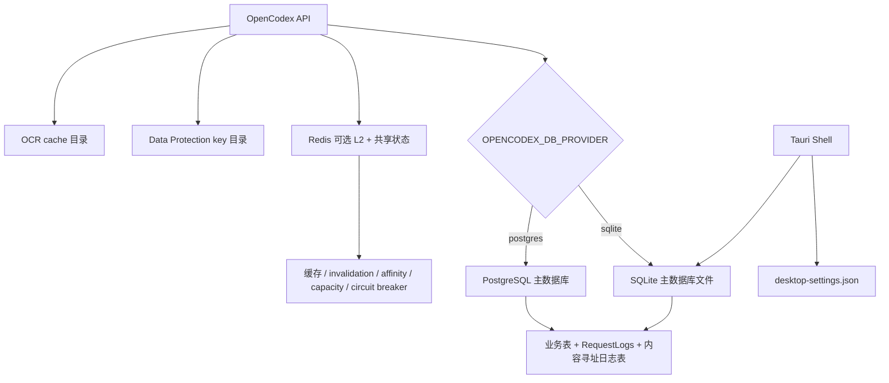
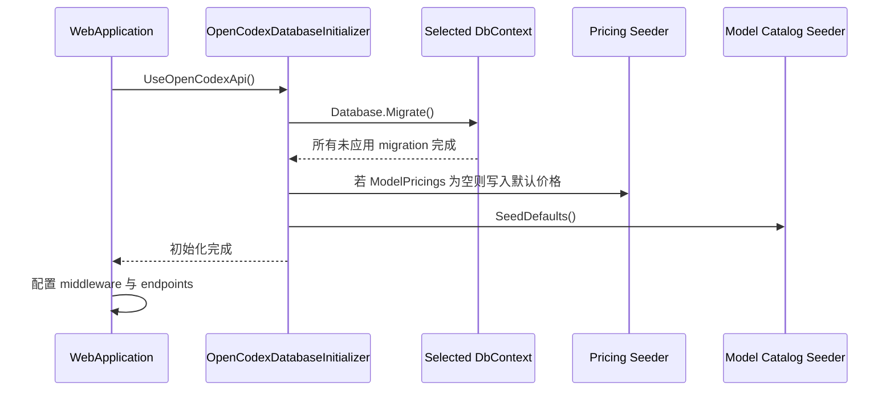
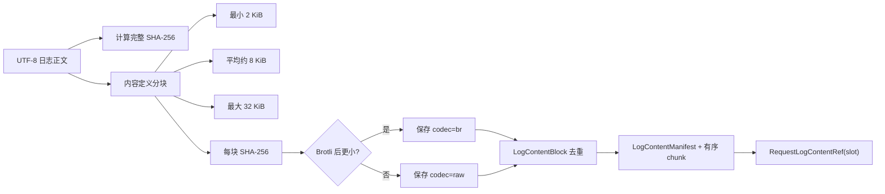
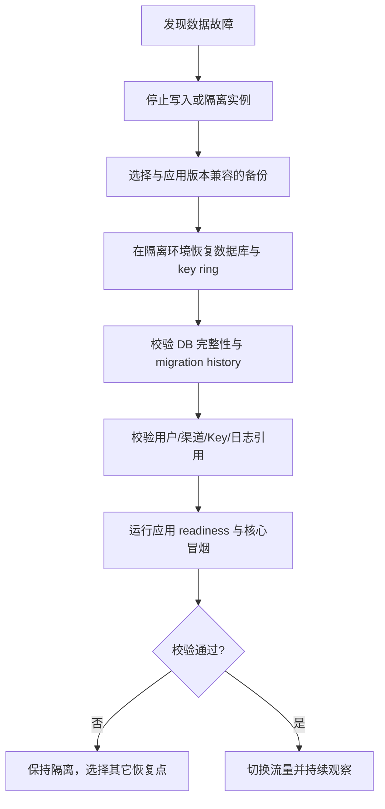

# 14. 数据、迁移、备份与恢复需求

## 1. 文档元数据

| 字段 | 内容 |
|---|---|
| 文档编号 | PRD-MIG-014 |
| 需求编号前缀 | `REQ-MIG` |
| 产品 | OpenCodex Proxy |
| 基线提交 | `3827590eb33acb67dd063054c4a36d2b87b09002` |
| 文档状态 | 当前实现基线审计 + 目标要求 |
| 最后核对日期 | 2026-08-17 |
| 事实来源 | EF Core DbContext、双 provider migrations、初始化器、实体、日志内容存储、Compose、测试 |
| 目标读者 | 后端、数据库、运维、测试、安全、合规与发布负责人 |

### 1.1 事实标签

- **当前实现基线**：在基线提交中可由源码、迁移或测试验证。
- **目标要求**：必须通过需求验收后才可视为产品能力。
- **TBD**：等待容量、合规、安全或部署决策，不预设结论。
- **风险**：可能造成数据丢失、不可恢复、跨 provider 漂移或安全问题。

---

## 2. 范围

本文覆盖：

1. SQLite、PostgreSQL、Redis 和本地文件的职责边界；
2. 业务实体、日志元数据和内容寻址正文的持久化模型；
3. SQLite/PostgreSQL 两套 EF Core context、migration 与 snapshot；
4. 应用启动自动迁移和默认数据播种；
5. schema 变更、数据迁移、兼容发布和回滚；
6. 备份、恢复、灾难恢复、完整性验证和数据保留；
7. 数据安全、秘密、租户隔离和审计。

本文不把 Redis 定义为业务主数据源；缓存与共享运行状态的详细降级见 [12-configuration.md](./12-configuration.md) 与 [13-non-functional-requirements.md](./13-non-functional-requirements.md)。

---

## 3. 数据存储边界

### 3.1 存储职责表

| 存储 | 是否主数据 | 当前内容 | 持久化位置 | 故障影响 |
|---|---:|---|---|---|
| SQLite | 是 | 用户、渠道、访问 Key 元数据、Web Search、模型目录/价格、请求日志、正文块 | 默认 `logs/opencodex.db`；Docker `/app/logs/opencodex.db`；桌面 app data/logs | 不可用时核心业务不可用；桌面/轻量单实例默认 |
| PostgreSQL | 是 | 与 SQLite 相同的逻辑模型 | Compose `./postgres-data` | 当前生产默认；不可用时核心业务不可用 |
| Redis | 否 | L2 缓存、跨实例失效广播、亲和、容量租约、熔断状态 | Compose `./redis-data`，RDB `save 60 1` | 可降级，但多实例一致性和全局容量能力下降 |
| Data Protection key 目录 | 安全关键 | 管理 Cookie 加解密 key ring | 默认 `logs/.keys`；示例 `/app/logs/opencodex.keys`；桌面 app data/keys | 丢失会使现有 Cookie 失效 |
| 桌面设置文件 | 是，桌面配置 | 访问模式、绑定地址、端口、探测拦截目标字段 | Tauri app config dir/`desktop-settings.json` | 损坏可能回退默认；当前 Rust/.NET 字段存在漂移风险 |
| OCR cache | 可再生缓存 | OCR 相关缓存 | 默认 `ocr-cache`；桌面 app data/ocr-cache | 应可清理；不得成为唯一业务真值 |
| 容器 json-file 日志 | 运维日志 | stdout/stderr | Docker host | 与数据库请求日志不同；轮转默认 50 MiB × 5 |

### 3.2 主数据原则

1. SQLite 与 PostgreSQL 是互斥的主数据库 provider；运行中切换 provider 不会自动搬迁数据。
2. Redis 丢失不得导致用户、渠道、API Key、价格、模型目录或请求日志永久丢失。
3. Data Protection key、数据库备份和必要配置必须作为同一恢复单元管理，否则恢复数据库后登录态仍可能全部失效。
4. 桌面端固定使用 SQLite，当前没有桌面到 PostgreSQL 的内建数据迁移功能。

### 3.3 默认值、优先级与运行模式差异

| 项目 | 当前默认/优先级 | 本地/桌面 | Docker SQLite | Docker PostgreSQL + Redis |
|---|---|---|---|---|
| 主数据库 provider | 未配置时 `sqlite`；Compose/Tauri 显式值优先 | 默认/强制 SQLite | Compose 强制 SQLite | Compose 强制 PostgreSQL |
| 默认 SQLite 连接串 | `Data Source=logs/opencodex.db` | 桌面改为 app data/logs 绝对路径 | `/app/logs/opencodex.db` | 不适用 |
| Redis | 空连接串表示禁用 | 默认禁用 | 默认禁用 | Compose 强制 `redis:6379` |
| migration | 应用启动自动执行 | 是 | 是 | 是 |
| seed | migration 后执行 | 是 | 是 | 是 |
| 数据持久化优先级 | 主数据库 > 可重建缓存；Data Protection keys 与数据库共同组成会话恢复单元 | app data + app config | `./logs` 挂载 | `./postgres-data` + `./logs`；Redis为辅助状态 |
| 备份现状 | 无内建任务 | 依赖用户/平台 | 依赖宿主 | 依赖宿主/运维 |

兼容性原则：同一应用版本只能选择一个主 provider；跨 provider 切换不是配置热切换，必须经过显式数据导出、转换、校验和切换流程。当前基线没有官方 SQLite ↔ PostgreSQL 迁移工具。

---

## 4. 关系数据模型

### 4.1 当前逻辑表

| 表 | 主要用途 | 关键索引/约束 | 敏感性 |
|---|---|---|---|
| `Users` | 超级管理员与普通用户 | `Username` 唯一；密码保存为 `PasswordHash` | 高 |
| `Channels` | 每个 owner 的上游渠道、认证、超时、容量、兼容和模型配置 | `(OwnerUserId, Position)`、`(OwnerUserId, Priority, Position)` 索引 | **高：ApiKey、HeadersJson 可含秘密** |
| `AccessApiKeys` | OpenCodex 客户端访问 Key 元数据 | `KeyHash` 唯一；`(OwnerUserId, Id)` 索引 | **高：当前同时持久化可空 `KeyPlaintext`、哈希、前后缀** |
| `WebSearchSettings` | Web Search 模式与系统设置 | 主键 | 中 |
| `TavilyKeys` | 搜索 provider Key、顺序与使用状态 | `Position` 索引 | **高：当前实体保存 ApiKey 字符串** |
| `ModelPricings` | 旧/全局模型价格规则 | `ModelId` 唯一，vendor/enabled/match 索引 | 中 |
| `ModelProviders` | 模型厂商目录 | `Code` 唯一，enabled/sort 索引 | 低 |
| `ModelInfos` | 全局/provider/channel scope 模型信息和 capabilities/catalog JSON | scope/provider/model 与 scope/channel/model 索引 | 中 |
| `ChannelModelInfos` | 渠道上游模型信息覆盖 | `(ChannelId, UpstreamModel)` 唯一 | 中 |
| `ModelPricingPlans` | 模型、渠道模型或渠道价格方案 | model/channel/enabled 索引 | 中 |
| `ModelPricingRules` | input/output/cache 等计费项规则 | price precision 18,8；plan/item/enabled 索引 | 中 |
| `ChannelModelMappings` | 请求模型到上游模型、价格策略的有序映射 | channel/position、channel/request model 索引 | 中 |
| `RequestLogs` | 请求生命周期、路由、token、成本、会话索引、错误摘要 | created/model/channel/path/status/owner/conversation 等大量索引 | 高 |
| `LogContentBlocks` | 去重后的原始正文分块或其压缩数据 | `Sha256` 唯一 | 高 |
| `LogContentManifests` | 一份完整正文的不可变清单 | `Sha256` 唯一 | 高 |
| `LogContentManifestChunks` | manifest 到 block 的有序映射 | `(ManifestId, Ordinal)` 唯一；block 索引 | 高 |
| `RequestLogContentRefs` | RequestLog 每个内容槽位到 manifest 的引用 | `(RequestLogId, Slot)` 唯一；manifest 索引 | 高 |

### 4.2 当前关系约束边界

- 内容寻址日志表显式配置了外键和删除行为：
  - 删除 `RequestLogs` 时级联删除 `RequestLogContentRefs`；
  - 删除 manifest 时级联删除其 chunk 映射；
  - block 与 manifest、manifest 与 request ref 采用 Restrict，防止仍被引用时删除。
- 大部分业务实体使用 `OwnerUserId`、`ChannelId`、`ProviderId` 等 ID 和索引，但当前 `OpenCodexDbContextBase` 未为全部业务关系显式配置导航外键和级联策略。
- 当前未配置 row version 或 EF optimistic concurrency token；并发更新主要依赖应用逻辑和数据库约束。

**风险：** 缺少数据库外键的业务引用可能产生孤立记录；没有并发版本字段可能出现最后写入覆盖前一写入。目标关系和冲突策略必须逐实体定义，不能只依赖 UI 串行操作。

### 4.3 时间与金额

- 多数实体时间使用 `double`，业务代码通常写入 Unix epoch 秒（由毫秒除以 1000.0），可能包含小数；
- `RequestLog` 的创建、处理开始、完成时间均为可空 double；
- 价格规则 `UnitPrice` 使用数据库 precision `(18,8)`；
- `RequestLog.Cost` 当前为 double，货币默认 `USD`。

目标要求必须统一说明时间单位、UTC/显示时区、金额精度和舍入规则，避免把 double 金额用于财务级结算真值。

---

## 5. SQLite 与 PostgreSQL provider

### 5.1 provider 选择

| 输入 | 规范化结果 |
|---|---|
| `sqlite` | SQLite |
| `postgres` | PostgreSQL |
| `postgresql` | PostgreSQL |
| `pgsql` | PostgreSQL |
| 其他值 | 创建/解析 DbContext 时抛 `InvalidOperationException` |

SQLite 配置会从连接串中解析 `Data Source`、`DataSource` 或 `Filename`，并在迁移前自动创建父目录。PostgreSQL 不执行目录操作。

### 5.2 两套 context 与迁移目录

| Provider | Context | 迁移目录 | Snapshot |
|---|---|---|---|
| SQLite | `OpenCodexSqliteDbContext` | `Migrations/SqliteMigrations` | `OpenCodexSqliteDbContextModelSnapshot.cs` |
| PostgreSQL | `OpenCodexPostgresDbContext` | `Migrations/PostgresMigrations` | `OpenCodexPostgresDbContextModelSnapshot.cs` |

两个 context 继承同一 `OpenCodexDbContextBase`，因此目标逻辑模型应一致，但底层列类型、SQL 和 provider-specific migration 文件不同。

### 5.3 当前 migration 历史

| 逻辑顺序 | SQLite migration | PostgreSQL migration | 主要变化 |
|---:|---|---|---|
| 1 | `20260624072444_InitialCreate` | `20260624072444_InitialCreate` | 用户、渠道、访问 Key、Web Search、价格、请求日志等初始表 |
| 2 | `20260627143924_ModelCatalog` | `20260627143941_ModelCatalog` | 模型厂商、模型信息、价格方案/规则、渠道模型映射 |
| 3 | `20260627171417_ChannelModelInfo` | `20260627171434_ChannelModelInfo` | 渠道级模型信息 |
| 4 | `20260702000000_ChannelCircuitBreakDuration` | 同名时间戳 | 渠道熔断时长 |
| 5 | `20260703000000_ChannelGroupName` | 同名时间戳 | 渠道分组名 |
| 6 | `20260705110840_WebSearchMode` | `20260705110856_WebSearchMode` | Web Search 模式 |
| 7 | `20260810233458_ContentAddressedLogs` | `20260810233510_ContentAddressedLogs` | 内容寻址日志和会话索引；删除旧日志详情/流行表 |

### 5.4 Pending model changes

`OpenCodexDbContextFactory` 当前显式忽略 `RelationalEventId.PendingModelChangesWarning`。这降低了运行时噪声，但也意味着模型发生变化而 migration/snapshot 未同步时，启动阶段可能缺少关键告警。

**目标要求：** 即使运行时继续忽略该 warning，CI 也必须通过生成迁移差异检查或等价机制阻止未迁移的模型变更进入主分支。

---

## 6. 启动自动迁移与播种

### 6.1 当前实现顺序

当前行为：

1. `OpenCodexDatabaseInitializer.Initialize(app)` 在 middleware 和 controller mapping 前同步执行；
2. `Database.Migrate()` 失败会阻止应用正常启动；
3. `ModelPricings` 只在表完全为空时写入默认值；已有任意记录时不会补齐缺失项；
4. 模型目录执行 `SeedDefaults()`，其幂等和覆盖语义由服务实现与测试约束；
5. 当前未见应用级“单迁移 leader”或显式分布式锁，多实例同时启动时依赖数据库/EF migration 自身行为；
6. `/health` 当前不报告 migration 版本或 readiness，且仅静态返回 ok。

### 6.2 目标启动门禁

- 迁移、关键 seed 和完整性检查完成前实例不得进入 ready；
- migration 失败必须输出 migration ID、provider 和安全错误摘要，但不得输出连接串密码；
- 多实例部署必须保证同一 schema 只由一个受控迁移作业执行，或证明 EF/provider 并发迁移安全；
- 生产环境应支持“仅验证 migration、暂不启动服务”的 preflight；
- seed 必须幂等，不能覆盖管理员明确修改的数据，覆盖策略必须逐 seed 定义。

---

## 7. 内容寻址日志存储

### 7.1 内容槽位持久化契约

`RequestLogContentSlot` 的数值是持久化契约，当前定义：

| 数值 | 槽位 | 内容 |
|---:|---|---|
| 1 | `RequestHeaders` | 脱敏后的入口 headers |
| 2 | `RequestBody` | 原始或序列化后的入口请求正文 |
| 3 | `UpstreamRequestBody` | 发送上游的请求正文 |
| 4 | `UpstreamResponseBody` | 上游响应/捕获正文 |
| 5 | `ResponseBody` | 客户端响应或错误正文 |
| 6 | `WebSearchJson` | Web Search 过程详情 |
| 7 | `OcrJson` | OCR 子流程详情 |
| 8 | `StreamLinesJson` | 选择性保存的流式行集合 |

枚举注释已明确“新增值只能追加”。不得重排、复用或改变已发布数值语义。

### 7.2 编码与分块

当前算法规则：

- 对完整原始 UTF-8 字节计算 SHA-256；
- 使用 gear hash 内容定义分块，分块边界受正文内容影响；
- 每块也计算 SHA-256；
- Brotli `CompressionLevel.Optimal` 仅在压缩结果小于原始块时使用；
- `LogContentBlocks.Sha256` 和 `LogContentManifests.Sha256` 唯一，实现跨请求、跨槽位去重；
- 空正文表现为长度 0、完整 hash 和空 chunk 列表。

### 7.3 写入事务

`LogContentStore.Write` 当前流程：

1. 对非 null 槽位编码；
2. 开启数据库事务；
3. 读取待替换槽位原 manifest ID；
4. 按 provider 使用 `INSERT OR IGNORE` 或 `ON CONFLICT DO NOTHING` 确保 block；
5. 确保 manifest 和有序 chunk；
6. 删除待更新槽位旧引用；
7. 插入新引用并保存；
8. 清理本次被替换且已无引用的 manifest 和孤立 block；
9. 提交事务。

### 7.4 读取完整性

读取时会验证：

- manifest 是否存在；
- manifest 预期 chunk 数与实际数量一致；
- block 是否存在；
- `StoredLength == Data.Length`；
- block raw length 与引用 raw length 一致；
- 解压后长度与 raw length 一致；
- block SHA-256 一致；
- 完整正文长度一致；
- 重算完整正文 SHA-256 与 manifest 一致；
- UTF-8 必须严格有效。

任一不一致会抛 `InvalidDataException`，当前没有“返回部分正文并假装完整”的降级。

### 7.5 清理语义

- 替换某个日志槽位时会清理被替换且已无引用的 manifest/block；
- 超级管理员清空全部日志：
  - PostgreSQL 使用单条 `TRUNCATE ... RESTART IDENTITY CASCADE`；
  - SQLite 依次执行 5 条 `DELETE`，当前 `ClearLogs` 未显式开启跨语句事务；中途失败可能留下部分清空状态；
- 当前没有按保留期、容量或批次自动清理；
- 当前没有后台全库孤立 manifest/block 垃圾回收任务。

---

## 8. ContentAddressedLogs migration 的数据风险

### 8.1 当前 Up 行为

SQLite 与 PostgreSQL 的 `ContentAddressedLogs` migration 均执行：

1. **直接删除** `RequestLogDetails`；
2. **直接删除** `RequestLogStreamLines`；
3. 给 `RequestLogs` 增加 conversation/turn/window/previous response 字段与索引；
4. 创建四张内容寻址日志表及索引/外键。

迁移中没有把旧 `RequestLogDetails` 和 `RequestLogStreamLines` 内容转换写入新 block/manifest/ref 表。因此该 migration 是 schema 转换，但不是旧日志正文的无损数据迁移。

### 8.2 当前 Down 行为

Down 会：

1. 删除全部内容寻址日志表；
2. 删除新会话索引字段；
3. 重新创建空的 `RequestLogDetails` 和 `RequestLogStreamLines`。

Down 同样不会把新日志正文重建回旧表，因此回退也是数据破坏性的。

### 8.3 产品判定

这是当前基线的**高风险事实**：

- 从旧版本升级会保留 `RequestLogs` 元数据，但丢失旧请求/响应正文和逐行流记录；
- 回滚 schema 会丢失升级后写入的新正文；
- 若该数据丢失是有意的产品决策，必须在发布说明、备份要求和升级确认中显式说明；
- 若要求无损升级，则必须新增离线/在线数据迁移阶段，而不能把当前 migration 描述为无损。

---

## 9. 备份需求

### 9.1 当前实现基线

- Compose 为 SQLite、PostgreSQL、Redis 和应用 logs 提供宿主目录挂载；
- DEPLOYMENT 记录数据目录，但没有自动备份任务、备份清单、加密、保留期、校验或恢复演练；
- 发布脚本在迁移前不创建数据库快照；
- Data Protection keys 与数据库数据没有统一备份流程；
- Redis 有 RDB `save 60 1`，但 Redis 不是业务主数据备份。

### 9.2 备份单元

| 模式 | 必须备份 | SHOULD 备份 | 不应作为唯一备份 |
|---|---|---|---|
| 桌面 SQLite | SQLite 数据库的一致性快照、Data Protection keys、desktop settings | OCR cache（可选） | 仅复制运行中的主 `.db` 而忽略 WAL 一致性 |
| Docker SQLite | `/app/logs` 中数据库及相关一致性文件、Data Protection keys、有效配置的安全副本 | 容器部署元数据 | 容器可写层 |
| PostgreSQL + Redis | PostgreSQL 逻辑/物理备份、Data Protection keys、部署配置/secret 引用、migration 清单 | Redis RDB（用于减少共享状态冷启动） | Redis RDB 或 Docker volume 单独快照 |

### 9.3 SQLite 备份约束

- 备份必须使用 SQLite 在线 backup API、受控停机复制，或能证明包含一致 WAL 状态的方法；
- 不能仅在数据库写入过程中复制 `.db` 主文件并宣称备份成功；
- 备份后必须执行 `integrity_check` 或等价校验，并记录 migration history；
- 恢复时必须检查文件权限、可用空间、Data Protection keys 和应用版本兼容性。

### 9.4 PostgreSQL 备份约束

- 备份必须包含 schema、数据、EF migration history 和必要 extension/owner 信息；
- 备份必须加密、校验、记录数据库版本和应用提交；
- 恢复必须在隔离数据库完成，然后运行核心数据与日志内容完整性检查；
- 是否使用逻辑备份、物理备份/PITR、保留周期和跨区域副本为 TBD。

### 9.5 Redis 备份约束

- Redis 可作为共享运行状态加速恢复，但不得用于替代主数据库备份；
- Redis 丢失后的目标行为是缓存冷启动、亲和/熔断/容量状态重置或近似恢复；
- 如保存 Redis RDB，必须将其安全级别视同可能包含 owner/channel 标识的内部运行数据。

---

## 10. 恢复与灾难恢复

恢复验证至少包含：

1. EF migration history 与目标应用兼容；
2. 用户可登录，原有 Cookie 是否应继续有效符合恢复策略；
3. Access API Key 哈希可正确鉴权；
4. 渠道、模型映射、价格和 Web Search 设置数量及 owner 关系正确；
5. 随机抽样日志 manifest/block 的长度与 SHA-256；
6. 清空/删除日志不会违反外键；
7. Redis 为空时应用仍可启动并正确回源；
8. readiness 成功后才允许接入流量。

---

## 11. Schema 发布与回滚策略

### 11.1 目标发布阶段

| 阶段 | 要求 |
|---|---|
| 设计 | 标注 additive、兼容、破坏性、数据回填、锁表风险和预估时长 |
| 开发 | 同时生成 SQLite/PostgreSQL migration 与 snapshot；编写 upgrade/downgrade 或明确不可逆 |
| CI | 空库迁移、上一正式版本升级、双 provider schema parity、数据回填和应用兼容测试 |
| 发布前 | 备份、校验恢复点、记录当前 migration、容量和最长锁等待 |
| 扩展 | 先添加新列/表并保持旧代码兼容 |
| 迁移 | 批量回填数据，具备进度、幂等与可恢复性 |
| 切换 | 新代码读取新结构，必要时双写/校验 |
| 收缩 | 至少一个批准兼容窗口后再删除旧结构 |
| 回滚 | 优先回滚应用；只有明确验证过的可逆 migration 才执行 schema Down |

### 11.2 回滚原则

1. “migration 有 Down 方法”不等于“数据可无损回滚”；
2. 删除列、表、正文和密钥前必须有已验证备份；
3. 新旧应用并行或蓝绿切换时，schema 必须处于两者兼容的扩展阶段；
4. 回滚应用前必须核对其能否读取当前 schema；
5. ContentAddressedLogs 当前 Up/Down 都是正文破坏性的，不能作为无损回滚机制；
6. 自动 `Database.Migrate()` 不应替代发布计划、备份和兼容矩阵。

---

## 12. 数据安全、隐私与隔离

### 12.1 当前敏感数据

| 数据 | 当前持久化形态 | 风险 |
|---|---|---|
| 用户密码 | `PasswordHash` | 哈希算法和参数必须持续评审 |
| OpenCodex Access Key | 当前为 `KeyHash` + 可空 `KeyPlaintext` + prefix/suffix | 与 README“只存哈希”冲突；目标应移除持久化明文或完成经批准的等价安全设计 |
| 渠道上游 API Key | `Channels.ApiKey` 字符串 | 数据库泄露可直接影响上游账户 |
| 渠道 headers | JSON 字符串 | 可能包含 Authorization、自定义 secret |
| Tavily Key | `TavilyKeys.ApiKey` 字符串 | 数据库泄露可导致搜索额度滥用 |
| 请求/响应正文 | 内容寻址压缩块 | 去重不是加密；共享块仍属于高敏数据 |
| Cookie key ring | 文件 | 丢失使会话失效，泄露可能影响会话安全 |
| 客户端 IP、会话/turn/window ID | RequestLogs | 属于可识别/关联元数据，需保留策略 |

### 12.2 目标安全要求

- 数据库、备份和 key ring 的静态加密策略为 TBD，但生产前必须完成威胁建模；
- 应用层读取渠道/Tavily秘密必须最小权限并默认遮罩；
- owner 数据查询必须始终带 owner 约束，超级管理员跨 owner 行为必须可审计；
- 日志内容块基于内容 hash 去重，不得通过 hash 或长度向无权用户泄露“另一请求存在相同内容”；
- 备份、导出和迁移工具必须执行与在线 API 等价或更严格的秘密保护。

---

## 13. 性能、容量、可靠性与可维护性

### 13.1 当前事实

- RequestLogs 有多列单索引，适合常见过滤，但写入每条请求会维护较多索引；
- 内容寻址写入需要 SHA-256、内容定义分块、Brotli 压缩、去重查询/插入和事务；
- 同一正文/块可跨槽位和请求复用，重复内容越多，存储收益越高；
- `CompressionLevel.Optimal` 的 CPU 成本尚无正式基准；
- 日志正文、manifest 和 block 没有自动保留/配额，数据库可持续增长；
- SQLite 与 PostgreSQL 的高并发写入能力差异尚无正式容量数据。

### 13.2 待建立指标

| 指标 | 目标值 |
|---|---|
| 每秒日志写入能力 | TBD |
| 日志写入 p95/p99 额外延迟 | TBD |
| 内容去重率、压缩率 | TBD |
| 日志查询 p95/p99 | TBD |
| 清理每批最大行数和锁时间 | TBD |
| SQLite 推荐最大数据库体积 | TBD |
| PostgreSQL 推荐分区/归档阈值 | TBD |
| migration 最大允许停机/锁表时间 | TBD |

### 13.3 可靠性与可维护性规则

| 维度 | 当前实现基线 | 目标要求 |
|---|---|---|
| 可靠性 | 内容正文写入使用事务和完整性校验；启动 migration 失败会阻止应用正常启动 | 必须增加 readiness、备份恢复、破坏性 migration 门禁和双 provider 升级测试 |
| Schema 可维护性 | 两套 migration 目录由人工同步；运行时忽略 pending model warning | CI 必须自动检查 snapshot、provider parity 和未生成 migration 的模型变化 |
| 数据模型可维护性 | JSON 字段为扩展提供灵活性，但数据库难以约束其内部 schema | 所有 JSON 持久化字段必须有版本、验证器和兼容策略；新增字段需回归导入/导出 |
| 日志存储可维护性 | 分块、manifest、ref 和清理逻辑复杂，已有 codec/store 单测 | 必须提供一致性检查、孤立内容 dry-run/GC、容量指标和故障注入测试 |
| 兼容发布 | 当前应用启动即自动迁移 | 目标采用 expand-migrate-contract，并记录每个应用版本支持的 schema 范围 |

---

## 14. 故障与降级

| 故障 | 当前行为 | 目标要求 |
|---|---|---|
| migration SQL 失败 | 应用启动失败 | 保持 fail-closed；输出 provider/migration ID；readiness 不成功 |
| seed 失败 | 启动失败 | 保持主数据一致；seed 必须可重试且幂等 |
| SQLite 目录不存在 | 自动创建父目录 | 目录不可写时明确失败 |
| SQLite 磁盘满 | 数据库写失败 | 产生容量告警；保护已有数据；不得继续报告 ready |
| PostgreSQL 暂时不可达 | 启动或请求失败 | readiness 失败；恢复策略和连接池行为需测试 |
| 日志 block hash 不匹配 | 抛数据损坏异常 | 不返回伪正文；告警并保留证据 |
| 日志写入部分失败 | 事务回滚当前槽位写入 | 不得留下 ref 指向缺失 manifest/block |
| SQLite ClearLogs 中途失败 | 当前多条无显式事务 DELETE 可能部分完成 | 必须改为原子事务或可恢复幂等操作 |
| Redis 全部丢失 | 主数据库不丢数据，共享状态重置 | 明确 degraded/cold-start，不执行数据库恢复 |
| Data Protection key 丢失 | 旧 Cookie 失效 | 提示重新登录；数据库恢复报告必须标记 key ring 缺失 |

---

## 15. 需求与验收标准

| 编号 | 级别 | 目标要求 | 当前状态 | 验收标准 |
|---|---|---|---|---|
| REQ-MIG-001 | MUST | SQLite/PostgreSQL 必须是用户、渠道、Key、模型、价格和请求日志的唯一业务主数据源。 | 已实现 | Redis 全清后核心数据仍完整且可由数据库重建缓存；测试不得依赖 Redis 恢复主数据。 |
| REQ-MIG-002 | MUST | provider 只允许 `sqlite` 与规范化后的 `postgres`。 | 已实现 | sqlite/postgres/postgresql/pgsql 测试通过；未知值启动失败且错误脱敏。 |
| REQ-MIG-003 | MUST | SQLite 与 PostgreSQL 必须维护逻辑等价的 schema、索引和业务约束。 | 双迁移存在 | CI 比较模型 metadata/snapshot，并在两 provider 执行相同核心 CRUD 与日志测试；差异必须有批准说明。 |
| REQ-MIG-004 | MUST | 每次模型变更必须同时提交两套 migration 与 snapshot。 | 流程要求未自动门禁 | CI 检测只有单 provider migration、snapshot 漂移或 pending model changes 时失败。 |
| REQ-MIG-005 | MUST | 应用进入 ready 前必须完成 `Database.Migrate()` 和关键 seed。 | 迁移同步执行，readiness 缺失 | 故意延迟/失败 migration，实例不得 ready；成功后才接入请求。 |
| REQ-MIG-006 | MUST | migration 失败必须阻断启动，并提供不泄露连接串的诊断。 | 基本实现 | 错误包含 provider、migration/阶段和内部关联 ID，不包含 password/API key；进程返回非成功状态。 |
| REQ-MIG-007 | MUST | 生产 schema 变更前必须创建并验证可恢复备份。 | 缺口 | 发布流水线记录备份 ID、校验和、migration history 和恢复抽检；缺失时阻断迁移。 |
| REQ-MIG-008 | MUST | 破坏性 migration 必须被自动或人工门禁识别。 | 缺口 | DropTable/DropColumn/raw destructive SQL 触发发布审批；文档列出数据处理和回滚策略。 |
| REQ-MIG-009 | MUST | `ContentAddressedLogs` 当前升级不得被描述为无损；是否允许丢弃旧日志正文必须显式决策。 | 高风险/TBD | 发布说明和升级 UI/文档明确影响；若要求无损，则旧详情和流行抽样在升级后可完整读取且数量校验通过。 |
| REQ-MIG-010 | MUST | 新的破坏性变更必须使用 expand-migrate-contract 或等价兼容策略。 | 缺口 | 旧版本和新版本在扩展阶段均能运行；回填可暂停/续跑；收缩在批准兼容窗口后执行。 |
| REQ-MIG-011 | MUST | migration Down 必须标记“无损、有限损失或不可逆”，不得仅因存在 Down 方法就宣称可回滚。 | 缺口 | 每个 release migration 有回滚分类；ContentAddressedLogs 标记为正文数据不可逆。 |
| REQ-MIG-012 | MUST | 多实例部署必须避免多个实例无协调地同时执行生产 migration。 | 缺口 | 使用单独 migration job、leader lock 或经验证 provider lock；并发启动测试只应用一次 migration。 |
| REQ-MIG-013 | MUST | 默认价格和模型目录 seed 必须幂等，不得覆盖管理员明确修改的数据。 | 部分实现 | 连续启动两次数据不重复；管理员修改后重启保持；缺失默认项的补齐策略有测试。 |
| REQ-MIG-014 | MUST | SQLite 备份必须是含 WAL 语义的一致快照。 | 缺口 | 写入负载下执行备份并恢复；`integrity_check` 成功、行数/哈希抽样一致。 |
| REQ-MIG-015 | MUST | PostgreSQL 必须具备自动备份、加密、校验和隔离恢复演练。 | 缺口 | 按批准周期生成备份；在隔离环境恢复后双 provider无关的核心验收全部通过。 |
| REQ-MIG-016 | MUST | Data Protection key ring 必须与数据库恢复计划绑定。 | 部分持久化，无统一备份 | 恢复报告同时验证 key ring；有 key 时旧 Cookie 行为符合策略，无 key 时明确要求重新登录。 |
| REQ-MIG-017 | MUST | Redis 备份不得替代主数据库备份。 | 当前架构符合 | 删除 Redis volume 后业务主数据校验通过；恢复手册把 Redis 标为可选共享状态。 |
| REQ-MIG-018 | MUST | `RequestLogContentSlot` 已发布数值只能追加，禁止重排和复用。 | 源码注释已规定 | 持久化兼容测试固定 1–8 映射；新增槽位只能使用新数值。 |
| REQ-MIG-019 | MUST | 日志内容块和 manifest 必须执行完整 SHA-256 与长度校验。 | 已实现 | 篡改 block、manifest、顺序、长度和 encoding 的测试均检测损坏。 |
| REQ-MIG-020 | MUST | 内容寻址写入必须原子，不得产生 ref 指向缺失内容。 | 已实现一部分 | 在 ensure block、manifest、ref、orphan cleanup 各阶段故障注入；事务回滚后外键和引用检查通过。 |
| REQ-MIG-021 | MUST | 内容去重必须处理并发插入，不因相同 hash 产生重复块或 manifest。 | provider SQL 已处理冲突 | 两实例并发写相同正文，最终 block/manifest hash 唯一且所有 ref 可读。 |
| REQ-MIG-022 | MUST | hash 冲突或相同 hash 不同长度必须 fail-closed。 | 已实现长度检查 | 构造冲突元数据，写入/读取报数据完整性错误，不复用错误内容。 |
| REQ-MIG-023 | MUST | 清空日志必须跨 RequestLogs、refs、manifests、chunks、blocks 原子执行。 | PostgreSQL较强；SQLite缺口 | SQLite 故障注入中不会留下部分清空；PostgreSQL/SQLite 清空后五类表计数均为 0。 |
| REQ-MIG-024 | SHOULD | 系统应提供可重复运行的全库孤立日志内容检查与垃圾回收。 | 缺口 | dry-run 报告孤立数量/字节；执行后不删除仍被引用内容；二次执行无变化。 |
| REQ-MIG-025 | MUST | 请求日志必须定义保留期、容量上限、清理批次和归档策略。 | TBD/缺口 | 参数经批准；超过阈值产生告警/清理；恢复与审计要求仍满足。 |
| REQ-MIG-026 | MUST | 备份和日志正文必须按高敏数据保护，去重/压缩不得被视为加密。 | 缺口/TBD | 威胁模型完成；静态加密、访问控制和密钥管理策略经安全验收。 |
| REQ-MIG-027 | MUST | owner 关联数据必须在数据库或应用层保持引用完整性和删除契约。 | 部分依赖应用逻辑 | 删除/停用用户、渠道时验证关联模型、Key、日志的保留或删除策略；无非预期孤立记录。 |
| REQ-MIG-028 | SHOULD | 可编辑配置实体应定义并发更新冲突策略。 | 无 row version | 两客户端并发更新测试得到明确冲突、merge 或批准的 last-write-wins，不得行为不明。 |
| REQ-MIG-029 | MUST | 时间字段必须统一记录 UTC 和单位；金额必须定义精度与舍入。 | 部分事实，契约缺失 | 文档和序列化测试固定 epoch seconds/显示时区；成本计算用例覆盖边界与舍入。 |
| REQ-MIG-030 | MUST | migration CI 必须覆盖空库到最新、上一正式版到最新和恢复备份到最新。 | 缺口 | SQLite/PostgreSQL matrix 三条路径全部通过；数据行数、关键 hash 和应用冒烟有报告。 |
| REQ-MIG-031 | MUST | 应用版本与 schema migration 范围必须有兼容矩阵。 | 缺口 | 每个 release 标记最小/最大兼容 migration；不兼容组合在启动前阻断。 |
| REQ-MIG-032 | SHOULD | 生产应支持只运行 migration/preflight 而不启动 API。 | 缺口 | 独立命令验证连接、pending migration、备份和磁盘；成功后退出 0，不监听业务端口。 |
| REQ-MIG-033 | MUST | 渠道和 Tavily 明文秘密的数据库保护策略必须在生产发布前确定。 | 高风险/TBD | 完成应用层加密或经批准的数据库/磁盘加密方案；备份同等级保护；读取权限测试通过。 |
| REQ-MIG-034 | MUST | 数据恢复必须在隔离环境通过完整性和业务冒烟后才切换流量。 | 流程缺口 | 恢复演练报告包含 migration history、DB完整性、登录、Key、渠道、日志 hash 和 readiness 结果。 |

---

## 16. TBD 决策

| 编号 | 待决问题 | 决策角色 | 影响 |
|---|---|---|---|
| TBD-MIG-001 | ContentAddressedLogs 升级是否允许主动丢弃历史正文。 | 产品 + 合规 + 运维 | 决定是否必须开发数据回填工具 |
| TBD-MIG-002 | SQLite 与 PostgreSQL 的最大推荐规模、切换阈值。 | 架构 + 运维 | 容量规划 |
| TBD-MIG-003 | PostgreSQL 采用逻辑备份、PITR 或两者结合。 | DBA/运维 | RPO/RTO |
| TBD-MIG-004 | 备份保留期、异地副本和恢复演练周期。 | 合规 + 运维 | 存储成本与灾备 |
| TBD-MIG-005 | 请求日志保留期、归档格式和删除证明。 | 产品 + 合规 | 隐私与排障 |
| TBD-MIG-006 | 渠道/Tavily秘密采用应用层加密或基础设施静态加密。 | 安全 + 架构 | 密钥管理和迁移 |
| TBD-MIG-007 | 是否支持 SQLite → PostgreSQL 官方迁移工具。 | 产品 + 架构 | 桌面/轻量部署升级路径 |
| TBD-MIG-008 | 成本字段是否升级为 decimal 作为财务真值。 | 产品 + 财务/计费 | 历史数据转换 |
| TBD-MIG-009 | 业务实体外键和用户删除时的级联/保留策略。 | 产品 + 合规 | 数据完整性 |
| TBD-MIG-010 | 可编辑实体的乐观并发策略。 | 产品 + 后端 | 管理台冲突体验 |

---

## 17. 风险清单

| 风险 | 等级 | 当前证据 | 缓解要求 |
|---|---|---|---|
| ContentAddressedLogs Up 直接删除旧正文表 | **高** | 两 provider migration 均无回填 SQL | REQ-MIG-008 至 REQ-MIG-011 |
| ContentAddressedLogs Down 同样丢新正文 | **高** | Down 仅重建空旧表 | 不得作为无损回滚 |
| 发布脚本迁移前无自动备份 | **高** | 应用启动直接 `Database.Migrate()` | REQ-MIG-007、014、015 |
| `/health` 不感知 migration/数据库 | **高** | 静态 ok | REQ-MIG-005、006 |
| SQLite ClearLogs 非显式跨语句事务 | 高 | 依次执行 DELETE | REQ-MIG-023 |
| 无日志保留和容量配额 | 高 | 只有手工全清 | REQ-MIG-025 |
| 渠道/Tavily秘密明文列 | 高 | 实体字段为字符串 | REQ-MIG-026、033 |
| 忽略 PendingModelChangesWarning | 中 | DbContextFactory 显式 ignore | REQ-MIG-004、030 |
| 多实例同时自动迁移 | 中 | 无应用级 migration leader | REQ-MIG-012 |
| 大部分业务 ID 关系无数据库外键 | 中 | DbContext 未全部配置关系 | REQ-MIG-027 |
| 无并发 token | 中 | 未配置 row version | REQ-MIG-028 |
| Redis RDB 被误认为业务备份 | 中 | Compose 持久化 Redis | REQ-MIG-017 |

---

## 18. 源码、迁移与测试追溯

### 18.1 数据模型与初始化

| 主题 | 文件 |
|---|---|
| DbContext 逻辑模型 | [OpenCodexDbContextBase.cs](../opencodex_proxy/src/Libraries/OpenCodex.Data/OpenCodexDbContextBase.cs) |
| provider 工厂 | [OpenCodexDbContextFactory.cs](../opencodex_proxy/src/Libraries/OpenCodex.Data/OpenCodexDbContextFactory.cs) |
| SQLite context | [OpenCodexSqliteDbContext.cs](../opencodex_proxy/src/Libraries/OpenCodex.Data/OpenCodexSqliteDbContext.cs) |
| PostgreSQL context | [OpenCodexPostgresDbContext.cs](../opencodex_proxy/src/Libraries/OpenCodex.Data/OpenCodexPostgresDbContext.cs) |
| 启动迁移与播种 | [OpenCodexDatabaseInitializer.cs](../opencodex_proxy/src/Presentation/OpenCodex.Api/Infrastructure/OpenCodexDatabaseInitializer.cs) |
| RequestLog 元数据 | [RequestLog.cs](../opencodex_proxy/src/Libraries/OpenCodex.Domain/Domain/RequestLog.cs) |
| 内容寻址实体/slot | [LogContent.cs](../opencodex_proxy/src/Libraries/OpenCodex.Domain/Domain/LogContent.cs) |
| 内容编码 | [LogContentCodec.cs](../opencodex_proxy/src/Libraries/OpenCodex.Core/Services/Proxy/LogContentCodec.cs) |
| 内容读写与回收 | [LogContentStore.cs](../opencodex_proxy/src/Libraries/OpenCodex.Core/Services/Proxy/LogContentStore.cs) |
| 全量日志清理 | [ObservabilityService.cs](../opencodex_proxy/src/Libraries/OpenCodex.Core/Services/ObservabilityService.cs) |

### 18.2 迁移目录

- [SQLite migrations](../opencodex_proxy/src/Libraries/OpenCodex.Data/Migrations/SqliteMigrations)
- [PostgreSQL migrations](../opencodex_proxy/src/Libraries/OpenCodex.Data/Migrations/PostgresMigrations)
- [SQLite ContentAddressedLogs migration](../opencodex_proxy/src/Libraries/OpenCodex.Data/Migrations/SqliteMigrations/20260810233458_ContentAddressedLogs.cs)
- [PostgreSQL ContentAddressedLogs migration](../opencodex_proxy/src/Libraries/OpenCodex.Data/Migrations/PostgresMigrations/20260810233510_ContentAddressedLogs.cs)
- [DEPLOYMENT migration commands](../DEPLOYMENT.md)

### 18.3 测试锚点

- [LogContentCodecTests.cs](../opencodex_proxy/tests/OpenCodex.Api.Tests/LogContentCodecTests.cs)
- [LogContentStoreTests.cs](../opencodex_proxy/tests/OpenCodex.Api.Tests/LogContentStoreTests.cs)
- [ProxyLogServiceTests.cs](../opencodex_proxy/tests/OpenCodex.Api.Tests/ProxyLogServiceTests.cs)
- [ObservabilityServiceTests.cs](../opencodex_proxy/tests/OpenCodex.Api.Tests/ObservabilityServiceTests.cs)
- [ObservabilityControllerTests.cs](../opencodex_proxy/tests/OpenCodex.Api.Tests/ObservabilityControllerTests.cs)
- [ModelCatalogServiceTests.cs](../opencodex_proxy/tests/OpenCodex.Api.Tests/ModelCatalogServiceTests.cs)
- [ModelPricingServiceTests.cs](../opencodex_proxy/tests/OpenCodex.Api.Tests/ModelPricingServiceTests.cs)

### 18.4 当前测试缺口

当前未发现独立的 migration 测试类覆盖：

1. 上一正式版本数据库升级到最新；
2. SQLite/PostgreSQL schema parity；
3. ContentAddressedLogs 旧正文数据保留或明确丢弃；
4. migration Down 的数据影响；
5. 备份恢复；
6. 多实例并发自动迁移；
7. SQLite ClearLogs 中途失败的原子性。
