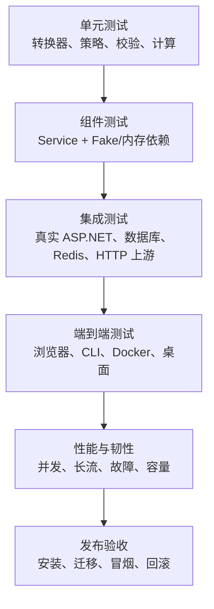

# 16. 测试与验收

> 需求前缀：`REQ-TST`  
> 代码基线：`main@3827590`  
> 目标：建立从需求、接口、协议、数据到发布形态的完整质量门禁

## 1. 质量原则

1. 测试必须验证用户可见结果，而不只验证内部方法被调用；
2. 多用户隔离和权限必须通过负向越权测试证明；
3. 协议兼容必须覆盖请求、非流式响应和 SSE 三个层面；
4. 流式测试必须区分网络块、SSE 行、事件、首字节和有效内容；
5. 数据库迁移必须在 SQLite 和 PostgreSQL 中真实执行；
6. Redis 可用与不可用都属于受支持场景；
7. Docker 和桌面产物需要启动/安装测试，编译成功不是产品验收；
8. 当前缺少正式目标的指标应标记 TBD，不以单元测试偶然性能作为 SLA；
9. 已知限制必须对应测试、监控或发布说明；
10. 每个 MUST 需求必须在追踪矩阵中有证据或明确缺口。

## 2. 当前测试基线

### 2.1 后端

当前存在约 43 个 .NET 测试类，静态统计约包括：

- 416 个 `[Fact]`；
- 25 个 `[Theory]`；
- 70 个 `[InlineData]`；
- 未发现显式 Skip；
- 覆盖协议转换、SSE、路由、熔断、亲和、日志、图片、MCP、模型目录和 Probe 等。

### 2.2 前端

当前存在：

- `channelImagesState.test.js`；
- `channelTestState.test.js`。

但 `frontend/package.json` 没有标准 `test` 脚本，CI 也未运行这些测试。

### 2.3 桌面端

当前未发现系统化 Rust/Tauri 单元、集成或安装自动化测试。

### 2.4 CI

当前 workflow：

- 仅手工触发或 tag 触发；
- validate 只执行后端测试；
- 不执行前端单测、lint、前端独立 build、Rust 测试、Docker 冒烟、安全扫描或 E2E；
- 普通 PR 和 push 缺少自动门禁。

### 2.5 当前真实环境和测试工具缺口

当前自动化测试数量较多，但尚未形成以下发布级证据：

- 未发现使用真实或容器化 PostgreSQL 执行完整迁移矩阵、约束和升级恢复的测试；
- 未发现连接真实 Redis 的共享状态、多实例一致性或网络分区测试，现有 Redis 相关单测主要使用 `redis: null`、Fake 或进程内状态；
- 未发现正式的数据库备份恢复、从上一发布版本升级、迁移失败恢复或回滚数据校验；
- `README_STREAMING_TESTS.md` 仍将 WebSearchSimulator 集成测试列为待添加项。

仓库中的手工流式工具也存在漂移：

- `capture_real_sse.sh` 调用旧的 `/api/auth/login` 并假定返回 token，与当前 Cookie 登录和访问 Key 流程不一致；
- `extract_sse_test_data.sh` 假定远端为 SQLite、查询历史表结构，并默认使用个人 SSH Key 路径；
- `test_streaming.py` 依赖未声明的 Python `requests` 包；多个脚本默认使用 `change-me` 作为 Key；
- 这些脚本当前只能视为历史辅助材料，不能作为自动化验收通过的证据。

## 3. 测试层级

### 3.1 单元测试

适合验证：

- 配置规范化与校验；
- 密码、Key、哈希和脱敏；
- 协议字段映射；
- 工具名称、Schema、调用结果配对；
- 路由排序和故障转移分类；
- 价格公式和阶梯计算；
- 内容分块、压缩和哈希；
- 前端状态机和纯函数。

### 3.2 组件测试

适合验证：

- Auth/User/ApiKey/Config 服务权限；
- ProxyEndpoint 编排；
- ChannelCapacity/CircuitBreaker/Affinity 状态机；
- Observability 查询和 DTO；
- WebSearchSimulator 工具循环；
- Images 控制器和读体约束。

### 3.3 集成测试

必须使用真实或容器化依赖验证：

- ASP.NET 路由、Cookie 和中间件；
- SQLite/PostgreSQL 迁移和约束；
- Redis 共享状态与降级；
- 实际 HTTP 上游和 SSE；
- 内容寻址日志事务；
- Images 生产 DI；
- Data Protection Key 持久化；
- 管理台静态资源路径。

### 3.4 E2E

应覆盖：

- 首次初始化；
- 超级管理员和普通用户登录；
- 渠道创建、测试、启停和删除；
- 访问 Key创建、复制、停用；
- Codex CLI/HTTP 客户端代理调用；
- 仪表盘、日志筛选、详情和实时流；
- 移动端关键页面；
- Tauri sidecar 重启与托盘；
- Docker 升级和回滚。

## 4. 认证与权限测试矩阵

| 场景 | 未登录 | 普通用户 Cookie | 超级管理员 Cookie | 有效 Bearer Key |
|---|---:|---:|---:|---:|
| `/setup/status` | 允许 | 允许 | 允许 | 身份无关 |
| `/login` | 允许 | 允许 | 允许 | 身份无关 |
| `/users` | 拒绝 | 拒绝 | 允许 | 拒绝 |
| 自己的渠道 | 拒绝 | 允许 | 允许 | 拒绝管理 |
| 他人的渠道 | 拒绝 | 拒绝 | 允许 | 仅由 Key 所属用户路由 |
| 自己的日志 | 拒绝 | 允许 | 允许 | 不能直接查询管理 API |
| 全局日志/清空 | 拒绝 | 拒绝 | 允许 | 拒绝 |
| `/v1/responses` | 拒绝 | Cookie 不足 | Cookie 不足 | 允许 |

必测负向用例：

- 普通用户猜测其他用户渠道 ID；
- 普通用户读取其他用户日志 ID；
- 超级管理员创建归属用户不存在或被停用的 Key；
- 用户停用后已有 Cookie 和 Key；
- Key停用/删除后的缓存窗口；
- 环境超级管理员被尝试停用、删除或改密；
- 当前用户删除自己；
- Bearer Key访问管理 API；
- Cookie 访问模型代理。

`REQ-TST-001`（MUST）：每个管理接口必须至少有未登录、普通用户和超级管理员三类授权测试；每个租户资源接口必须有跨用户 ID 越权测试。

## 5. 渠道和路由测试

### 5.1 渠道 CRUD

- 必填字段、URL、类型、认证模式；
- 同用户重名；
- 普通用户 Owner 强制覆盖；
- 超级管理员指定 Owner；
- JSON Header/Compat/Models 格式；
- 环境变量展开；
- Images 渠道方言、模型映射和 retry=0；
- capacity 空值/0/负数的最终产品规则；
- 导入合并、冲突和部分失败；
- 批量编辑未选字段不修改；
- 乐观启停失败回滚。

### 5.2 路由

- 仅用户自己的启用渠道进入候选；
- 无模型映射时通用渠道路径；
- 任一映射存在时必须精确命中；
- 请求模型到上游模型转换；
- 图片能力筛选；
- 亲和优先、priority、活跃数、position 的排序；
- 容量满跳过；
- 熔断 Open/Half-open/Closed；
- 所有候选满时 429；
- 无候选时明确错误；
- 管理员修改其他用户渠道后的缓存一致性。

### 5.3 重试与故障转移

- 同渠道 retry 次数是“额外次数”还是“总次数”；
- 指数退避和最大等待；
- `Retry-After`；
- 400、403、429、500、502、503、504 分类；
- 客户端 4xx 不应错误熔断的决策；
- 流首前允许跨渠道；
- 流首后禁止切换；
- 客户端取消不触发无意义重试；
- 成功后重置熔断；
- 半开只有一个探测租约。

## 6. 协议测试矩阵

### 6.1 九个方向

| 入口 \ 渠道 | Responses | Chat | Messages |
|---|---:|---:|---:|
| Responses | 同协议 | 跨协议 | 跨协议 |
| Chat | 跨协议 | 同协议 | 跨协议 |
| Messages | 跨协议 | 跨协议 | 同协议 |

每个方向至少覆盖：

- 非流式请求转换；
- 非流式响应转换；
- `stream=true` 请求；
- SSE 完成；
- SSE 错误和 incomplete；
- 模型名恢复；
- Usage、finish reason 和 Reasoning；
- 工具声明、工具调用、工具结果续轮；
- 图片内容；
- 参数不等价错误；
- 渠道 compat 重写。

`REQ-TST-002`（MUST）：协议矩阵测试必须明确区分同协议透传和六个跨协议方向，不能用单一 happy path 代表全部兼容性。

### 6.2 流式专项

- SSE 注释、空行、多行 data；
- 网络块在 UTF-8 字符、JSON 或 SSE 行中间切断；
- 首事件、TTFT 和空事件；
- 文本、Reasoning、工具参数并行增量；
- 多 choice/多 content block；
- 结束原因、usage、completed/incomplete/error；
- 上游在首事件前返回错误 JSON；
- 上游半途中断；
- 客户端断开；
- 捕获大小、集合数量和待解析事件超限；
- 同协议模型名恢复和响应捕获；
- Web Search simulate 多轮的中间 completed 抑制。

## 7. 工具和特殊流程测试

### 7.1 普通工具

- function Schema 正常/空/非法；
- tool_choice 转换；
- 并行工具；
- 调用 ID 冲突或缺失；
- 工具结果错误；
- 续轮历史缺失；
- 大参数增量。

### 7.2 Apply Patch

- function/custom/freeform/grammar；
- `apply_patch_call` 和 output；
- 多段补丁参数；
- 名称带命名空间；
- 目标不支持时的 compat/错误；
- 结果成功/失败。

### 7.3 MCP

- MCP server 配置；
- mcp_call / mcp_tool_use / mcp_tool_result；
- 名称展开与恢复；
- Header；
- 错误结果；
- 历史修复；
- Chat 降级；
- 原生 MCP 不误变普通工具。

### 7.4 Web Search

- `convert` 不调用 Tavily；
- `disabled` 删除工具、choice、include；
- `simulate` 参数、Key 选择、用量、续轮；
- Tavily 超时、429、错误 JSON；
- 无 Key、Key 达上限；
- 搜索轮数上限；
- 流式和非流式；
- 普通用户不能触发未授权本地搜索；
- 当前明确缺少的 WebSearchSimulator 集成测试必须补齐。

### 7.5 图片/OCR/Images

- 三协议图片检测；
- 工具结果图片；
- 支持图片映射直接路由；
- 非视觉模型触发 OCR；
- OCR 缓存命中/未命中/损坏；
- 视觉渠道失败和无视觉渠道；
- OCR 子日志；
- Images JSON Content-Type；
- multipart 单文件/总量/数量/MIME；
- stream=true 拒绝；
- OpenAI/xAI 方言；
- 真实生产 DI 启动。

### 7.6 Probe

- 系统开关开/关；
- 三种 token 上限字段；
- 数字、字符串、0、1、2、负数；
- 有效/无效 Key；
- 三种入口协议最小响应；
- 不调用上游；
- 写日志并标记拦截。

## 8. 数据库与存储测试

### 8.1 双数据库

- 从空库迁移到最新；
- 从每个已发布版本升级；
- SQLite/PostgreSQL Schema 语义一致；
- 唯一索引和外键；
- 时间、decimal、JSON、byte[] 差异；
- 自动播种幂等；
- 多实例迁移竞争；
- 迁移失败恢复。

### 8.2 内容寻址日志

- 空内容、小内容、大内容；
- 分块边界；
- Brotli 更小/不更小；
- 相同块去重；
- 相同 Manifest 去重；
- 事务回滚；
- 替换引用；
- 删除共享和孤立块；
- 哈希不一致；
- 块缺失、顺序错误；
- 大量日志并发写入和读取；
- 使用包含非空 `RequestLogDetails` 和 `RequestLogStreamLines` 的上一版本数据库执行 `ContentAddressedLogs.Up`；
- 逐字段验证旧请求/响应正文、Header、OCR、Web Search、流式行和时间信息已迁移，或验证经审批的数据丢弃契约；
- 执行 `ContentAddressedLogs.Down` 并核对真实数据影响，不能仅验证旧表重新出现。

### 8.3 备份恢复

- SQLite 热/冷备份恢复；
- PostgreSQL dump/PITR 方案；
- Data Protection Key 同步恢复；
- 恢复后旧 Cookie、用户、渠道、日志和内容可读；
- Redis 数据丢失后系统可重建运行状态；
- 在迁移执行前、执行中失败和执行后分别恢复，并核对日志正文而不只是行数或 Schema。

`REQ-TST-003`（MUST）：每个数据库迁移必须在 SQLite 和 PostgreSQL 中从上一正式版本真实升级，并验证应用启动、读写和回滚/恢复路径。

## 9. 管理台测试

### 9.1 页面功能

- 初始化、登录、会话、退出；
- 仪表盘时间范围、自动刷新、图表和实时流；
- 渠道原始/归并视图、批量操作、测试和定价；
- API Key创建、复制、导入导出、启停；
- 用户 CRUD；
- Web Search模式、Key 和测试；
- 模型信息筛选、编辑和停用；
- 系统设置、重启；
- 日志过滤、分页、列设置、详情和关联跳转。

### 9.2 状态和错误

- 加载、空态、错误态；
- 重复提交；
- API 401/403；
- 会话过期；
- 网络中断和恢复；
- SSE 断开/重连；
- 乐观更新失败回滚；
- 导入部分非法；
- 页面切换导致状态销毁；
- 未保存表单离开；
- 异步组件加载失败。

### 9.3 响应式

至少覆盖：

- 375×667 小屏手机；
- 390×844 主流手机；
- 768×1024 平板；
- 900px 导航断点；
- 1280×800 桌面；
- 1440×900 桌面；
- 横竖屏切换；
- iOS 安全区和输入缩放；
- 表格/卡片布局切换；
- 大弹窗全屏。

### 9.4 可访问性

- 键盘导航；
- 焦点可见；
- 图标按钮可访问名称；
- 错误行内关联；
- 颜色之外的状态文本；
- ECharts 文本替代；
- `aria-live`；
- reduced motion；
- 200% 缩放；
- 屏幕阅读器关键流程。

## 10. 桌面端测试

- sidecar 启动和端口等待；
- 端口冲突；
- 本地/LAN 设置；
- 保存设置后重启；
- 数据目录和权限；
- 主窗口打开/隐藏；
- 托盘打开/退出；
- sidecar 异常退出；
- 多次重启无僵尸进程；
- 安装、升级、降级、卸载；
- Windows/macOS/Linux 路径差异；
- macOS 扩展路径前缀处理；
- 发布版 CSP、DevTools 和签名。

## 11. 性能与韧性测试

### 11.1 待确认指标

必须由产品/技术负责人确认：

- 单实例最大并发；
- 每渠道容量范围；
- p50/p95/p99 代理开销；
- p95 TTFT 增量；
- 日志写入开销；
- 日志查询在 10万/100万/1000万记录下的延迟；
- 最大 SSE 时长；
- 最大请求、工具 Schema 和响应体；
- SQLite/PostgreSQL 适用规模。

### 11.2 故障注入

- 上游 DNS 失败、连接拒绝、TLS 失败、超时；
- 上游慢响应、错误 SSE、半流断开；
- Redis 网络分区；
- PostgreSQL 重启和连接池耗尽；
- 磁盘满；
- 日志正文写入失败；
- Data Protection Key丢失；
- Tauri sidecar 崩溃；
- 进程发布中断；
- 客户端大量取消。

`REQ-TST-004`（MUST）：可靠性需求必须通过故障注入证明，而不是只用 Fake 返回预设状态码。

## 12. 发布门禁

### 12.1 PR 门禁

- 代码格式/Lint；
- 后端 build + 全量测试；
- 前端单测 + build；
- Rust check/test；
- SQLite/PostgreSQL 迁移校验；
- 关键协议矩阵；
- Secret 和依赖扫描；
- PRD/接口/迁移变更检查。

### 12.2 Release 门禁

- PR 门禁全部通过；
- Docker build + 启动冒烟；
- 三平台桌面构建；
- 安装测试；
- 性能回归阈值；
- 数据备份和恢复抽检；
- 版本、签名、哈希和 SBOM；
- 发布说明和已知风险；
- 回滚演练。

## 13. 缺陷处理流程

1. 先写复现测试或最小复现步骤；
2. 记录基线版本、入口协议、渠道类型、流式状态和相关日志；
3. 修复最小责任模块；
4. 运行受影响单测、协议方向测试和全量回归；
5. 若改变用户可见规则，同步 PRD；
6. 对生产数据或迁移问题补恢复验证；
7. 确认复现用例从失败变为通过。

## 14. 需求列表

| 编号 | 级别 | 需求 |
|---|---|---|
| `REQ-TST-005` | MUST | 前端测试提供标准 npm script 并在 CI 执行 |
| `REQ-TST-006` | MUST | 普通 PR 自动运行质量门禁 |
| `REQ-TST-007` | MUST | 九个协议方向覆盖流式和非流式 |
| `REQ-TST-008` | MUST | Redis 可用/不可用和多实例行为均测试 |
| `REQ-TST-009` | MUST | Images 真实生产依赖通过启动集成测试 |
| `REQ-TST-010` | MUST | WebSearchSimulator 具备完整集成测试 |
| `REQ-TST-011` | MUST | 移动端关键管理流程具备 E2E |
| `REQ-TST-012` | MUST | 桌面三平台完成安装冒烟 |
| `REQ-TST-013` | MUST | 所有安全边界有负向测试 |
| `REQ-TST-014` | SHOULD | 采集代码覆盖率并设关键模块门槛 |
| `REQ-TST-015` | SHOULD | 建立性能基线和自动回归比较 |
| `REQ-TST-016` | MUST | 每个 MUST 需求在追踪索引中有测试证据或缺口状态 |
| `REQ-TST-017` | MUST | `ContentAddressedLogs` 必须以非空旧库验证 Up/Down 数据影响，任何预期数据丢弃都需显式验收 |
| `REQ-TST-018` | MUST | 手工测试和数据采集脚本必须与当前认证、数据库 Schema、部署形态和依赖声明同步，否则从验收证据中排除 |

## 15. 当前测试文件索引

| 领域 | 代表测试 |
|---|---|
| 路由/可靠性 | `RouteTests.cs`、`ChannelAffinityServiceTests.cs`、`ChannelCircuitBreakerServiceTests.cs`、`ProxyFailoverPolicyTests.cs` |
| 代理编排 | `ProxyEndpointServiceTests.cs`、`ProxyCompatibilityTests.cs` |
| 协议矩阵 | `ProtocolConversionMatrixTests.cs`、`ProtocolStructuralCompatibilityTests.cs` |
| 流式 | `SseStreamConverterTests.cs`、`StreamingIntegrationTests.cs`、`ProxyStreamServiceTests.cs` |
| MCP | `NativeMcpConfigurationTests.cs`、`NativeMcpProtocolTests.cs`、`NativeMcpHistoryTests.cs`、`NativeMcpResponseTests.cs` |
| 图片 | `ImagesControllerTests.cs`、`ProxyImageFallbackTests.cs`、`ProxyVisionRoutingTests.cs` |
| 日志 | `ProxyLogServiceTests.cs`、`ObservabilityServiceTests.cs`、`LogContentCodecTests.cs`、`LogContentStoreTests.cs` |
| 模型和价格 | `ModelCatalogServiceTests.cs`、`ModelPricingServiceTests.cs`、`ProxyControllerTests.cs`（统一 `/models` 返回） |
| Probe | `ProbeRequestInterceptorTests.cs`、`ProxyControllerTests.cs` |
| 前端状态 | `channelImagesState.test.js`、`channelTestState.test.js` |
| 手工流式工具（当前漂移） | `capture_real_sse.sh`、`extract_sse_test_data.sh`、`test_streaming.py` |
