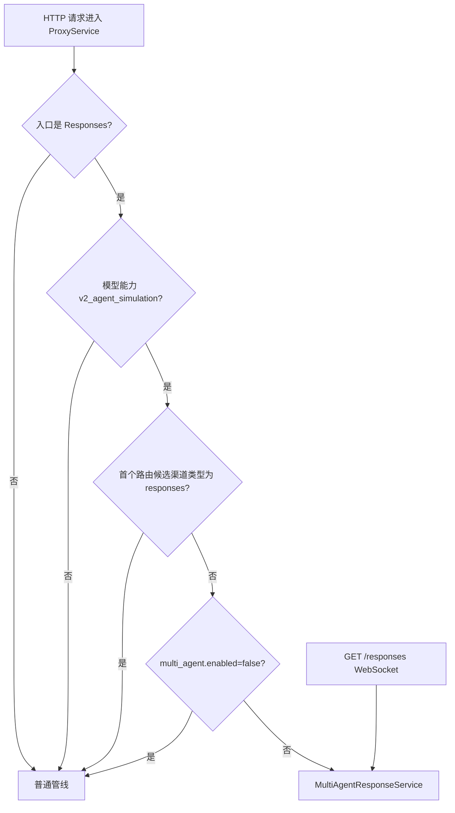

# OpenCodex PRD：多代理模拟（v2）

## 文档元数据

| 项目 | 内容 |
|---|---|
| 文档编号 | PRD-19 |
| 需求前缀 | `REQ-MA` |
| 文档状态 | 基于现状反向建模，待产品评审 |
| 基线版本 | `main@235da3f4` |
| 最后核对日期 | 2026-09-30 |
| 适用对象 | 产品、后端、测试、SDK/客户端、SRE |
| 相关文档 | [协议转换](./08-protocol-conversion.md)、[路由与可靠性](./07-routing-and-reliability.md)、[配置](./12-configuration.md)、[测试与验收](./16-testing-and-acceptance.md)、[已知限制与风险](./17-known-limitations-and-risks.md) |
| 事实优先级 | 当前源码与快照模型 > 自动化测试 > 当前运行配置 > 说明性文档 |

> 本文将 **当前实现事实（CURRENT）**、**产品化要求**、**已知限制** 与 **待确认 TBD** 分开描述。本文只以当前源码、快照模型与自动化测试为依据，不把对外兼容目标写成已实现能力。
>
> 本文中的“多代理模拟（v2）”指 OpenCodex 服务端托管的多代理运行器及其普通管线兼容策略，不等价于 OpenAI 官方 hosted multi-agent v2 的全部协议语义。官方密文互通、外部 hosted 运行导入、多实例状态协调和 Codex 客户端原生代理树 UI 均不属于当前已实现范围。

---

## 1. 目标与范围

### 1.1 产品目标

多代理模拟让 Responses 客户端在不改变自身多代理工具调用外观的前提下，由 OpenCodex 服务端承担以下职责：

1. 根据全局模型能力开关决定哪些 Responses 请求进入服务端多代理运行器。
2. 维护根代理、子代理、任务代次、邮箱、等待状态与客户端工具调用归属。
3. 将模型返回的文本、reasoning、工具参数和工具调用转换为带代理归属的 Responses 事件。
4. 将客户端工具调用交给客户端执行，并通过 `call_id` 与服务器状态重新挂接结果。
5. 在进程内或本地 JSON 快照中保存运行状态，支持同一 API key 与同一会话范围内的 `previous_response_id` 续接。
6. 按调度累计整次运行的模型调用计数，保留子代理并发上限和按 token 阈值触发的上下文压缩；不因调用计数终止或触发压缩。
7. 对未进入服务端运行器的普通管线请求，按渠道配置处理上游 v2 语义。
8. 明确失败、恢复、跨实例、安全和可观测性边界，避免把“工具可执行”误写成“官方 v2 全等价”或“客户端原生代理树已实现”。

### 1.2 本文范围

- 能力开关 `capabilities.v2_agent_simulation` 的匹配与默认关闭语义。
- `POST /responses`、`POST /v1/responses` 的 JSON 与 SSE 行为。
- `GET /responses`、`GET /v1/responses` 的 WebSocket 升级、`response.create` 与 `response.inject`。
- `ocxp_ma_spawn_agent`、`send_message`、`followup_task`、`wait_agent`、`interrupt_agent`、`list_agents` 六个服务端协作函数。
- 代理树、任务代次、邮箱、等待、中断、子代理失败隔离与根代理终态。
- 文本、reasoning、函数调用参数、自定义工具输入等增量事件的服务端分发与身份分配。
- API key 加会话标识的状态隔离、会话标识来源顺序、`previous_response_id` 查询与固定模型。
- `store:false` 内存模式、JSON 快照、重启恢复、快照兼容与不猜测旧回合。
- 模型调用计数、子代理并发上限、上下文压缩阈值和摘要调用。
- 普通管线中的 `multi_agent_v2_mode` 自动/显式策略、降级改写和重复轮次软性护栏。
- 已知限制、TBD、源码与测试追溯、发布验收建议。

### 1.3 不在本文范围

- 通用 Responses、Chat、Messages 三协议转换矩阵，见 [协议转换](./08-protocol-conversion.md)。
- 渠道路由、容量、熔断、故障转移与渠道亲和，见 [路由与可靠性](./07-routing-and-reliability.md)。
- 模型目录、全局模型能力编辑器的完整管理面，见 [管理控制台](./10-admin-console.md) 与 [配置](./12-configuration.md)。
- 模型定价、账单科目和成本计算，见 [可观测性与计费](./11-observability-and-billing.md)。
- 与 OpenAI 官方 hosted multi-agent v2 的完整协议等价、官方密文互通、外部 hosted 运行导入或官方代理树可视化协议。
- 多实例协调、Redis 共享运行状态、跨进程锁和负载均衡下的会话粘滞策略。
- Codex 客户端或其它客户端的原生代理树 UI 实现。

---

## 2. 角色与前置条件

### 2.1 角色

| 角色 | 关注点 |
|---|---|
| API 客户端 | Responses 请求格式、SSE/WebSocket 事件、客户端工具调用与结果回传 |
| 模型目录管理员 | 全局模型能力 `capabilities.v2_agent_simulation` 的开启与匹配范围 |
| 渠道管理员 | 普通管线 `multi_agent_v2_mode` 的透传、降级或拒绝策略 |
| 后端开发者 | 代理运行、会话状态、任务代次、调用计数、压缩与快照 |
| 测试人员 | 入口分流、协作动作、流式顺序、错误码、恢复和隔离 |
| SRE | 单实例边界、快照目录、容量、清理、可观测性与多实例限制 |

### 2.2 前置条件

1. 请求已通过代理 API key 鉴权，且运行器可取得稳定的 API key 标识。
2. 请求体是 JSON 对象，`model` 在进入运行器前可解析。
3. `POST /responses` 要进入服务端运行器，命中的全局启用模型必须显式声明 `capabilities.v2_agent_simulation=true`。
4. `GET /responses` WebSocket 升级固定由 `MultiAgentResponseService` 处理；`response.create` 仍需在模型目录中通过能力检查。
5. 客户端若希望续接同一运行，需要继续提供相同的 API key、会话标识或可解析的 `previous_response_id`。
6. 客户端工具调用必须由客户端执行；服务端只分配调用 ID、记录归属并等待结果。

---

## 3. 术语

| 术语 | 定义 |
|---|---|
| 服务端多代理模拟 | OpenCodex 在服务端调用模型、维护代理树并产生 Responses 事件的运行模式 |
| 运行（Run） | 一个 `MultiAgentRun`，包含模板、代理表、待处理调用、输出历史、调用计数与 usage |
| 代理（Agent） | `MultiAgentState`，路径以 `/root` 开始，可为根代理或子代理 |
| 根代理 | 路径为 `/root` 的代理；最终回答由根代理汇总 |
| 子代理 | 路径为 `/root/...` 的代理；用于执行委派任务 |
| 任务代次 | `Generation` 与 `CurrentTaskGeneration`，用于区分同一代理的多次 follow-up 任务 |
| 已完成回合 | `MultiAgentTaskTurn`，记录已完成、失败、不完整或已中断任务的条目 |
| 协作函数 | 以 `ocxp_ma_` 为前缀的六个服务端动作 |
| 客户端工具 | 非 `ocxp_ma_` 的 function/custom 工具；由客户端执行并回传输出 |
| 内部动作 | 服务端在运行器内执行的 `ocxp_ma_*` 调用，不向客户端暴露为可执行函数 |
| 普通管线 | `ProxyEndpointService` 的常规路由、Compat、协议转换与上游调用链路 |
| 客户端侧多代理 | Codex 客户端通过 `agent_message`、`assign_agent_task` 等载荷表达的多代理请求 |
| Hosted 多代理 | 上游服务托管的 `multi_agent_call`、`multi_agent_call_output` 与密文历史 |
| 会话键 | API key 标识与解析出的会话标识组成的隔离键 |
| 快照 | `MultiAgentRunStore` 写入的 JSON 运行状态 |
| 模型调用计数 | `MultiAgentRun.ModelTurns` 按调度累计：普通回合预先计 1，需要摘要的回合预先计 2；用于续接输入判定，不设次数上限 |
| 压缩 | 在代理上下文达到阈值时，先用摘要模型调用生成参考摘要，再继续主模型调用 |

---

## 4. 当前实现事实（CURRENT）

### 4.1 能力开关与入口分流

`IModelCatalogService.SimulatesMultiAgent` 的默认实现返回 `false`；`ModelCatalogService.SimulatesMultiAgent` 只在命中启用中的全局模型且 `CapabilitiesJson` 中 `v2_agent_simulation` 显式为 `true` 时返回 `true`。前端模型编辑器在新建模型时把该能力初始化为 `false`。

| 入口 | 当前分流条件 | 当前行为 |
|---|---|---|
| `POST /responses`、`POST /v1/responses` | `SimulatesMultiAgent(model)` 为 `true` 且首个路由候选渠道类型不是 responses | 进入 `MultiAgentResponseService.Responses` |
| `POST /responses`、`POST /v1/responses` | 模型能力开启且首个路由候选渠道类型为 responses | 跳过运行器，保持 `responses -> responses` 透传，不注入 `ocxp_ma_*` 协作工具 |
| `POST /responses`、`POST /v1/responses` | 能力未开启或模型不匹配 | 继续普通管线 |
| `POST /responses` 且 `multi_agent.enabled=false` | 即使模型能力开启 | 顶层 `multi_agent` 被移除，直接调用普通管线 |
| `GET /responses`、`GET /v1/responses` WebSocket 升级 | 始终 | 固定由 `MultiAgentResponseService.ResponsesWebSocket` 处理；在 `response.create` 内检查模型能力 |
| `POST /chat/completions`、`POST /v1/chat/completions` | 不进入服务端多代理运行器 | 继续普通管线；上游 v2 语义由普通管线的渠道策略处理 |
| `POST /messages`、`POST /v1/messages` | 不进入服务端多代理运行器 | 继续普通管线；上游 v2 语义由普通管线的渠道策略处理 |



### 4.2 HTTP 请求与响应形态

1. `POST /responses` 与 `POST /v1/responses` 接受 JSON 对象。
2. `stream=false` 时，运行器仍通过内部流式模型管线收集模型输出，最终返回一个 Responses 对象。
3. `stream=true` 时，响应使用 SSE；首个事件触发 SSE 响应头与正文准备，后续增量实时写出。
4. 服务端模型调用会把内部请求的 `stream` 设为 `true`，通过 `MultiAgentModelStreamWriter` 收集终态和 usage。
5. 未显式关闭并继续服务端运行器的 HTTP 响应会设置 `X-OpenCodex-Multi-Agent-Session`，值为最终解析或生成的会话标识；`multi_agent.enabled=false` 的直接回退分支不设置该头。
6. 根代理模型失败或不完整时，运行器生成状态为 `failed` 或 `incomplete` 的 Responses 对象；流式路径输出 `response.failed` 或 `response.incomplete`。

### 4.3 WebSocket 请求与响应

1. `GET /responses` 或 `GET /v1/responses` 在是 WebSocket 升级请求时接受连接。
2. 客户端事件类型为 `response.create` 与 `response.inject`。
3. 每个连接同时只允许一个活动响应；活动响应未完成时再次发送 `response.create` 返回 `response_in_progress`，现有模型调用继续运行。
4. 连接内首次 `response.create` 解析并固定会话标识；后续 `response.create` 继续使用同一连接的会话标识。
5. `response.create` 在 `multi_agent.enabled=false` 时返回错误并关闭连接，提示改用 HTTP。
6. `response.create` 的模型必须通过 `SimulatesMultiAgent` 检查；否则返回错误并关闭连接。
7. `response.inject` 只接受 `response_id` 与非空的 `function_call_output` 或 `custom_tool_call_output` 列表；每条输入必须包含非空 `call_id` 与 `output`。
8. 注入成功时发送 `response.inject.created`；注入失败时发送 `response.inject.failed`，错误码包括 `response_already_completed`、`response_not_found` 与 `invalid_tool_call`。
9. 服务器发送事件使用 JSON 文本帧；`sequence_number` 在发送时归一为严格递增。
10. 客户端断开时活动模型调用被取消；连接级输入通道被完成。连接仍可写且执行器未取消时，排队注入会收到失败响应。

### 4.4 协作函数与代理路径

`MultiAgentProtocol.Actions` 固定六个动作：

| 动作 | 服务端工具名 | 当前语义 |
|---|---|---|
| `spawn_agent` | `ocxp_ma_spawn_agent` | 在调用者路径下创建子代理，创建成功后发送 `NEW_TASK` |
| `send_message` | `ocxp_ma_send_message` | 向目标代理邮箱追加消息，不启动空闲代理 |
| `followup_task` | `ocxp_ma_followup_task` | 向非根目标代理排队新任务，空闲时启动 |
| `wait_agent` | `ocxp_ma_wait_agent` | 等待邮箱更新或超时，默认超时 10000 毫秒，最大 60000 毫秒 |
| `interrupt_agent` | `ocxp_ma_interrupt_agent` | 中断另一个代理的当前任务，保留会话，结束当前回合 |
| `list_agents` | `ocxp_ma_list_agents` | 按可选路径前缀列出代理名称、父级、状态与最近任务 |

路径规则：

1. 根代理固定为 `/root`。
2. `spawn_agent.task_name` 必须是非空路径段，不能包含 `/`，不能是 `.` 或 `..`。
3. 相对路径按调用者路径解析；绝对路径以 `/` 开头。
4. `followup_task` 不允许目标为 `/root`。
5. 客户端传入的 `collaboration`、`collaboration.*` 或 `collaboration_*` 协作工具会在规范化时被替换为服务端动作。
6. `ocxp_ma_` 前缀为服务端保留；客户端定义同名或未知 `ocxp_ma_*` 工具会被拒绝。

`fork_turns` 当前语义：

1. `all` 或空值复制调用时的完整历史副本，可能包含当前任务已写入历史的上下文。
2. 正整数复制 system/developer 指令，并附加 `CompletedTurns` 中最近 N 个已完成、失败、不完整或已中断回合，不包含当前未完成回合和邮箱消息。
3. `none` 只保留 system/developer 指令。

### 4.5 调度、并发与任务队列

1. 根代理与子代理都进入同一个 `MultiAgentRun`。
2. `multi_agent.max_concurrent_subagents` 控制同时处于模型调用中的非根代理数量；省略时为 `3`，小于 `1` 返回 400。
3. 根代理不计入子代理并发上限。
4. 处于 `waiting`、`tool_wait` 或已有活动调用的代理不会被重复调度。
5. `PendingTasks` 按先进先出执行；`StartNextTask` 取队列首项并立即占用任务代次。
6. 同一运行的 `MultiAgentRun.ModelTurns` 按调度预先累计：普通回合加 1，需要摘要的回合加 2；不设置次数上限。
7. `wait_agent` 超时或收到邮箱消息后会生成成对的工具调用结果。
8. `interrupt_agent` 会取消活动模型令牌，结束当前任务回合；后续 follow-up 作为新任务代次执行。

### 4.6 会话、隔离与续接

1. 运行器使用 API key 标识与会话标识组成会话键，隔离不同 key、不同会话的运行。
2. 会话标识来源顺序固定为：
   1. `client_metadata.session_id`
   2. `client_metadata.thread_id`
   3. `session-id` 请求头
   4. `X-OpenCodex-Multi-Agent-Session` 请求头
   5. `prompt_cache_key`
3. 全部为空时，服务端运行器路径生成新的 GUID 字符串，并通过 HTTP `X-OpenCodex-Multi-Agent-Session` 响应头返回；`multi_agent.enabled=false` 的直接回退分支不生成也不返回该头。
4. `previous_response_id` 只会在同一 API key 与同一会话的已保存运行中查询。
5. 同一会话必须先命中已有运行，再按其 `Model` 检查请求模型；模型不一致返回 400。
6. `store=false` 时运行的最新状态只保留在当前进程内存中；重启后不能恢复到未持久化的最新状态，磁盘上已有的旧快照仍按既有内容加载。
7. 未设置 `store=false` 时，运行写入 `MultiAgent:StateDirectory`；默认目录为 `logs/multi-agent-runs`。
8. 快照目录使用会话键哈希分层，单个运行使用运行 ID 哈希命名；写入先生成临时文件，再覆盖移动到目标文件。
9. 重启后在下一次请求加载快照；加载过程只恢复状态，不主动调用模型。已处于 `running` 的代理恢复为 `ready`，未完成的模型回合可能重做。
10. `ReceivedCalls` 会随快照保留，用于拒绝重复投递已经消费过的客户端工具结果。

### 4.7 流式事件与身份分配

1. 模型流中的文本、reasoning、函数参数、自定义工具输入等增量事件会进入运行器分发队列。
2. 运行器在 `response.output_item.added` 时为输出项分配新的服务端 `item_id`，并写入 `agent.agent_name`。
3. `output_index` 使用运行器统一输出列表的位置，不直接沿用多个代理各自的上游索引。
4. `sequence_number` 由运行器统一递增；WebSocket 发送层再次保证严格递增。
5. 多个代理即使返回相同上游 `item_id` 或 `output_index`，在客户端侧仍获得不同身份。
6. `response.output_item.done` 在协调器接受完整模型结果后才发布；正常终结时不会重新播放此前已经发送的 delta。续接请求中，尚未完成的 pending 客户端调用会为恢复执行而重放调用项，这是显式例外。
7. 未完成的工具参数不会被发布为可执行工具调用。
8. 缺少终结事件、终结事件不是对象、成功终结但没有输出项时会抛出上游错误。
9. `response.failed` 与 `response.incomplete` 不会与 `response.completed` 同时发布。
10. 内部 `ocxp_ma_*` 函数调用对客户端隐藏，不作为普通函数增量转发；运行器改为发出 `multi_agent_call` 与 `multi_agent_call_output` 项。

### 4.8 上下文压缩与调用计数

1. 运行器在调度代理前检查该代理的 `LastInputTokens` 是否达到 `CompactThresholdTokens`。
2. 压缩阈值默认 `64000`，可由 `MultiAgent:CompactThresholdTokens` 配置，也可由请求 `context_management.compact_threshold` 覆盖；小于 `1` 返回 400。
3. 达到阈值时，调度先将 `ModelTurns` 加 2，再发起摘要调用；摘要成功后继续主调用。若摘要失败，主调用不会发起，但已累计的 2 不回退，因此该计数不等于实际完成或已发出的调用次数。
4. 摘要请求复用原来的模型调用管线，但清空 `tools` 并移除 `tool_choice`。
5. 摘要保留 system/developer 约束，将原历史摘要为参考数据，并保留当前任务所需的历史尾部。
6. 摘要成功且主模型回合进入 `ProcessTurn` 后，摘要调用的 input/output usage 与主模型调用一并计入运行的 input/output tokens；摘要成功后主调用直接抛错的失败终态不包含该摘要 usage。
7. 摘要状态为 `failed`、`incomplete` 或摘要文本为空时，历史不被摘要替换，运行按失败路径处理。
8. `ModelTurns` 按根代理和子代理的调度累计，包含需要摘要时预先计入的两次调用，也用于续接输入判定，不设次数上限；旧 `MultiAgent:MaxModelTurns` 配置不再读取。
9. 压缩只根据 token 阈值触发，与累计调用次数无关；摘要与后续主调用不受剩余调用次数限制。
10. 请求 `context_management.compact_threshold` 在本地解析和校验；`context_management` 随后由多代理规范化层移除，不透传给上游。

### 4.9 终态、失败隔离与客户端工具暂停

1. 根代理正常完成且没有未完成子代理与邮箱消息时，运行标记为完成并发布 `response.completed`。
2. 根代理模型返回 `incomplete` 时，根代理状态为 `incomplete`，发布 `response.incomplete`，运行不标记为完成。
3. 根代理模型抛出 `ProxyException` 时，根代理状态为 `failed`，发布 `response.failed`，运行不标记为完成。
4. 子代理的 `ProxyException` 或 `IncompleteModelResponse` 只把该子代理标记为失败或不完整，并发送 `FAILURE` 消息给父代理；其它子代理继续运行。
5. 根代理提前给出最终回答但仍有未完成子代理时，根代理进入 `finalizing`；子代理结果到达后会再次调度根代理进行汇总。
6. HTTP 运行在只剩客户端工具调用时返回当前 Responses 完成结果，但 `MultiAgentRun.Finished` 保持 `false`；客户端用后续请求回传工具结果后继续运行。
7. 重复回传同一个客户端工具结果不会再次应用到历史。
8. WebSocket 运行在等待客户端注入时保持连接与活动状态，直到注入、等待条件或断开。

### 4.10 普通管线中的上游 v2 兼容

以下逻辑只在请求没有进入服务端多代理运行器时由普通管线执行，适用于 `multi_agent.enabled=false`、Chat/Messages 入口或未命中模拟能力的 Responses 请求。

1. `MultiAgentV2Policy.IsV2Request` 的命中条件包括：
   - 顶层 `multi_agent` 非空且未显式 `enabled=false`；
   - 输入项类型为 `agent_message`、`multi_agent_call` 或 `multi_agent_call_output`；
   - 工具名为 `assign_agent_task`。
   只有命中这些条件时才继续读取渠道配置或应用自动策略；非 v2 请求返回 `None`。
2. 渠道 `compat.multi_agent_v2_mode` 只接受 `passthrough`、`downgrade`、`reject` 或空值。
3. 未配置时自动策略为：
   - Responses 入口、Responses 上游（不区分渠道域名）：`passthrough`；
   - Chat 或 Messages 上游：`downgrade`；
   - 其它 Responses 渠道：`reject`。
4. `passthrough` 不重写载荷。
5. `downgrade` 删除顶层 `multi_agent`，把 `agent_message`、`multi_agent_call`、`multi_agent_call_output` 转为普通用户文本消息，并删除 hosted 工具类型。
6. `downgrade` 对 `enc_` 前缀密文只保留可读占位说明，不回传密文原文；非 `enc_` 的明文内容按当前重写规则保留。
7. `reject` 在调用上游前返回 400。
8. `downgrade` 路径在超过重复轮次阈值后追加 `multi_agent_repeat_guard` 指令，阈值常量为 12，计数器按会话与任务消息 ID 隔离，并在 TTL 或容量上限下淘汰。

### 4.11 客户端历史、官方互通与 UI 边界

1. 服务端以自身运行状态为准。客户端回传的 Responses 历史只用于消费用户新任务和客户端工具结果；服务端不会从客户端历史重建代理树。
2. 客户端工具结果中的 `agent` 字段会被移除，调用归属仍由服务端 `PendingCalls` 与 `ReceivedCalls` 映射决定。
3. 新建服务端运行时，若输入包含外部 `multi_agent_call` 或 `multi_agent_call_output`，会返回 400，提示启动新的服务端多代理对话。
4. 新建服务端运行时，`agent_message` 中带 `enc_` 前缀的外部密文会返回 400；普通管线 `downgrade` 不返回 400，而是把 `enc_` 内容转为占位说明。纯文本或非 `enc_` 文本按当前规则转入普通消息。
5. 服务端事件包含 `agent.agent_name` 与 `multi_agent_call` 项，但当前仓库前端没有消费这些字段来渲染原生代理树。
6. 工具调用可以在客户端执行，不代表客户端 UI 已原生显示代理层级、邮箱或任务树。

---

## 5. 状态与决策表

### 5.1 入口分流决策

| 条件 | 结果 |
|---|---|
| 非 Responses 入口 | 不进入服务端多代理运行器 |
| Responses 模型能力未开启 | 普通管线 |
| Responses 模型能力开启且首个路由候选渠道类型为 responses | 跳过服务端多代理运行器，保持 `responses -> responses` 透传 |
| Responses 模型能力开启且 `multi_agent.enabled=false` | 移除顶层 `multi_agent` 后进入普通管线 |
| Responses 模型能力开启且未显式关闭 | 服务端多代理运行器 |
| WebSocket 升级请求 | 固定进入 `MultiAgentResponseService` |
| WebSocket `response.create` 模型能力未开启 | 返回错误并关闭连接 |

### 5.2 会话标识解析顺序

| 顺序 | 来源 | 缺失时行为 |
|---:|---|---|
| 1 | `client_metadata.session_id` | 继续下一项 |
| 2 | `client_metadata.thread_id` | 继续下一项 |
| 3 | `session-id` 请求头 | 继续下一项 |
| 4 | `X-OpenCodex-Multi-Agent-Session` 请求头 | 继续下一项 |
| 5 | `prompt_cache_key` | 继续下一项 |
| 6 | 自动生成 | 生成 GUID 字符串 |

HTTP 服务端运行器路径把最终值写入 `X-OpenCodex-Multi-Agent-Session` 响应头；直接回退分支不生成该会话头。WebSocket 路径当前不在握手响应中返回该头，连接内通过 `connectionSession` 复用。

### 5.3 WebSocket 错误与状态

| 场景 | 事件或错误码 | 处理 |
|---|---|---|
| 活动响应未完成时再次 `response.create` | `response_in_progress` | 保留现有模型调用 |
| 注入已完成的响应 | `response_already_completed` | 返回 `response.inject.failed` |
| 注入当前连接未知的响应 | `response_not_found` | 返回 `response.inject.failed` |
| 注入未处于 pending 的调用 | `invalid_tool_call` | 返回 `response.inject.failed` |
| 非法 JSON、非法事件类型或非法注入结构 | `error` | 发送错误并关闭连接 |
| 模型能力未开启或显式关闭 | `error` | 发送错误并关闭连接 |
| 客户端断开 | 无正常完成 | 取消活动模型，结束连接 |

### 5.4 存储与恢复决策

| 请求条件 | 进程内状态 | 磁盘快照 | 重启后可恢复 |
|---|---|---|---|
| `store=false` | 保留 | 不写 | 否 |
| 未设置 `store=false` | 保留 | 写入状态目录 | 是，需相同 API key 与会话 |
| 旧快照缺少新增字段 | 使用模型默认值 | 不自动回填 | 不猜测缺失回合 |
| 快照中的代理状态为 `running` | 恢复为 `ready` | 保留其它字段 | 模型回合可能重做 |

---

## 6. 接口契约摘要

### 6.1 HTTP

1. `POST /responses` 与 `POST /v1/responses` 接受 JSON 对象。
2. `stream=false` 返回最终 Responses 对象。
3. `stream=true` 返回 `text/event-stream`，事件名使用 Responses 事件类型。
4. 成功进入运行器后，响应头包含 `X-OpenCodex-Multi-Agent-Session`。
5. 客户端工具调用会出现在输出项中；客户端执行后必须在后续请求中回传对应 `function_call_output` 或 `custom_tool_call_output`。

### 6.2 WebSocket

1. 客户端发送 `response.create`，可携带 `model`、`input`、`tools`、`multi_agent`、`previous_response_id` 等 Responses 字段。
2. 服务端为每次运行发送 `response.created`、增量事件、输出项事件和终态事件。
3. 客户端可发送 `response.inject` 回传工具输出。
4. 每个连接同一时间只允许一个活动响应。
5. `sequence_number` 在连接内严格递增。

### 6.3 协作函数契约

| 函数 | 关键参数 | 结果 |
|---|---|---|
| `ocxp_ma_spawn_agent` | `task_name`、`message`、可选 `fork_turns` | 创建子代理或返回重复错误 |
| `ocxp_ma_send_message` | `target`、`message` | 写入邮箱，不启动空闲代理 |
| `ocxp_ma_followup_task` | `target`、`message` | 排队新任务，空闲时执行 |
| `ocxp_ma_wait_agent` | 可选 `timeout_ms` | 返回 `updated` 与 `timed_out` |
| `ocxp_ma_interrupt_agent` | `target` | 取消当前任务并记录中断回合 |
| `ocxp_ma_list_agents` | 可选 `path_prefix` | 返回路径前缀匹配的代理列表 |

### 6.4 流式事件归属

1. 输出项事件带服务端分配的 `item_id`、`output_index` 和 `agent.agent_name`。
2. 增量事件的 `output_index`、`item_id` 与 agent 归属使用服务端映射，不信任多个上游代理的同名字段。
3. 完成事件只发布一次对应输出项，不重复播放 delta。
4. 根代理终态只发布 `response.completed`、`response.failed` 或 `response.incomplete` 之一。

---

## 7. 异常与边界

1. `multi_agent.enabled=false` 只删除顶层 `multi_agent`，不会自动移除输入中的 `agent_message`、`multi_agent_call`、`multi_agent_call_output` 或 `assign_agent_task` 工具；这些标记仍可能触发普通管线的上游 v2 策略。
2. `GET /responses` WebSocket 入口固定进入运行器，即使模型能力未开启，也在 `response.create` 内失败。
3. 模型流缺少终结事件、终结事件对象缺失、成功终结无输出时，当前实现按上游错误处理。
4. 停止或中断的模型调用可以留下不完整输出项，但不会把未完成工具调用发布为可执行调用。
5. 子代理失败不会取消兄弟代理；父代理收到失败消息后可以继续汇总。
6. 根代理失败或不完整不会发布正常完成事件。
7. 客户端工具调用没有独立超时；HTTP 运行会返回当前结果并把调用保留为 pending，WebSocket 会等待注入或断开。
8. `store=false` 的更新不会跨进程或跨重启恢复；重启只会加载之前已持久化的旧快照。
9. 旧快照缺少回合记录时，代码使用空集合，不从历史内容猜测代理任务边界。
10. 当前快照没有 schema 版本字段、迁移器或自动回填逻辑。
11. 当前实现仅使用进程内字典、进程内信号量和本地文件快照，没有 Redis 或跨实例协调。
12. WebSocket 的注入集合与已完成 ID 集合按连接建立；重连后不会把旧连接上的注入状态带入新连接。
13. 会话标识自动生成时，HTTP 客户端可通过响应头获知；WebSocket 客户端当前只能依赖自己提供标识或继续使用 `previous_response_id`。
14. `v2_agent_simulation` 只由全局模型目录解析，渠道级模型覆盖编辑器没有该能力开关。
15. 服务端事件的 `agent` 归属是协议数据，不代表客户端已渲染原生代理树。
16. 官方 hosted 多代理密文和外部 hosted 历史的互通不在当前实现范围。

---

## 8. 产品化需求与验收标准

### REQ-MA-001 能力开关与默认关闭（MUST）

**状态：** CURRENT（已实现）

**要求：** 只有启用中的全局模型显式声明 `capabilities.v2_agent_simulation=true` 时，Responses 请求才允许进入服务端多代理运行器；缺省、`false`、模型未启用、无匹配或空模型名都必须返回未开启。

**验收标准：**

1. `ModelCatalogServiceTests.SimulatesMultiAgentRequiresEnabledMatchingModelAndExplicitCapability` 覆盖空对象、显式 `false`、显式 `true` 和模型未启用。
2. `ModelCatalogServiceTests.SimulatesMultiAgentUsesExactBeforeBroaderPrefixMatching` 验证精确匹配优先于更宽泛的前缀匹配。
3. 前端模型编辑器新建模型时把 `v2_agent_simulation` 初始化为 `false`。
4. `IModelCatalogService` 的默认接口实现返回 `false`。

### REQ-MA-002 Responses 入口分流（MUST）

**状态：** CURRENT（已实现）

**要求：** 服务端多代理模拟只拦截启用能力的 Responses 入口；Chat 与 Messages 入口不得被该运行器接管。

**验收标准：**

1. `ProxyService.ProxyAsync` 只在入口协议为 Responses 且模型能力命中时解析 `MultiAgentResponseService`。
2. `ProxyControllerTests.Responses_ModelWithoutSimulationUsesOriginalProxyWithoutRuntimeServices` 验证普通模型不会解析运行器服务。
3. Chat 与 Messages 路由仍进入普通代理、Compat 与协议转换管线。
4. WebSocket 升级路径由 `ProxyController.ResponsesWebSocket` 固定转发到运行器。
5. `MultiAgentV2PolicyTests.IsNativeResponsesPassthrough_ResolvesByProtocolsOnly`、`ProxyControllerTests.Responses_ModelWithSimulationOnThirdPartyResponsesChannel_SkipsRuntimeAndForwardsToProxy` 与 `ProxyControllerTests.Responses_ModelWithSimulationOnChatChannel_UsesRuntimeInsteadOfPassthrough` 验证 responses -> responses 直通时命中 v2 模拟的模型也不进入运行器、不注入协作工具，同时非 responses 上游仍进入运行器。

### REQ-MA-003 HTTP 显式回退（MUST）

**状态：** CURRENT（已实现）

**要求：** HTTP Responses 请求可通过 `multi_agent.enabled=false` 跳过服务端多代理运行器，并直接调用普通管线。

**验收标准：**

1. `MultiAgentResponseServiceTests.DisabledRequestUsesDirectEndpointWithoutReadingBodyAgain` 验证直接端点被调用且请求体不包含顶层 `multi_agent`。
2. 回退路径不得重复读取 HTTP 请求体。
3. 该回退只移除顶层 `multi_agent`；普通管线仍按自身策略处理其它 v2 标记。

### REQ-MA-004 HTTP JSON 与 SSE（MUST）

**状态：** CURRENT（已实现）

**要求：** HTTP 运行器必须同时支持非流式 JSON 结果与流式 SSE，并且内部模型调用统一走流式解析。

**验收标准：**

1. `MultiAgentResponseServiceTests.JsonUsesInternalStreamingPipelineAndReturnsFinalObject` 验证 JSON 请求返回最终对象，内部模型请求的 `stream` 为 `true`。
2. `MultiAgentResponseServiceTests.SseWritesFirstDeltaBeforeUpstreamTerminalIsReleased` 验证首个 delta 可在上游终结前写出。
3. SSE 响应内容类型为 `text/event-stream`。
4. 继续服务端运行器的 HTTP 响应带 `X-OpenCodex-Multi-Agent-Session`；`multi_agent.enabled=false` 直接回退分支除外。

### REQ-MA-005 WebSocket 入口与单活动响应（MUST）

**状态：** CURRENT（已实现）

**要求：** WebSocket 连接必须支持 `response.create`，且同一连接同时只有一个活动响应。

**验收标准：**

1. `ProxyController.ResponsesWebSocket` 处理 `GET /responses` 与 `GET /v1/responses`。
2. `MultiAgentWebSocketTests.ConcurrentCreateIsRejectedWithoutCancellingTheExistingModel` 验证并发 create 返回 `response_in_progress`，原有模型不被取消。
3. 非 WebSocket 升级请求返回 `404`。
4. 模型能力未开启时 `response.create` 在调用上游前失败。

### REQ-MA-006 WebSocket 创建与注入契约（MUST）

**状态：** CURRENT（已实现）

**要求：** 客户端必须通过 `response.create` 启动运行，通过 `response.inject` 回传客户端工具结果；两种事件的字段和类型必须被校验。

**验收标准：**

1. `response.create` 支持 `model`、`input`、`tools`、`multi_agent` 与 `previous_response_id`。
2. `response.inject` 只接受非空输入数组，每项类型为 `function_call_output` 或 `custom_tool_call_output`，且包含非空 `call_id` 与 `output`。
3. `MultiAgentWebSocketTests.InvalidSchemaReturnsErrorAndCloses` 覆盖非法 JSON、空输入、缺失 `call_id` 与未知事件类型。
4. `response.inject` 被接受后发送 `response.inject.created`。

### REQ-MA-007 WebSocket 注入错误码（MUST）

**状态：** CURRENT（已实现）

**要求：** WebSocket 注入失败必须使用稳定错误码表达，不得静默丢弃。

**验收标准：**

1. 已完成响应返回 `response_already_completed`。
2. 当前连接未知响应返回 `response_not_found`。
3. 非 pending 调用返回 `invalid_tool_call`。
4. `MultiAgentWebSocketTests.ToolInjectionAcknowledgesThenCompletionRejectsLaterAndUnknownResponses` 验证成功注入、完成后注入失败与未知响应失败。

### REQ-MA-008 WebSocket 断连与并发安全（MUST）

**状态：** CURRENT（已实现）

**要求：** 连接断开必须取消活动模型调用；排队注入不得因并发 create 静默丢失。

**验收标准：**

1. `MultiAgentWebSocketTests.DisconnectCancelsActiveModel` 验证断开后模型取消且不发正常完成。
2. `MultiAgentWebSocketTests.ConcurrentCreateCannotSilentlyDropAnAlreadyQueuedInjection` 验证已经排队的注入得到成功或失败结果。
3. 发送层使用信号量串行化 WebSocket 写入。

### REQ-MA-009 服务端协作函数集（MUST）

**状态：** CURRENT（已实现）

**要求：** 运行器必须只把六个 `ocxp_ma_*` 动作作为服务端协作函数，并拒绝客户端冒用保留前缀。

**验收标准：**

1. `MultiAgentProtocolTests.ActionName_AcceptsOnlyInternalKnownActions` 覆盖六个动作。
2. `MultiAgentProtocolTests.Normalize_ReplacesClientCollaborationToolsWithServerActions` 验证客户端 collaboration 工具被替换。
3. `MultiAgentProtocolTests.Normalize_RejectsReservedNamesIncludingNested` 验证顶层与命名空间内的保留名称被拒绝。
4. `MultiAgentStreamingTests.InternalActionNeverLeaksAsAClientFunctionCall` 验证内部动作不泄漏为客户端函数调用，而作为 `multi_agent_call` 项出现。
5. 运行器为每个请求注入服务端动作定义。

### REQ-MA-010 客户端工具调用与结果归属（MUST）

**状态：** CURRENT（已实现）

**要求：** 客户端工具必须由客户端执行；服务端必须分配独立 `call_id`、保存代理归属，并把结果恢复到正确代理历史。

**验收标准：**

1. `MultiAgentStreamingTests.ClientToolDonePublishesCompleteArgumentsAndRegistersPendingCall` 验证客户端工具完成时才注册 pending 调用。
2. `MultiAgentStreamingTests.IdenticalUpstreamIdsAndIndexesRemainDistinctAcrossConcurrentAgents` 验证相同上游调用 ID 不会串代理。
3. `MultiAgentLifecycleTests.Http_tool_pause_does_not_finish_run_and_duplicate_results_are_not_reapplied` 验证 HTTP 工具暂停与重复结果去重。
4. `MultiAgentDynamicContextTests.ContinuationReplacesInstructionsAndToolsWhileAcceptingRevokedToolResult` 验证已撤销工具的结果仍可被消费。

### REQ-MA-011 代理路径与子代理并发上限（MUST）

**状态：** CURRENT（已实现）

**要求：** 代理路径必须以 `/root` 为根，子代理必须拥有独立路径；同时活动的非根代理数量不得超过配置上限。

**验收标准：**

1. `MultiAgentActionsTests.SpawnDuplicate_ReturnsToolError_AndForkNoneKeepsOnlyInstructions` 验证合法路径段、重复代理错误与 fork 语义。
2. `MultiAgentActionsTests.ConcurrentLimit_StartsThirdChildOnlyAfterOneSlotCompletes` 验证第三个子代理要等待槽位。
3. 省略 `multi_agent.max_concurrent_subagents` 时默认上限为 `3`。
4. 小于 `1` 的并发上限返回 400。

### REQ-MA-012 send_message 与 followup_task（MUST）

**状态：** CURRENT（已实现）

**要求：** `send_message` 只投递消息，不启动空闲代理；`followup_task` 必须为现有非根代理排队新任务并在空闲时启动。

**验收标准：**

1. `MultiAgentActionsTests.SendMessage_DoesNotStartCompletedAgent` 验证消息进入邮箱但状态保持完成。
2. `MultiAgentActionsTests.Followup_StartsCompletedAgent_AndDeliversItsResultToParent` 验证 follow-up 启动代理并把结果交给父代理。
3. `MultiAgentActionsTests.FollowupDuringRunning_AndAfterInterrupt_ExecutesNewGeneration` 验证运行中或中断后的 follow-up 都执行新代次。
4. 同一代理的多个 follow-up 按 `PendingTasks` 先进先出执行。
5. `followup_task` 目标为 `/root` 时返回错误。

### REQ-MA-013 wait_agent 与 interrupt_agent（MUST）

**状态：** CURRENT（已实现）

**要求：** `wait_agent` 必须支持超时与邮箱唤醒；`interrupt_agent` 必须取消目标当前任务并保留会话。

**验收标准：**

1. `MultiAgentWaitTests.WaitTimeout_UsesInjectedClock_AndCompletesMatchingToolCall` 验证超时结果、状态清理与调用结果成对。
2. `MultiAgentWaitTests.ChildMessage_WakesParentWithoutAdvancingClock` 验证邮箱唤醒。
3. `MultiAgentWaitTests.InterruptWaitingAgent_ClosesWaitCallAndLeavesItInterrupted` 验证等待中的代理被中断。
4. `MultiAgentWaitTests.DuplicateWait_ReturnsErrorWithoutOrphaningOriginalWait` 验证重复等待不破坏原等待。
5. `MultiAgentStreamingTests.InterruptedGenerationCannotPublishLateDelta` 验证旧任务代次的迟到增量不会发布。

### REQ-MA-014 list_agents（MUST）

**状态：** CURRENT（已实现）

**要求：** `list_agents` 必须按可选路径前缀返回代理树子集，并排除相似名称的兄弟路径。

**验收标准：**

1. `MultiAgentActionsTests.ListPrefix_IncludesSubtree_ButExcludesSimilarSiblingName` 验证 `/root/a/` 只包含 `/root/a` 与 `/root/a/child`。
2. 返回字段包含 `task_name`、`parent`、`status` 与 `last_task_message`。
3. 空前缀返回当前已知代理。

### REQ-MA-015 fork_turns 与已完成回合（MUST）

**状态：** CURRENT（已实现）

**要求：** `fork_turns` 必须支持 `none`、`all` 和正整数；`all` 复制调用时的完整历史副本，正整数在 system/developer 指令之外只附加最近已完成任务回合，`none` 只保留 system/developer 指令。

**验收标准：**

1. `MultiAgentForkTests.Fork_uses_completed_task_turns_not_mailbox_or_tool_rounds` 覆盖 `1`、`2`、`99` 与 `none`。
2. `MultiAgentForkTests.CompactionPreservesOriginalTaskTranscript_ForNextCompletedTurnFork` 验证压缩后下一次 fork 仍保留原始任务记录。
3. 正整数不包含当前未完成回合或邮箱消息。
4. `fork_turns` 非 `none`、非 `all` 且不是正整数时返回工具错误。

### REQ-MA-016 子代理失败隔离与根代理终态（MUST）

**状态：** CURRENT（已实现）

**要求：** 子代理失败不得取消兄弟代理；根代理失败或不完整必须发布失败或不完整终态，根代理最终回答必须汇总已完成子代理结果。

**验收标准：**

1. `MultiAgentLifecycleTests.Child_failure_is_reported_to_parent_without_cancelling_sibling` 验证兄弟代理继续完成，根代理仍可完成。
2. `MultiAgentLifecycleTests.Root_early_final_waits_for_child_report_and_synthesizes_again` 验证根代理提前回答后会等待子代理并再次汇总。
3. `MultiAgentLifecycleTests.RootTerminalError_ClosesItsTaskAndPersistsTheTerminalAgentStatus` 覆盖 `failed` 与 `incomplete`。
4. `MultiAgentStreamingTests.UnsuccessfulRootDoesNotPublishSuccessfulCompletion` 验证失败或不完整不会发布 `response.completed`。

### REQ-MA-017 流式增量即时转发（MUST）

**状态：** CURRENT（已实现）

**要求：** 客户端可见输出项中的文本、reasoning、函数参数和自定义工具输入增量必须在终结事件之前即时转发；内部 `ocxp_ma_*` 调用不按普通函数调用泄漏。

**验收标准：**

1. `MultiAgentStreamingTests.TextDeltaIsObservableBeforeModelCompletionAndIsNotReplayed` 验证文本 delta 在模型完成前可见且不重复。
2. `MultiAgentModelStreamWriterTests.DeltaArrivesWhileUpstreamTerminalIsStillBlocked` 覆盖 `response.output_text.delta`、`response.function_call_arguments.delta`、`response.custom_tool_call_input.delta` 与 `response.reasoning_summary_text.delta`。
3. `MultiAgentModelStreamWriterTests.CallbackAppliesBackpressureBeforeReadingNextEvent` 验证回调背压生效。

### REQ-MA-018 事件身份、归属与顺序（MUST）

**状态：** CURRENT（已实现）

**要求：** 运行器必须为代理输出统一分配服务端 item ID、output index、agent 归属与事件序号，保证并发代理不会串身份。

**验收标准：**

1. `MultiAgentStreamingTests.IdenticalUpstreamIdsAndIndexesRemainDistinctAcrossConcurrentAgents` 验证相同上游 ID 与索引仍得到不同 item ID 与 output index。
2. `MultiAgentStreamingTests.AssertOrdered` 验证事件序号严格递增。
3. WebSocket `Send` 会把 `sequence_number` 归一为严格递增。
4. 输出项与增量事件携带 `agent.agent_name`。

### REQ-MA-019 终结与输出完整性（MUST）

**状态：** CURRENT（已实现）

**要求：** 缺少终结事件、终结对象缺失、成功终结无输出或非法 JSON 时必须报错；失败或不完整终结允许空输出。

**验收标准：**

1. `MultiAgentModelStreamWriterTests.RejectsInvalidOrMissingTerminal` 覆盖非法 JSON、非对象、缺少 response 对象与只有 `[DONE]`。
2. `MultiAgentModelStreamWriterTests.CompletedWithoutOutputIsNotSuccessful` 验证成功终结无输出失败。
3. `MultiAgentModelStreamWriterTests.PreservesUnsuccessfulTerminalStatus` 验证 `failed` 与 `incomplete` 状态保留。
4. `MultiAgentModelStreamWriterTests.CompletedItemsReconstructEmptyTerminalOutputInIndexOrder` 验证空终结输出可按索引重建。

### REQ-MA-020 未完成工具调用不可执行（MUST）

**状态：** CURRENT（已实现）

**要求：** 失败或不完整模型回合中的未完成 function/custom 工具参数不得发布为可执行调用。

**验收标准：**

1. `MultiAgentStreamingTests.IncompleteToolArgumentsAreNeverPublishedAsExecutable` 覆盖 function 与 custom 的 `failed`、`incomplete` 组合。
2. 不发布 `response.output_item.done` 或对应的 tool done 事件。
3. `PendingCalls` 保持为空。

### REQ-MA-021 会话标识解析与响应头（MUST）

**状态：** CURRENT（已实现）

**要求：** 服务端运行器路径必须严格按固定来源顺序解析会话标识；未提供时必须生成，并通过 HTTP 响应头返回。

**验收标准：**

1. 解析顺序为 `client_metadata.session_id`、`client_metadata.thread_id`、`session-id` 头、`X-OpenCodex-Multi-Agent-Session` 头、`prompt_cache_key`。
2. 全部缺失时生成 GUID 字符串。
3. 服务端运行器 HTTP 响应设置 `X-OpenCodex-Multi-Agent-Session`；直接回退分支不设置。
4. WebSocket 连接内使用首次解析的 `connectionSession` 复用。

### REQ-MA-022 会话隔离与 previous_response_id（MUST）

**状态：** CURRENT（已实现）

**要求：** 不同 API key、不同会话不得互相查询 `previous_response_id`；同一会话内必须能按运行 ID 或历史响应 ID 找到目标运行。

**验收标准：**

1. `MultiAgentRunStoreTests.OwnerAndSessionKeysIsolatePreviousResponseLookup` 覆盖 key、session 与重启后的隔离。
2. `MultiAgentResponseServiceTests.PreviousResponseRequiresSameApiKeyAndSessionAndModel` 覆盖 owner、session 与模型三项变化。
3. `MultiAgentRunStoreTests.LatestRunAndHistoricalResponseResolveAfterRestart` 验证最新运行与历史响应都可在重启后解析。

### REQ-MA-023 单会话固定模型（MUST）

**状态：** CURRENT（已实现）

**要求：** 一个多代理会话必须保持首次进入运行器时的模型；后续请求模型不一致时返回 400。

**验收标准：**

1. HTTP 路径在取得运行后比较 `run.Model` 与请求模型。
2. WebSocket 路径在 `response.create` 中比较运行模型与请求模型。
3. 错误信息明确要求开始新会话或新连接。

### REQ-MA-024 store:false 内存模式（MUST）

**状态：** CURRENT（已实现）

**要求：** `store=false` 时运行只能在当前进程内存中续接，不得写入磁盘快照。

**验收标准：**

1. `MultiAgentRunStoreTests.MemoryOnlySaveResumesWithinProcessButNotAfterRestart` 验证进程内可续接、重启后找不到。
2. 内存模式不创建状态目录。
3. 同一进程内同一运行的 Gate 保持一致。

### REQ-MA-025 快照持久化与恢复（MUST）

**状态：** CURRENT（已实现）

**要求：** 默认启用持久化时，运行必须写入 JSON 快照；重启后下一次请求按需加载，不主动调用模型，并把 `running` 恢复为 `ready`。

**验收标准：**

1. 默认目录为 `logs/multi-agent-runs`，可由 `MultiAgent:StateDirectory` 覆盖。
2. `MultiAgentRunStoreTests.SnapshotPreservesTaskBoundariesCompactionPrefixAndQueuedAssignments` 验证任务边界、压缩前缀和排队任务保留。
3. `MultiAgentRunStoreTests.JsonRoundTripRestoresWeakTypesRoutingAndRunningState` 验证弱类型、路由字段、pending/received 调用和 `running` 到 `ready`。
4. `MultiAgentRunStoreTests.CancelledSaveDoesNotReplaceLastDurableSnapshot` 验证取消保存不覆盖最后快照。
5. 恢复过程不调用 `MultiAgentModelCall`。

### REQ-MA-026 旧快照兼容与不猜测（MUST）

**状态：** CURRENT（已实现）

**要求：** 旧快照缺少新增字段时只能使用模型默认值，不得从历史内容猜测代理任务边界。

**验收标准：**

1. `CompletedTurns`、`PendingTasks`、`CurrentTurnPrefix` 等集合缺失时按空集合处理。
2. `MultiAgentRunStore` 只修正 `running` 到 `ready`，没有回合迁移或回填逻辑。
3. fork 只读取 `CompletedTurns`，不会把当前历史猜测为已完成回合。

### REQ-MA-027 客户端回传历史边界（MUST）

**状态：** CURRENT（已实现）

**要求：** 客户端回传的完整历史不能替代服务器运行状态；服务端必须保留调用映射，并在新建运行时拒绝外部 hosted 运行导入与外部密文代理历史。

**验收标准：**

1. `MultiAgentProtocolTests.InitialHistory_PreservesToolOutputsAndStripsRoutingMetadata` 验证工具结果保留且 `agent` 路由字段剥离。
2. `MultiAgentProtocolTests.InitialHistory_RejectsExternalHostedRun` 验证 `multi_agent_call` 与 `multi_agent_call_output` 导入被拒绝。
3. `MultiAgentProtocolTests.InitialHistory_RejectsExternalEncryptedAgentMessage` 验证 `enc_` 密文被拒绝。
4. 续接请求必须提供相同 API key、会话与 `previous_response_id`，或者继续在同一进程内使用内存状态。

### REQ-MA-028 模型调用计数与无次数上限（MUST）

**状态：** CURRENT（已实现）

**要求：** 整次运行必须按根代理与子代理的调度累计 `ModelTurns`：普通回合预先计 1，需要摘要的回合预先计 2；该计数继续支持续接输入判定，但不得用于终止运行。

**验收标准：**

1. `MultiAgentContextTests` 验证超过旧的 128 次上限后仍可继续调用并正常完成。
2. 调度普通回合时 `ModelTurns` 预先加 1，需要摘要时预先加 2；摘要失败导致主调用未发起时，仍保留已累计的 2。
3. 超过旧上限后，取消仍能停止在途调用，后续用户输入继续按原有规则入队。
4. HTTP 与 WebSocket 入口不读取 `MultiAgent:MaxModelTurns`，运行器不再包含调用次数配置或预算检查。
5. 高累计调用次数不会触发压缩；达到 token 阈值后仍执行摘要和主调用，二者不受旧上限影响。

### REQ-MA-029 上下文压缩与摘要语义（MUST）

**状态：** CURRENT（已实现）

**要求：** 达到阈值时必须先摘要再继续；摘要保留 system/developer 约束、隔离其它代理历史、复用原模型管线；摘要成功且主回合完成时计入 usage；摘要失败不得丢弃原历史，主调用失败后的摘要 usage 归属见 TBD-MA-011。

**验收标准：**

1. 阈值默认 `64000`，可由 `MultiAgent:CompactThresholdTokens` 或 `context_management.compact_threshold` 覆盖。
2. `MultiAgentContextTests.SummaryPreservesSystemDeveloperConstraintsAndIsolatesOtherAgentHistory` 验证约束保留与代理隔离。
3. `MultiAgentContextTests.InvalidSummaryDoesNotDiscardOriginalHistory` 验证失败、不完整或空摘要不替换历史。
4. `MultiAgentContextTests.IncompleteRootResponseHasOneIncompleteTerminalAndCountsUsage` 验证 usage 在终态中计数。

### REQ-MA-030 普通管线 v2 策略选择（MUST）

**状态：** CURRENT（已实现）

**要求：** 未进入服务端运行器的 v2 请求必须按渠道配置或自动规则选择 `passthrough`、`downgrade`、`reject`，其中 `reject` 在调用上游前失败。

**验收标准：**

1. `MultiAgentV2PolicyTests.Resolve_NonV2Request_ReturnsNone` 验证非 v2 请求不触发策略。
2. `Resolve_OfficialResponsesV2_ReturnsPassthrough`、`Resolve_ThirdPartyResponsesV2_ReturnsReject`、`Resolve_ChatV2_ReturnsDowngrade` 与 `Resolve_MessagesV2_ReturnsDowngrade` 验证自动策略。
3. `Resolve_ConfiguredRejectOnChat_OverridesDefaultDowngrade` 与 `Resolve_ConfiguredDowngrade_OverridesDefaultReject` 验证显式配置优先。
4. `ProxyEndpointServiceTests.ProxyAsync_MultiAgentV2OnThirdPartyResponses_RejectsBeforeUpstream` 验证拒绝发生在调用上游前。
5. `ConfigValidatorCompatTests.ValidateChannel_MultiAgentV2Mode_IsAccepted` 与 `ValidateChannel_UnknownMultiAgentV2Mode_IsRejected` 验证渠道值域。

### REQ-MA-031 downgrade 改写保真（MUST）

**状态：** CURRENT（已实现）

**要求：** `downgrade` 必须删除 hosted 顶层字段与 hosted 工具类型，把 hosted 输入项转为普通用户消息；官方密文只能降级为占位说明。

**验收标准：**

1. `MultiAgentV2RequestRewriterTests.Apply_Passthrough_DoesNotRewritePayload` 验证透传不重写。
2. `Apply_Downgrade_PreservesPlaintextAgentMessagePayload` 验证明文 agent_message 保留。
3. `Apply_Downgrade_EncryptedAgentMessagePayloadBecomesPlaceholder` 验证 `enc_` 密文不泄漏原文。
4. `Apply_Downgrade_HostedCallBecomesTextMessageInsteadOfFunctionCall` 验证 hosted call 不变成客户端函数调用。
5. `Apply_Downgrade_RemovesHostedToolTypes` 验证 hosted 工具类型删除。

### REQ-MA-032 重复轮次软性护栏（SHOULD）

**状态：** CURRENT（已实现）

**要求：** 客户端侧子代理在同一任务上超过重复轮次阈值后，应追加收尾提醒，不得修改消息序列或终止请求。

**验收标准：**

1. `MultiAgentRepeatGuardTests.Apply_SubAgentTurnBelowLimit_KeepsPayloadUntouched` 验证阈值内不改载荷。
2. `MultiAgentRepeatGuardTests.Apply_SubAgentTurnExceedingLimit_InjectsReminder` 验证超过 12 轮后注入提醒。
3. `MultiAgentRepeatGuardTests.Apply_RootTurn_IsNotCounted` 验证根代理不计入。
4. `MultiAgentRepeatGuardTests.Apply_DifferentSessionsAndTasks_UseIndependentCounters` 验证会话与任务隔离。
5. 护栏只追加 `instructions`，不终止请求。

### REQ-MA-033 多代理专用可观测性与计费归属（SHOULD）

**状态：** 产品化要求（未实现，需产品确认）

**要求：** 产品化版本应把运行 ID、代理路径、任务代次、模型回合类型、摘要调用和客户端工具调用映射暴露到可检索日志或指标，并把子模型调用归因到父运行。

**验收标准：**

1. 可按运行 ID 检索根代理、子代理、摘要与客户端工具结果。
2. 计费与成本计算可区分用户主回答、摘要调用和子代理调用。
3. 失败日志包含运行 ID、代理路径、任务代次与错误类别。
4. 当前代码中未发现多代理专用指标或专用日志字段，因此本项不标记为 CURRENT。

### REQ-MA-034 快照安全、保留与容量治理（MUST）

**状态：** 产品化要求（未实现，需产品确认）

**要求：** 产品化版本必须定义快照的访问控制、静态加密或等价保护、保留期限、清理策略和容量上限。

**验收标准：**

1. 快照目录权限与部署文档一致，非授权用户不可读取。
2. 快照包含用户文本、工具输出与代理历史时满足数据保护要求。
3. 过期运行有清理策略，孤儿快照可被诊断或回收。
4. 运行数量、单快照大小、代理数量和路径深度有明确上限。
5. 当前 `MultiAgentRunStore` 写入明文 JSON，且未发现保留或清理逻辑。

### REQ-MA-035 多实例与共享状态协调（SHOULD）

**状态：** 产品化要求（未实现，需产品确认）

**要求：** 产品化版本应明确多实例部署下的运行归属、跨实例续接、跨实例工具结果回传和并发互斥策略。

**验收标准：**

1. 多实例负载均衡下同一会话可命中同一运行，或明确要求粘滞会话。
2. 共享快照目录时有跨进程锁或等价冲突检测。
3. 可选用 Redis 或其它共享状态实现，但不得把未实现的共享协调写成 CURRENT。
4. 当前实现只使用进程内字典、进程内 `SemaphoreSlim` 与本地文件快照。

### REQ-MA-036 WebSocket 跨连接恢复与会话发现（SHOULD）

**状态：** 产品化要求（未实现，需产品确认）

**要求：** 产品化版本应定义 WebSocket 自动生成会话标识的发现方式，以及重连后注入、恢复和重复结果处理语义。

**验收标准：**

1. 客户端可在 `response.create` 响应、握手或首个服务端事件中获得稳定会话标识。
2. 重连后可以按运行 ID 与响应 ID 恢复，或得到明确的不可恢复错误。
3. 旧连接的完成 ID 不会被错误复用到新连接。
4. 当前 `completedIds` 与 `injections` 都是连接级字段，WebSocket 路径未设置会话响应头。

### REQ-MA-037 原生代理树 UI 契约（SHOULD）

**状态：** 产品化要求（未实现，需产品确认）

**要求：** 若产品要求 Codex 或其它客户端原生展示代理树，应定义 `agent.agent_name`、`multi_agent_call`、`multi_agent_call_output`、状态和任务代次的稳定 UI 契约。

**验收标准：**

1. 客户端能按代理路径渲染根代理与子代理层级。
2. 客户端能展示代理状态、当前任务、邮箱与终态。
3. 服务端协议字段有版本化或兼容策略。
4. 当前仓库前端只配置模型能力与渠道 compat，没有消费代理树字段。

---

## 9. 数据、安全与可观测性影响

### 9.1 数据

1. 持久化快照包含模型模板、代理历史、待处理调用、已接收调用、输出历史、任务队列、阻塞状态、调用计数与 usage。
2. 默认快照目录为 `logs/multi-agent-runs`；`store=false` 时不写磁盘，但进程内仍保留状态。
3. 快照键按 API key 与会话隔离；文件名使用哈希，不对目录暴露原始 API key 或会话标识。
4. 运行状态可能包含用户请求、工作区任务、客户端工具结果和代理间消息，应按敏感业务数据管理。
5. 外部 hosted 历史与 `enc_` 密文不会导入服务端运行；普通管线降级只保留可读占位说明。

### 9.2 安全与隔离

1. 运行器要求已认证 API key 身份。
2. `previous_response_id` 查询同时受 API key 与会话限制。
3. 代理路径是运行内命名空间，不是跨用户安全边界；同一运行内的代理共享客户端工作区。
4. 服务端保留 `ocxp_ma_` 前缀，拒绝客户端定义或冒充服务端动作。
5. 客户端工具调用结果必须匹配服务端 pending 调用或已接收调用；未知服务端前缀调用 ID 会返回错误。

### 9.3 可观测性建议

1. 记录运行 ID、模型、会话哈希、代理路径、任务代次、模型回合类型与终态。
2. 区分普通模型回合、压缩摘要回合和子代理模型回合。
3. 统计子代理并发峰值、等待超时、中断、失败隔离、客户端工具暂停、重复结果拒绝和上游上下文窗口错误。
4. 统计快照写入失败、加载失败、旧快照默认字段命中、`running` 到 `ready` 恢复与冲突检测。
5. 当前实现未发现多代理专用指标与专用日志字段，以上为产品化建议，不作为 CURRENT 声明。

---

## 10. 已知限制

1. 当前实现是单实例模型：运行状态在进程内，本地 JSON 快照没有跨进程锁；没有 Redis 或其它共享协调。
2. `store=false` 的更新不会写入磁盘；重启后最多只能恢复到之前已持久化的旧快照，不能恢复到未持久化的最新状态。
3. 客户端回传历史不参与代理树重建；必须保留服务器状态、会话键与调用映射。
4. 外部 hosted 多代理运行、官方 `enc_` 密文互通与外部密文代理历史不在范围内。
5. 当前仓库前端没有原生代理树 UI；服务端 `agent.agent_name` 与 `multi_agent_call` 只是协议数据。
6. 快照没有 schema 版本、迁移器或自动回填；旧快照缺失字段按默认空集合处理，不猜测任务边界。
7. WebSocket 自动生成的会话标识没有响应头暴露；已完成 ID 与注入通道按连接建立，重连不继承旧连接状态。
8. 客户端工具调用没有独立超时；客户端不返回结果时，HTTP 运行保持 pending，WebSocket 等待注入或断开。
9. `multi_agent.enabled=false` 是顶层字段回退，不是完整的 v2 标记清理；其它 v2 标记仍可能触发普通管线策略。
10. `v2_agent_simulation` 只从全局模型目录解析，渠道级模型覆盖编辑器没有该能力开关。
11. 模型调用次数没有上限；`ModelTurns` 按调度预先累计，并非实际发出或完成的调用数。运行由正常完成、取消或错误结束，当前没有单独的代理级费用科目。
12. 快照以明文 JSON 写入本地目录，当前没有静态加密、保留期限、容量配额或自动清理。
13. 没有对代理数量、路径深度、单代理历史长度、工具输出大小或快照大小设置独立上限；实际仍受上游模型上下文窗口、HTTP/WebSocket 请求体限制和系统资源约束。
14. 普通管线降级会把 hosted 输入转为文本，可能丢失 hosted 调用结构；这是当前明确的功能边界，不是服务端模拟能力。
15. 摘要成功后主模型调用直接抛错时，失败终态不会累计摘要调用的 usage。
16. 当前实现不声称与 OpenAI 官方 hosted multi-agent v2 的全部语义等价。

---

## 11. 待确认 TBD

| 编号 | 问题 | 影响 | 建议默认值 |
|---|---|---|---|
| TBD-MA-001 | WebSocket 自动生成的会话标识如何向客户端暴露与复用 | 影响重连、可观测性和客户端会话管理 | 在握手或首个服务端事件中返回稳定会话标识；在此之前要求客户端显式提供 |
| TBD-MA-002 | 多实例部署是否需要共享运行状态与跨实例续接 | 影响架构、Redis、粘滞会话和故障恢复 | 先明确单实例支持范围；需要多实例时再引入共享状态与跨进程锁 |
| TBD-MA-003 | 快照是否需要 schema 版本、迁移器和旧回合回填 | 影响升级兼容与恢复正确性 | 增加版本字段和显式迁移；缺失回合不猜测 |
| TBD-MA-004 | 快照的访问控制、静态加密、保留期限与容量上限 | 影响数据保护、磁盘容量与合规 | 明文快照仅限受保护目录；上线前定义保留与清理策略 |
| TBD-MA-005 | 多代理专用日志、指标与计费归属字段 | 影响排障、成本分摊和运营可见性 | 增加运行 ID、代理路径、回合类型与摘要调用标记 |
| TBD-MA-006 | 客户端工具调用的超时、取消和重试策略 | 影响挂起运行、资源占用和用户体验 | 定义默认超时与显式取消；超时后保留可恢复状态 |
| TBD-MA-007 | `multi_agent.enabled=false` 是否应同时清理所有 v2 标记 | 影响回退语义是否真正等价于普通请求 | 保留当前“只移除顶层字段”行为并在客户端文档中说明，或增加显式彻底清理模式 |
| TBD-MA-008 | 原生代理树 UI 的字段、版本与交互契约 | 影响客户端实现和服务端事件稳定性 | 另立 UI 契约 PRD，当前不把协议字段等同于 UI 能力 |
| TBD-MA-009 | 代理数量、路径深度、单代理历史和工具输出是否有硬上限 | 影响内存、快照大小和拒绝服务风险 | 定义运行级与代理级上限，超限显式失败 |
| TBD-MA-010 | 普通管线 downgrade 对非 `enc_` 的 `encrypted_content` 内容保留到什么程度 | 影响明文/密文语义和兼容性 | 只保留可读明文语义；无法解释的内容使用占位说明 |
| TBD-MA-011 | 摘要成功但主模型调用失败时，摘要 usage 是否应计入失败终态与计费 | 影响失败请求的成本归属和用量统计 | 在失败终态保留已发生的摘要 usage，并标记为摘要调用 |

---

## 12. 源码与测试追溯

| 能力 | 源码锚点 | 现有测试锚点 |
|---|---|---|
| 能力开关 | `ModelCatalogService.SimulatesMultiAgent`、`IModelCatalogService`、`ModelCatalog.vue` | `ModelCatalogServiceTests.SimulatesMultiAgentRequiresEnabledMatchingModelAndExplicitCapability`、`SimulatesMultiAgentUsesExactBeforeBroaderPrefixMatching` |
| HTTP 入口分流 | `ProxyService.ProxyAsync`、`ProxyController.Responses`、`ProxyController.ResponsesWebSocket` | `ProxyControllerTests.Responses_ModelWithoutSimulationUsesOriginalProxyWithoutRuntimeServices` |
| HTTP 运行器 | `MultiAgentResponseService.Responses` | `MultiAgentResponseServiceTests` |
| WebSocket 运行器 | `MultiAgentResponseService.ResponsesWebSocket` | `MultiAgentWebSocketTests` |
| 协议规范化与动作 | `MultiAgentProtocol` | `MultiAgentProtocolTests` |
| 运行主循环 | `MultiAgentRuntime.ExecuteAsync`、`ProcessTurn` | `MultiAgentLifecycleTests`、`MultiAgentStreamingTests` |
| 协作动作 | `MultiAgentRuntime.Actions` | `MultiAgentActionsTests`、`MultiAgentWaitTests` |
| 任务代次与回合 | `MultiAgentRuntime.Lifecycle`、`MultiAgentTaskTurn` | `MultiAgentForkTests`、`MultiAgentActionsTests` |
| 上下文压缩 | `MultiAgentRuntime.Context` | `MultiAgentContextTests`、`MultiAgentForkTests` |
| 流式事件映射 | `MultiAgentRuntime.Streaming` | `MultiAgentStreamingTests` |
| 模型流解析 | `MultiAgentModelStreamWriter` | `MultiAgentModelStreamWriterTests` |
| 会话与快照 | `MultiAgentRunStore`、`MultiAgentRun` | `MultiAgentRunStoreTests` |
| 普通管线 v2 策略 | `MultiAgentV2Policy`、`MultiAgentV2RequestRewriter` | `MultiAgentV2PolicyTests`、`MultiAgentV2RequestRewriterTests`、`ProxyEndpointServiceTests` |
| 重复轮次护栏 | `MultiAgentRepeatGuard`、`MultiAgentTurnContext` | `MultiAgentRepeatGuardTests` |
| 模型调用计数与无次数上限 | `MultiAgentRun.ModelTurns`、`MultiAgentRuntime` | `MultiAgentContextTests` |
| 配置项 | `OpenCodexServiceCollectionExtensions`、`ConfigValidator` | `ConfigValidatorCompatTests`、`MultiAgentApiTestContext` |

---

## 13. 发布验收建议

1. 运行多代理专项测试：

   ```bash
   dotnet test opencodex_proxy/tests/OpenCodex.Api.Tests/OpenCodex.Api.Tests.csproj --filter 'FullyQualifiedName~MultiAgent'
   ```

2. 运行完整解决方案测试，确认普通协议转换、路由和渠道 Compat 没有回归。
3. 覆盖 HTTP JSON、HTTP SSE、WebSocket create/inject、客户端工具暂停与续接、并发 create、断连取消。
4. 覆盖六个协作动作、路径解析、并发上限、follow-up 队列、等待超时、中断和迟到事件。
5. 覆盖子代理失败隔离、根代理提前汇总、根代理 `failed`/`incomplete`、缺少终结事件和成功终结无输出。
6. 覆盖 API key 与会话隔离、`previous_response_id` 同域查询、自动会话标识、固定模型、`store=false` 和重启恢复。
7. 覆盖超过旧调用上限后的正常完成与取消、调用次数不触发压缩、token 阈值与请求覆盖、摘要调用计费、摘要失败不丢历史，以及达到阈值后摘要和主调用不受旧次数上限影响。
8. 覆盖普通管线 `passthrough`、`downgrade`、`reject`、配置覆盖与 `multi_agent.enabled=false` 的边界。
9. 在发布说明中明确单实例边界、快照目录、明文状态、无原生代理树 UI、无官方密文互通和无多实例 Redis 协调。
