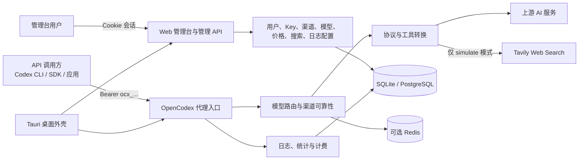

# OpenCodex 产品需求文档（PRD）

> 文档类型：基于当前代码反向整理的现状型 PRD  
> 代码基线：`main@3827590eb33acb67dd063054c4a36d2b87b09002`  
> 基线日期：2026-08-17  
> 产品版本：OpenCodex `0.1.0`（以 `src-tauri/tauri.conf.json` 为准）  
> 文档状态：已完成（现状基线版；标记为 TBD 的产品决策仍需负责人确认）  
> 主要读者：产品、设计、前端、后端、测试、运维、安全、项目负责人

## 1. 文档目的

本目录把 OpenCodex 当前分散在后端、管理台、桌面端、数据库迁移、部署脚本和自动化测试中的产品逻辑，重构为一套可评审、可开发、可测试、可追踪的完整产品需求文档。

这套 PRD 重点回答以下问题：

1. OpenCodex 解决什么问题，服务哪些用户；
2. 系统包含哪些产品能力，哪些能力不在当前范围内；
3. 超级管理员、普通用户和 API 调用方分别能做什么；
4. 请求如何从访问 Key 鉴权进入模型路由，并完成协议转换、重试、故障转移和日志记录；
5. 管理台每个页面应展示什么、允许什么操作、如何反馈错误；
6. 用户、渠道、模型、价格、日志等数据如何关联；
7. Web、Docker、Tauri 桌面端三种运行方式的边界与差异；
8. 当前实现已经满足哪些要求，哪些地方存在冲突、风险或未决指标；
9. 每条关键需求应如何验收，并可追踪到哪些接口、源码和测试。

## 2. 事实口径

### 2.1 证据优先级

当不同资料互相冲突时，按以下顺序判断当前事实：

1. 当前基线提交中的可执行源码；
2. 当前数据库模型及最新 SQLite/PostgreSQL 迁移；
3. 当前自动化测试固定的行为；
4. 当前管理台实际调用方式及用户可见文案；
5. 当前 Docker、Tauri、CI 和部署脚本；
6. `README.md`、`DEPLOYMENT.md` 及其他说明文档；
7. 未跟踪、历史计划或基于旧提交生成的文档。

说明文档和源码不一致时，本 PRD 会同时记录：

- **当前实现事实**：当前代码真实执行的行为；
- **文档冲突**：既有说明声称但代码不再支持的行为；
- **产品化要求**：为了让产品规则稳定、明确而提出的规范；
- **待确认项（TBD）**：需要产品或技术负责人决策，不能由代码事实推导的目标。

### 2.2 需求措辞

| 标记 | 含义 |
|---|---|
| `MUST` | 必须满足；不满足即该需求验收失败 |
| `SHOULD` | 原则上应满足；若不实施，必须记录原因和替代措施 |
| `MAY` | 可选能力；不影响核心版本验收 |
| `CURRENT` | 当前代码已实现或测试已固定的行为 |
| `GAP` | 当前实现与产品化要求之间存在差距 |
| `TBD` | 当前代码无法提供目标值，需要负责人确认 |

### 2.3 需求编号

每个专题使用稳定的需求编号前缀：

| 前缀 | 专题 |
|---|---|
| `REQ-OV` | 产品总览 |
| `REQ-USR` | 用户与权限 |
| `REQ-SYS` | 系统边界 |
| `REQ-DAT` | 领域与数据模型 |
| `REQ-AUTH` | 初始化与认证 |
| `REQ-CH` | 渠道管理 |
| `REQ-RTE` | 路由与可靠性 |
| `REQ-PRT` | 协议转换 |
| `REQ-SPC` | 工具、多模态和特殊流程 |
| `REQ-UI` | 管理台 |
| `REQ-OBS` | 可观测性与计费 |
| `REQ-CFG` | 配置 |
| `REQ-NFR` | 非功能要求 |
| `REQ-MIG` | 数据与迁移 |
| `REQ-REL` | 部署与发布 |
| `REQ-TST` | 测试与验收 |
| `REQ-RSK` | 已知限制与风险 |

## 3. 产品一句话定义

OpenCodex 是一个支持多用户隔离、多上游渠道路由和多 AI 协议互转的模型代理与运维管理平台，并提供 Web 管理台、Docker 服务端部署和 Tauri 桌面应用。

## 4. 文档目录

| 序号 | 文档 | 核心内容 |
|---:|---|---|
| 01 | [产品总览](01-product-overview.md) | 背景、目标、范围、产品原则、核心场景与成功指标 |
| 02 | [用户与权限](02-users-and-permissions.md) | 角色、租户隔离、权限矩阵、资源归属和越权规则 |
| 03 | [系统边界](03-system-boundary.md) | 系统上下文、组件、部署形态、外部依赖和信任边界 |
| 04 | [领域模型](04-domain-model.md) | 实体、关系、状态、约束、生命周期和数据字典 |
| 05 | [初始化与认证](05-initialization-and-auth.md) | 首次初始化、登录、Cookie、管理台会话和 Tauri 重启 |
| 06 | [渠道管理](06-channel-management.md) | 渠道 CRUD、导入、模型发现、测试、兼容规则和定价覆盖 |
| 07 | [路由与可靠性](07-routing-and-reliability.md) | 模型匹配、排序、亲和、容量、重试、熔断和故障转移 |
| 08 | [协议转换](08-protocol-conversion.md) | Responses、Chat、Messages 的请求、响应和 SSE 互转 |
| 09 | [工具、多模态和特殊流程](09-tools-multimodal-and-special-flows.md) | 工具、MCP、Apply Patch、图片、OCR、Web Search、Probe |
| 10 | [管理台](10-admin-console.md) | 所有页面、交互状态、移动端、自适应和可访问性 |
| 11 | [可观测性与计费](11-observability-and-billing.md) | 请求日志、详情、统计、实时流、Token、成本和内容存储 |
| 12 | [配置](12-configuration.md) | 环境变量、默认值、配置优先级、桌面设置和运行模式 |
| 13 | [非功能要求](13-non-functional-requirements.md) | 性能、可靠性、安全、兼容性、可维护性和容量 |
| 14 | [数据与迁移](14-data-and-migrations.md) | SQLite/PostgreSQL、EF 迁移、备份、恢复和回滚 |
| 15 | [部署与发布](15-deployment-and-release.md) | Docker、桌面包、CI、版本、升级、回滚和运行检查 |
| 16 | [测试与验收](16-testing-and-acceptance.md) | 测试矩阵、需求验收、发布门禁和回归范围 |
| 17 | [已知限制与风险](17-known-limitations-and-risks.md) | 安全、数据、功能、部署、文档漂移和开放决策 |
| 18 | [追踪索引](18-traceability-index.md) | 需求到页面、接口、实体、源码和测试的追踪矩阵 |

## 5. 推荐阅读路径

### 5.1 产品和项目负责人

1. 产品总览；
2. 用户与权限；
3. 系统边界；
4. 管理台；
5. 已知限制与风险；
6. 测试与验收。

### 5.2 后端研发

1. 领域模型；
2. 初始化与认证；
3. 渠道管理；
4. 路由与可靠性；
5. 协议转换；
6. 特殊流程；
7. 可观测性与计费；
8. 数据与迁移。

### 5.3 前端和设计

1. 用户与权限；
2. 初始化与认证；
3. 管理台；
4. 渠道管理；
5. 可观测性与计费；
6. 非功能要求中的响应式与无障碍章节。

### 5.4 测试

1. 产品总览和系统边界；
2. 各功能专题中的验收标准；
3. 测试与验收；
4. 已知限制与风险；
5. 追踪索引。

### 5.5 运维和安全

1. 系统边界；
2. 配置；
3. 非功能要求；
4. 数据与迁移；
5. 部署与发布；
6. 已知限制与风险。

## 6. 当前产品能力总览

核心能力包括：

- 两套相互独立的身份体系：管理台 Cookie 与代理 Bearer 访问 Key；
- 超级管理员和普通用户两级管理角色；
- 用户维度的渠道、访问 Key、路由和日志数据隔离；
- Responses、Chat Completions、Messages 三类文本协议入口；
- Images 生成与编辑的控制器/契约入口；当前生产实现和 DI 注册已确认缺失，不能视为可用能力；
- 模型映射、渠道优先级、亲和、容量、熔断、重试和故障转移；
- 工具调用、MCP、`apply_patch`、Reasoning、Usage 和 SSE 事件转换；
- Web Search 的模拟、转换和关闭模式；
- 模型目录、渠道级模型覆盖和多计费模式；
- 请求生命周期日志、渠道尝试日志、OCR 子日志、实时队列和统计；
- SQLite 单机模式、PostgreSQL 服务端模式，以及可选 Redis 跨实例运行时协调；
- Docker 服务端与 Tauri 桌面应用。

## 7. 关键术语

| 术语 | 定义 |
|---|---|
| 管理台用户 | 使用用户名和密码登录 `/admin/` 的人，身份保存在 Cookie 中 |
| 超级管理员 | 能管理所有用户和全局配置的管理角色 |
| 普通用户 | 只能管理自己渠道、访问 Key 和日志的管理角色 |
| API 调用方 | 使用 `Authorization: Bearer ocx_...` 调用代理接口的客户端 |
| 访问 API Key | OpenCodex 自己签发的代理访问凭证，不是上游模型服务 Key |
| 上游 Key | 配置在渠道中的第三方模型服务认证凭证 |
| 渠道 | 一个带协议类型、Base URL、认证、模型映射和可靠性策略的上游连接配置 |
| 请求模型 | 客户端在请求中提交、对外可见的模型名 |
| 上游模型 | 渠道模型映射后实际发送给上游的模型名 |
| 入口协议 | 客户端调用 OpenCodex 时使用的 Responses、Chat 或 Messages 协议 |
| 渠道协议 | 渠道配置的上游协议类型 |
| 尝试 | 主请求对某个候选渠道发起的一次上游调用 |
| 故障转移 | 当前渠道失败后，在允许条件下切换到下一个候选渠道 |
| 亲和 | 基于 `prompt_cache_key` 优先复用此前渠道的映射 |
| 容量 | 渠道允许同时占用的请求槽位数量 |
| 熔断 | 连续失败达到阈值后暂时停止向渠道发送普通请求 |
| TTFT | 流式响应首个有效内容、推理或工具增量到达所需时间 |
| Probe 请求 | 输出上限不超过 1、用于探测服务或模型的轻量请求 |
| 内容寻址日志 | 以内容哈希、分块、压缩和去重方式保存的大段日志正文 |

## 8. 当前重大冲突索引

下列问题会在专题文档中展开，不应在阅读 PRD 时被忽略：

1. README 声称访问 API Key 明文只显示一次且数据库只存哈希，但当前实体和服务保留 `KeyPlaintext`；
2. 管理台允许渠道、访问 Key、Web Search 配置导出明文凭证；
3. README 和部署文档仍出现已不再作为主配置来源的数据库或日志变量；
4. Images 控制器依赖的 `IProxyImagesEndpointService` 生产实现和 DI 注册已确认缺失，真实请求当前不可用；
5. LAN 模式监听 `0.0.0.0`，但默认仍是明文 HTTP；
6. `/health` 仅证明进程响应，不证明数据库、Redis、迁移或上游健康；
7. 普通 push 和 PR 没有完整 CI 质量门禁；
8. 当前缺少日志保留期、容量上限、备份恢复、RTO/RPO 和正式 SLA；
9. 管理台无 URL 路由深链、全局会话失效处理和统一未保存变更保护；
10. 当前文档目录中存在基于其他提交生成的未跟踪技术文档，不能直接作为本 PRD 的当前事实。

## 9. 文档维护规则

### 9.1 何时必须更新

以下变更合入代码时必须同步更新对应 PRD：

- 新增、删除或更改公开 API；
- 更改角色、资源归属或访问控制；
- 更改渠道字段、路由排序、重试、熔断或故障转移规则；
- 更改协议字段、工具、Reasoning、Usage 或 SSE 事件映射；
- 更改数据库实体、迁移、日志存储或计费规则；
- 更改管理台页面、关键交互、移动端行为或导入导出格式；
- 更改环境变量、默认值、部署形态或支持平台；
- 修复会改变产品可见结果的缺陷；
- 确认任何 `TBD` 指标或开放决策。

### 9.2 更新要求

每次更新至少应：

1. 修改受影响需求及验收标准；
2. 更新文档顶部基线提交；
3. 更新追踪索引；
4. 标明兼容性影响和迁移要求；
5. 为新增或改变的 MUST 需求补充测试证据；
6. 避免把计划中的能力提前写成当前实现。

## 10. 源码总索引

| 区域 | 主要位置 |
|---|---|
| 后端入口 | `opencodex_proxy/src/Presentation/OpenCodex.Api/` |
| 核心业务 | `opencodex_proxy/src/Libraries/OpenCodex.Core/` |
| 接口与 DTO | `opencodex_proxy/src/Libraries/OpenCodex.CoreBase/` |
| 领域实体 | `opencodex_proxy/src/Libraries/OpenCodex.Domain/Domain/` |
| 数据与迁移 | `opencodex_proxy/src/Libraries/OpenCodex.Data/` |
| 后端测试 | `opencodex_proxy/tests/OpenCodex.Api.Tests/` |
| 管理台 | `frontend/src/` |
| 桌面端 | `src-tauri/` |
| 构建脚本 | `scripts/`、`Dockerfile` |
| 部署 | `docker-compose-*.yml`、`DEPLOYMENT.md`、`update_remote_image*.sh` |
| 发布 CI | `.github/workflows/desktop-release.yml` |
